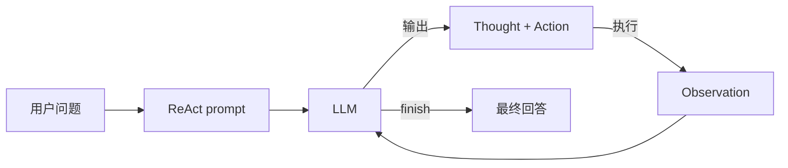

<KeyIdea>
**一句话**：ReAct = **Reason + Act**，让模型轮流写「**思考 → 调工具 → 看结果**」三块文本，循环直到任务完成。今天 90% 的 Agent 框架（LangChain / OpenAI tools / Claude tools）底层都是它的变种。
</KeyIdea>

## 是什么

模型每一轮输出三段：

```
Thought: 我需要先知道今天北京天气，应该用 search 工具。
Action:  search("北京 天气 今天")
Observation: 26°C，多云。

Thought: 用户问要不要带伞，结合天气我可以回答了。
Action:  finish("不用带伞，今天多云。")
```

把 `Thought / Action / Observation` 当作模型生成的「**结构化日志**」，循环喂回去 —— **每一轮都基于上一轮的 Observation 做决策**。

## 打个比方

<Analogy>
ReAct 像**侦探破案**：
- **Reason** = 推理（「凶手可能是 A，因为他有动机」）；
- **Act** = 取证（去查 A 当晚不在场的证据）；
- **Observation** = 拿到证据；
- 然后再 Reason —— 一直到案子破了。
</Analogy>

## 关键概念

<Terms items={[
  { term: "Thought", en: "推理", def: "模型用自然语言思考下一步 —— CoT 在循环里的应用。" },
  { term: "Action", en: "动作", def: "结构化的工具调用 (Function Calling)：选哪个工具 + 传什么参数。" },
  { term: "Observation", en: "观察", def: "工具执行后的返回，由系统拼回 prompt 让模型继续。" },
  { term: "Stop Condition", en: "终止条件", def: "模型显式调 finish() 或达到最大步数。" },
]} />

## 怎么工作



每次循环都把**完整历史**（所有 Thought / Action / Observation）拼进 prompt 重新给模型 —— 这是为什么 Agent 容易吃光 Context。

## 实操要点

- **优先用原生 Tools API**：OpenAI / Anthropic / Gemini 的 tools 字段都内置了 ReAct，不必手写 parser。
- **每个工具一行 description**：写清楚「**什么时候用、要什么参数、返回什么**」 —— 模型选工具的准头全靠它。
- **限步数**：硬上限 8–15 步。模型卡住时要么报错要么交给人。
- **Observation 要简短**：工具返回长 JSON 直接干掉一半上下文。**先做摘要、过滤再喂回去**。
- **Thought 不进生产 UI**：思考链只给开发者看 trace，前端只展示「最终回答」+ 关键 Action 进度。

## 易混点

<Compare
  leftTitle="ReAct"
  rightTitle="纯 CoT"
  left={<>
    **会调工具**，能改外部世界。<br />
    多轮循环，每步基于上一步结果。
  </>}
  right={<>
    **只在脑里想**，不改世界。<br />
    一次性输出推理链 + 答案。
  </>}
/>

<Compare
  leftTitle="ReAct"
  rightTitle="Plan & Execute"
  left={<>
    **边想边做**，每步重新决策。<br />
    适合分支多、不确定的任务。
  </>}
  right={<>
    **先一次性规划**所有步骤，再批量执行。<br />
    适合稳定流程，省 Token。
  </>}
/>

## 延伸阅读

- [Agent](/ai/beginner/agent) —— 整体框架
- [Function Calling](/ai/beginner/function-calling) —— ReAct 里 Action 的底层协议
- [Planning](/ai/beginner/planning) —— Plan & Execute 等替代范式
- [Reflection](/ai/advanced/reflection) —— 给 ReAct 装一个「自我校对」环节
