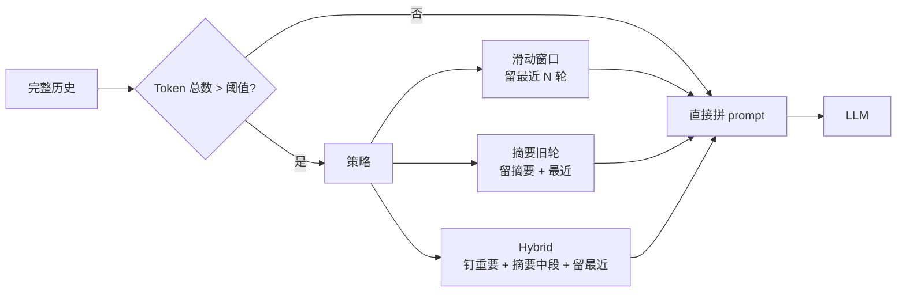

<KeyIdea>
**一句话**：短期记忆 = 当前会话里**最近若干轮**的消息。模型本身没有「会话」概念 —— 我们每轮都把整个聊天历史拼回 prompt，**让模型「以为」自己记得**。一旦超出 context window，就要决定**留哪些、丢哪些**。
</KeyIdea>

## 是什么

每次调用 LLM 实际发的是：

```json
[
  {"role": "system", "content": "你是助手"},
  {"role": "user", "content": "我叫小明"},
  {"role": "assistant", "content": "你好，小明"},
  {"role": "user", "content": "我叫什么?"}   ← 当前问题
]
```

模型「记得名字」纯粹是因为**前面几条 message 还在 prompt 里**。一旦总长超出 context window，前面的会被砍掉，**模型就「失忆」了**。

## 打个比方

<Analogy>
模型的脑袋 = 一张**有限大小的白板**。每轮对话都把过去的笔记重新抄一遍上去，再写当前问题。  
白板写满了，**就得擦掉一些旧的** —— 短期记忆策略就是「**擦哪些**」。
</Analogy>

## 关键概念

<Terms items={[
  { term: "Sliding Window", en: "滑动窗口", def: "只保留最近 N 轮，旧的直接丢 —— 最简单。" },
  { term: "Summarization", en: "摘要压缩", def: "把旧轮压成一段摘要塞回 system prompt，节省 token。" },
  { term: "Token Budget", en: "Token 预算", def: "实际可用 = context window − system prompt − 工具定义 − 输出预留。" },
  { term: "Pin Messages", en: "钉住消息", def: "重要事实（用户名、偏好）始终保留，不参与裁剪。" },
]} />

## 怎么工作



实际生产里几乎都用 **Hybrid**：钉关键事实 + 摘要中段 + 留最近 5–10 轮。

## 实操要点

- **总 token 算清楚**：context window 不是免费的 —— **system + 历史 + 工具 + 预留输出**全算进去。
- **摘要要给具体格式**：让模型「**用 3 行 markdown 列表输出关键事实**」，再插回 system prompt。**比让它自由发挥稳得多**。
- **重要事实立刻提取**：用户提到「**我对花生过敏**」时**当场抽取**写进 system prompt，**不依赖未来摘要**。
- **不要把 tool 输出原样存**：动辄几 KB 的 JSON 立刻吃完上下文。**摘要后再回喂**。
- **超长任务上 LangGraph / 自带 checkpoint 的库**：自己手写历史拼接是 bug 大户。

## 易混点

<Compare
  leftTitle="短期记忆"
  rightTitle="长期记忆"
  left={<>
    **当前会话内**。<br />
    本质是 prompt 里的几条消息。
  </>}
  right={<>
    **跨会话**持久化。<br />
    存进 DB / 向量库，下次会话再检索回来。
  </>}
/>

<Compare
  leftTitle="短期记忆"
  rightTitle="Context Window"
  left={<>
    **应用策略**：怎么塞进窗口。
  </>}
  right={<>
    **模型属性**：窗口本身有多大。
  </>}
/>

## 延伸阅读

- [Context Window](/ai/beginner/context-window) —— 短期记忆的物理上限
- [Long-term Memory](/ai/beginner/long-term-memory) —— 跨会话持久记忆
- [RAG](/ai/beginner/rag) —— 当历史太长时，用 RAG 检索旧对话
