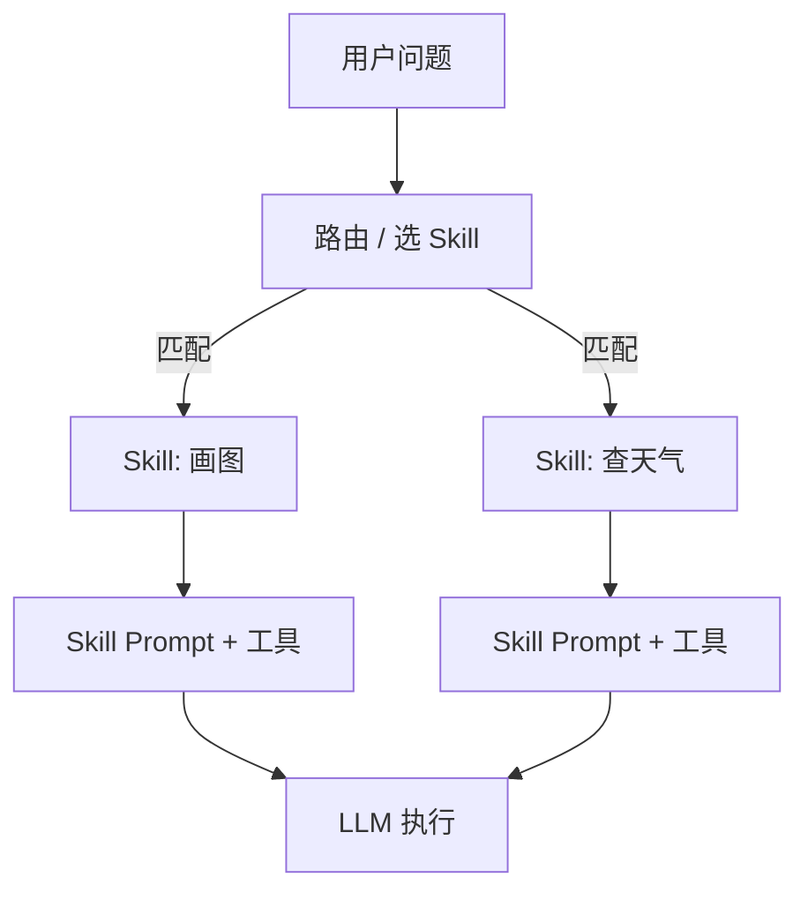

<KeyIdea>
**一句话**：Skill 是一个「**特定能力包**」 —— 它把某项任务需要的 **system prompt + 工具列表 + 示例 + 资源**封装成一个单元。装上某个 Skill，Agent 就「学会」做这件事；不装就不会。
</KeyIdea>

## 是什么

举几个直观例子：

- **画图 Skill** —— prompt 里教模型如何写 Stable Diffusion prompt + 一个 `gen_image` 工具。
- **查天气 Skill** —— 一个 `get_weather` 工具 + 一段「**天气解读**」prompt。
- **PDF 阅读 Skill** —— 一个 `read_pdf` 工具 + 一组示例教模型怎么概括论文。

把 N 个 Skill 装进一个 Agent，它就同时具备 N 项专业能力。

## 打个比方

<Analogy>
Agent 是**手机**，Skill 是**App**。  
- 装上「外卖 App」就能点餐。  
- 卸了它，手机当然不会自动会点餐。  
Anthropic 的 Skills、Coze 的「插件」、Dify 的「Tool Set」都是同一个东西的不同名字。
</Analogy>

## 关键概念

<Terms items={[
  { term: "Skill Manifest", en: "技能描述", def: "一个 YAML / JSON：name + description + 触发条件 + 资源清单。" },
  { term: "Bound Tools", en: "绑定工具", def: "Skill 自带的 function calls（API、MCP server、本地代码）。" },
  { term: "Skill Prompt", en: "技能提示", def: "Skill 私有的 system 增量 prompt：只在该 Skill 被激活时拼入。" },
  { term: "Activation", en: "激活", def: "由用户显式选 / Manager Agent 路由 / 关键词匹配决定何时上场。" },
]} />

## 怎么工作

**单 Agent + 多 Skill** 是「轻量版 Multi-Agent」 —— 同一个 LLM，根据任务**临时换装**。

## 实操要点

- **每个 Skill 单一职责**：「文档总结」+「图表生成」别塞一个 Skill。**单一职责让路由更准、调试更快**。
- **Skill description 决定路由准头**：跟 Function description 一样，写清楚「**什么时候用，能做什么，不擅长什么**」。
- **Skill 可以套 Skill**：复杂能力（「写一份产品发布邮件」）= 「写作」+「图表」+「校对」三个 Skill 组合。
- **可热插拔**：好的 Skill 系统应该让你**运行时新增 / 禁用 Skill**，不重启 Agent。
- **审计 / 计费按 Skill 切**：不同 Skill 的 Token 消耗、调用次数应该单独统计 —— 出问题好定位。

## 易混点

<Compare
  leftTitle="Skill"
  rightTitle="Tool / Function"
  left={<>
    **能力包**：prompt + N 个工具 + 示例 + 资源。
  </>}
  right={<>
    **单个原子动作**：一个 function。 
    Skill 是 Tool 的上层封装。
  </>}
/>

<Compare
  leftTitle="Skill"
  rightTitle="Multi-Agent"
  left={<>
    **同一个 Agent 换装**。 
    上下文共享、便宜、轻量。
  </>}
  right={<>
    **多个独立 Agent**对话。 
    隔离强、能力专精，但贵。
  </>}
/>

## 延伸阅读

- [Function Calling](/ai/beginner/function-calling) —— Skill 内部的工具就是它
- [MCP](/ai/beginner/mcp) —— Skill 可以打包成 MCP server 跨产品复用
- [Multi-Agent](/ai/beginner/multi-agent) —— Skill 不够时再升级到多 Agent
- [Dify / Coze](/ai/ecosystem/dify-coze) —— 把 Skill 可视化的平台
