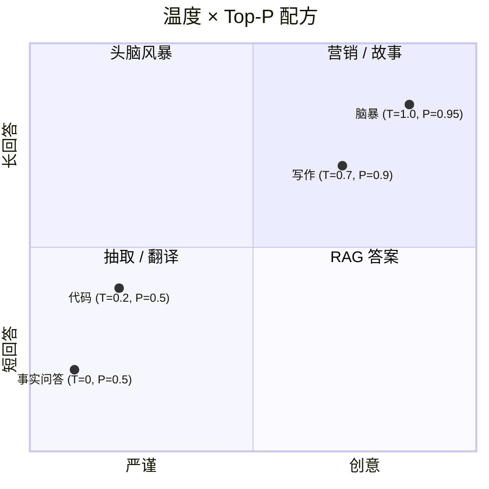

<KeyIdea>
**一句话**：Temperature 决定「**多大胆**」（高温更随机），Top-P 决定「**敢从多大的池子里挑词**」（小 P 只挑最稳的几个）。两者都让你在「**严谨可控 ↔ 灵活创意**」之间滑动。
</KeyIdea>

## 是什么

模型每生成一个 Token，都是在词表上算一份概率分布，然后采样：

```
Token 候选         概率
"清"             0.42
"晴"             0.28
"凉"             0.10
"…"              0.20
```

**Temperature** 改变这份分布的「锐度」，**Top-P** 改变「采样的候选池有多大」。

## 打个比方

<Analogy>
- **Temperature** = 调音师的「变奏旋钮」。0 是逐字背稿；1 是即兴 jazz；>1 就开始走调。
- **Top-P** = 餐厅菜单的「**只看销量前 N% 的菜**」。Top-P 0.1 = 只看最热门的两三个；0.95 = 几乎所有菜都可能被点。
</Analogy>

## 关键概念

<Terms items={[
  { term: "Temperature 0", en: "确定性", def: "永远挑概率最高的 Token。同样的输入永远得同样的输出。" },
  { term: "Temperature 0.7", en: "默认创意", def: "OpenAI / 大多数 chat 默认值。回答自然且有变化。" },
  { term: "Temperature 1.5+", en: "胡话区", def: "随机性强，容易跳梗、跑题甚至拼错字。" },
  { term: "Top-P 0.1", en: "保守采样", def: "只在「累计概率前 10%」的候选里挑，几乎确定性。" },
  { term: "Top-P 1.0", en: "全开", def: "整个词表都可能被采，搭配高温能玩出花。" },
]} />

## 怎么搭配



经验值：

| 任务 | Temperature | Top-P |
|---|---|---|
| 抽取 / SQL / JSON | 0 – 0.2 | 0.5 |
| RAG 问答 / 翻译 | 0.2 – 0.4 | 0.7 |
| 文案 / 写作 | 0.6 – 0.8 | 0.9 |
| 头脑风暴 / 故事 | 0.9 – 1.2 | 0.95 |

## 实操要点

- **二选一就够**：实践里**只调 Temperature 就好**。Top-P 留默认 1.0 即可，除非要极端确定性。
- **越严谨任务越降温**：抽实体、生成 schema、SQL —— `T=0` 最稳，**结果可重放**。
- **调高温别忘加约束**：`T=1` 时务必把字数、结构在 system 里写死，不然容易跑偏。
- **不影响 RAG 质量**：温度只控制采样，**不影响检索环节**；让 RAG 表现差的多半是 prompt / chunking 而非温度。

## 易混点

<Compare
  leftTitle="Temperature"
  rightTitle="Top-P"
  left={<>
    改变**整份概率分布的锐度**。<br />
    所有候选都可能被选，但弱者机会变化。
  </>}
  right={<>
    改变**候选池的大小**。<br />
    池子外的 Token 概率被强制归零。
  </>}
/>

<Callout type="tip" title="同时调会怎样？">
两者都能压随机性。**通常只改一个**，避免「调一调忘了哪个开了多少」。
</Callout>

## 延伸阅读

- [System Prompt](/ai/beginner/system-prompt) —— 用约束 + 低温 = 最稳输出
- [Hallucination](/ai/beginner/hallucination) —— 低温也救不了根本性的事实编造
- [CoT](/ai/beginner/cot) —— 高温下让推理更稳的小技巧
