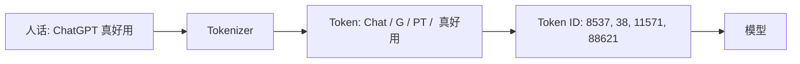

<KeyIdea>
**一句话**：Token 是 LLM 看文字的「最小积木」 —— 不是字、不是词，而是**模型词表里事先约定好的一小段字符**。模型读、写、计费、限长度，全部以 Token 为单位。
</KeyIdea>

## 是什么

LLM 不直接处理人话，它先把文本切成一串 Token，再把每个 Token 映射成一个 ID。常见切分方式（**BPE**、**SentencePiece**）会把高频字符串切大块，低频的切碎，所以：

- 英文：1 Token ≈ 0.75 个单词
- 中文：1 Token ≈ 1–2 个汉字
- 代码 / 表情 / 罕见字：可能 1 个字符 = 多个 Token

## 打个比方

<Analogy>
你的大脑读「今天天气真好」是按字处理。模型读它是按 **「今天 / 天气 / 真好」** 这种「词块」处理 —— 每个词块就是一个 Token。
</Analogy>

## 关键概念

<Terms items={[
  { term: "Token ID", en: "词表索引", def: "每个 Token 在词表里都有一个唯一整数（如 GPT 词表 ~100K 个 token）。" },
  { term: "BPE / WordPiece", en: "切分算法", def: "高频字符串保留为整体，低频拆碎，达到「**压缩 + 覆盖所有字符**」的平衡。" },
  { term: "Special Tokens", en: "特殊标记", def: "<bos> / <eos> / <pad> / <system> 等，标识开头、结尾、对话角色。" },
  { term: "Token 计费", en: "经济模型", def: "API 按输入 + 输出 Token 数算钱，长上下文很贵。" },
]} />

## 怎么工作

切分规则在训练前就定好了，**所有用户共享同一份词表**。

## 实操要点

- **估 Token 量**：英文按「单词数 × 1.3」估；中文按「字数 × 1.5」估，能粗算 API 成本。
- **省 Token**：写 prompt 别废话；表格数据可以用 JSON 或 CSV 压一压；长文先做摘要再喂模型。
- **小心冷门字**：emoji、繁体罕见字、生僻代码符号往往一个字就是好几 Token，**长度容易爆**。
- **Tokenizer 不通用**：GPT-4 的切分跟 Claude / Qwen 不一样，同一段文字 Token 数可能差 30%。

## 易混点

<Compare
  leftTitle="Token (LLM 视角)"
  rightTitle="Word / 字 (人类视角)"
  left={<>
    模型词表里**预定义的字符串片段**。 
    可能是半个词、一个词、甚至几个词。
  </>}
  right={<>
    自然语言里的最小语义单位。 
    跟模型词表**没有一一对应关系**。
  </>}
/>

<Callout type="tip" title="实测自己的 Token 数">
OpenAI 的 [tokenizer.com](https://platform.openai.com/tokenizer) 可以贴文本看 Token 切分；Python 里用 `tiktoken` 一行算出来。
</Callout>

## 延伸阅读

- [Context Window](/ai/beginner/context-window) —— 一次能塞多少 Token
- [Parameters](/ai/beginner/parameters) —— 模型规模 vs Token 处理量
- [Chunking](/ai/beginner/chunking) —— RAG 里如何把长文切成 Token 友好的块
