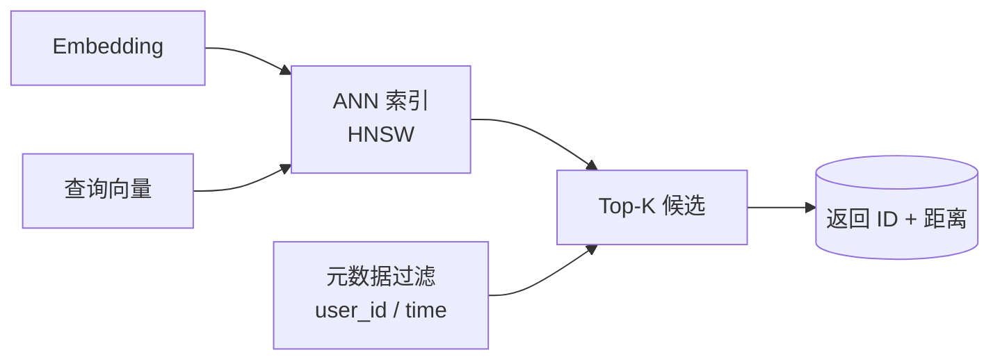

<KeyIdea>
**一句话**：向量数据库 = 一个**专门存向量 + 极快查近邻**的数据库。它解决的核心问题是：在百万、上亿条向量中**毫秒级**找出和某个向量最像的 K 条。
</KeyIdea>

## 是什么

普通 SQL 库做不了 —— 「找 1536 维向量里余弦相似度最高的 5 条」算下来要扫全表，百万级就崩了。向量库用近邻索引 (HNSW / IVF / DiskANN) 把它降到 **O(log N)**：

```sql
-- pgvector 的写法
SELECT id, content
FROM docs
ORDER BY embedding <=> $query_vector
LIMIT 5;
```

`<=>` 是 cosine 距离 —— 由索引加速，**毫秒返回**。

## 打个比方

<Analogy>
普通 DB 像**电话簿** —— 按名字（key）找记录。  
向量 DB 像**地图 + 雷达** —— 给一个坐标，雷达**扫一扫附近最近的几个点**。
</Analogy>

## 关键概念

<Terms items={[
  { term: "ANN Index", en: "近似近邻索引", def: "HNSW / IVF / DiskANN 等。牺牲一点点准确率换巨大速度。" },
  { term: "Metric", en: "距离度量", def: "Cosine / Euclidean / Dot product —— 必须和 Embedding 模型训练时一致。" },
  { term: "Filter", en: "元数据过滤", def: "向量检索时同时按字段过滤（user_id / 时间 / 类别）。" },
  { term: "Hybrid Search", en: "混合检索", def: "向量 + 关键词 (BM25) 一起，再 rerank。" },
]} />

## 主流选项

| 方案 | 特点 | 适合 |
|---|---|---|
| **pgvector** | Postgres 扩展，0 引入成本 | 千万级以下，已有 PG |
| **Qdrant / Milvus / Weaviate** | 专用、支持过滤 + 混合检索 | 亿级、生产 |
| **Pinecone** | 全托管 SaaS，免运维 | 不想自己维护 |
| **FAISS / Chroma** | 单机库，本地实验 | 原型 / 离线 |
| **OpenSearch / Elasticsearch** | BM25 + 向量都能做 | 已有 ES 集群 |

## 怎么工作



索引把高维空间「**分区 + 邻接图**」存起来 —— 查询时只扫局部就够了。

## 实操要点

- **先 pgvector 试试**：万级到千万级 pgvector 完全够用，**别一上来上 Milvus 集群**。
- **Metric 必须对齐**：Embedding 模型训练用 cosine 就用 cosine。错了召回掉一大截。
- **元数据 + 向量一起存**：每条向量绑定 `{doc_id, chunk_idx, user_id, source, time}`。**查询时按需过滤**。
- **批量写入**：一次写 1 条 vs 一次写 1000 条，建索引速度差几十倍。
- **监控召回**：定期跑「黄金问题集」测召回率，**升级 embedding / 调 chunk 大小后立刻看效果**。

## 易混点

<Compare
  leftTitle="向量 DB"
  rightTitle="搜索引擎 (ES)"
  left={<>
    **按语义找**。<br />
    懂同义、懂模糊。
  </>}
  right={<>
    **按字面找** (BM25)。<br />
    精确实体强。
  </>}
/>

混合检索 = 二者都做 → **最稳的 RAG 召回**。

## 延伸阅读

- [Embeddings](/ai/beginner/embeddings) —— 向量从哪来
- [RAG](/ai/beginner/rag) —— 向量 DB 的最大应用
- [Chunking](/ai/beginner/chunking) —— 写入向量库前的预处理
