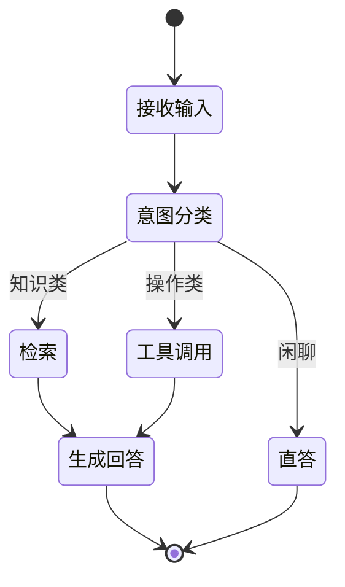

<KeyIdea>
**一句话**：Workflow 是把 AI 应用画成一张**节点图** —— 每个节点是一步操作（LLM 调用、工具、判断、写库），节点之间用边连起来。**流程在哪、几步、谁跑哪个 prompt，全部由人提前定义**，模型只在每个节点内部发挥。
</KeyIdea>

## 是什么

跟 Agent「让模型自己想下一步」相反，Workflow 是：

```
[读取用户问题] → [意图分类] → [选分支]
                                ├─ FAQ 类 → [RAG 检索] → [生成答案]
                                ├─ 售后类 → [查订单 API] → [写回答]
                                └─ 闲聊类 → [直答]
```

**每条边、每个节点都在开发时定好**。运行时只是把数据顺着图传下去。

## 打个比方

<Analogy>
Agent 像**自由职业者**：你说「帮我搞定这事」，他自己排活、自己决定步骤。  
Workflow 像**生产线**：每个工位干什么、活怎么传，工厂主预先定死，**良率稳定可预测**。
</Analogy>

## 关键概念

<Terms items={[
  { term: "Node", en: "节点", def: "一个原子操作：调 LLM、查 API、写库、条件判断…" },
  { term: "Edge", en: "边", def: "节点之间的流转规则。可以条件分支（if）、并行（parallel）、循环（loop）。" },
  { term: "State", en: "状态", def: "在节点之间传递的数据，通常是一个 JSON dict 一直被 patch。" },
  { term: "Checkpoint", en: "检查点", def: "把状态持久化，使长任务可中断、可恢复、可人工审批。" },
]} />

## 怎么工作



**每条线都是开发时确定的** —— 模型不能跳节点，也不能临时新增分支。

## 实操要点

- **能写流程图就上 Workflow**：B 端业务、客服、流程审批 —— 流程清晰的地方 Workflow 比 Agent **稳一万倍**。
- **节点小而单一**：一个节点干一件事。Prompt 长得失控时拆成两个节点，**比塞进一个 mega-prompt 容易调试得多**。
- **加 Human-in-the-loop**：关键节点（下单、退款、发邮件）设 checkpoint 等人审批，再放行。
- **错误分支也要画**：节点失败有 retry / fallback / 人工兜底，**不要让流程默默崩在一处**。
- **Workflow + Agent 混合**：主流程用 workflow 锁住，**某个节点内部**让 Agent 处理灵活的子任务 —— 这是工业里最常用的姿势。

## 易混点

<Compare
  leftTitle="Workflow (确定性)"
  rightTitle="Agent (灵活性)"
  left={<>
    流程**人定**，模型只在节点内做事。<br />
    可观测、可重放、可 SLA。
  </>}
  right={<>
    流程**模型定**，每步都临场决策。<br />
    灵活但难以保证 99.9% 通过率。
  </>}
/>

## 延伸阅读

- [Agent](/ai/beginner/agent) —— Workflow 的对立兄弟
- [Multi-Agent](/ai/beginner/multi-agent) —— 在 workflow 节点里跑 Agent 团
- [LangGraph](/ai/ecosystem/langgraph) —— 把 workflow 写成代码的事实标准
- [Dify / Coze](/ai/ecosystem/dify-coze) —— 把 workflow 画成图的 GUI 平台
