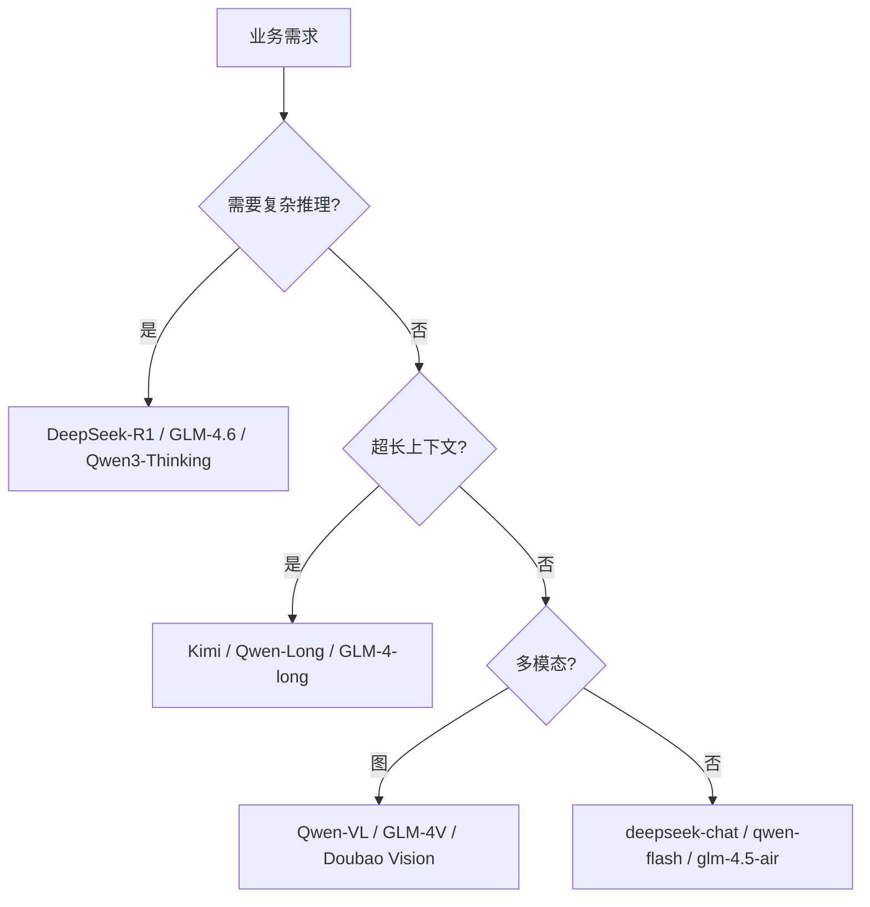

<KeyIdea>
**一句话**：DeepSeek / Qwen / GLM / Kimi 是国内最常用的几家 LLM API，**OpenAI 兼容、定价比海外便宜 5–20 倍、数据合规**。各家擅长不同：DeepSeek 推理强、Qwen 全能 + 开源、GLM 中英双修 + 多模态、Kimi 长上下文。
</KeyIdea>

## 各家定位（速记）

<KV items={[
  { k: "DeepSeek", v: "deepseek-chat（V3 系）+ deepseek-reasoner（R1 系）。性价比之王。tool / json mode 完整。" },
  { k: "Qwen / 通义千问", v: "qwen-max / qwen-plus / qwen-flash + 开源 Qwen3 / Qwen-VL / Qwen-Coder 全家。生态最丰富。" },
  { k: "智谱 GLM", v: "GLM-4.6（推理）/ GLM-4.5-Air（轻量）/ GLM-4V（多模态）/ CodeGeeX。中英文均衡，Agent 任务好。" },
  { k: "月之暗面 Kimi", v: "k2 / moonshot-v1-* —— 长上下文 (128k–200k) 的早期王者。" },
  { k: "MiniMax", v: "abab 系 + 视频生成。多模态优势。" },
  { k: "Doubao 豆包", v: "字节体系，速度快，文字 + 视觉模型齐全。" },
  { k: "Hunyuan 混元 / Pangu / Spark", v: "腾讯 / 华为 / 讯飞自研。" },
  { k: "硅基流动 / 火山方舟 / 阿里灵积", v: "聚合服务商，一个账号调多家。" },
]} />

## 打个比方

<Analogy>
不同 API 像不同**外卖平台**：菜单（模型）大同小异，**价格 / 配送速度 / 优惠**各有侧重。同一道菜（功能），换一家可能省一半钱。
</Analogy>

## 接入示例

```python
from openai import OpenAI

# DeepSeek
ds = OpenAI(base_url="https://api.deepseek.com/v1", api_key="sk-...")
ds.chat.completions.create(model="deepseek-chat", messages=[...])
# 推理模型走另一个 model 名
ds.chat.completions.create(model="deepseek-reasoner", messages=[...])

# Qwen（兼容模式）
qw = OpenAI(
    base_url="https://dashscope.aliyuncs.com/compatible-mode/v1",
    api_key="sk-...")
qw.chat.completions.create(model="qwen-plus", messages=[...])

# 智谱 GLM
zp = OpenAI(base_url="https://open.bigmodel.cn/api/paas/v4", api_key="...")
zp.chat.completions.create(model="glm-4.6", messages=[...])

# Kimi
km = OpenAI(base_url="https://api.moonshot.cn/v1", api_key="sk-...")
km.chat.completions.create(model="moonshot-v1-32k", messages=[...])
```

## 关键差异点

<Terms items={[
  { term: "推理模式", en: "Reasoner / Thinking", def: "DeepSeek-R1、GLM-4.6、Qwen3 thinking 模式 —— delta 里多一个 reasoning_content 字段。" },
  { term: "上下文长度", en: "Context", def: "Kimi 早期 128k；现在 Qwen3 / GLM / DeepSeek 主流都 128k–256k。" },
  { term: "JSON / Tools", en: "结构化输出", def: "各家 OpenAI 兼容 schema 大体一致；个别字段差异需要测。" },
  { term: "多模态", en: "Vision / Audio", def: "Qwen-VL、GLM-4V、Doubao、Kimi-VL 都支持图像；视频与音频生态在快速跟进。" },
  { term: "国内合规", en: "ICP / 数据驻留", def: "国内厂数据存境内，C 端产品 / 上线 App 必须用合规模型。" },
  { term: "限流 / 配额", en: "Rate Limit", def: "各家按余额 / 等级限流；上量前先看文档申请。" },
]} />

## 怎么选



价格更新频繁；做选型时**实测一周** + 对比报价。

## 实操要点

- **网关层抽象**：统一封装，按业务 / 任务路由。模型变化只改一处。
- **本地兜底**：在线服务出问题，自动降级到本地 vLLM / Ollama 跑开源版本（Qwen / DeepSeek / GLM 都开源了同名模型）。
- **多模型协同**：复杂任务用强推理（DeepSeek-R1 / GLM-4.6）做规划，跑大量调用用小模型（qwen-flash）。
- **企业**：火山方舟 / 阿里云灵积 / 腾讯 TI 等聚合 + 私有部署方案，提供 SLA 与合规。
- **安全 prompt**：国内模型在政治 / 敏感词上比海外严，prompt 里**避免触发**。
- **批量任务**：DeepSeek、Qwen 都有 batch API，**便宜一半**。

## 易混点

<Compare
  leftTitle="API 调用（在线）"
  rightTitle="开源模型（自托管）"
  left={<>
    免运维、按 token 计费。<br />
    最快上线。
  </>}
  right={<>
    自己部署 Qwen / DeepSeek / GLM。<br />
    数据不出私有，但要管 GPU。
  </>}
/>

## 延伸阅读

- [OpenAI 兼容 API](/ai/ecosystem/openai-compatible)
- [vLLM](/ai/ecosystem/vllm)
- [HuggingFace](/ai/ecosystem/huggingface)
