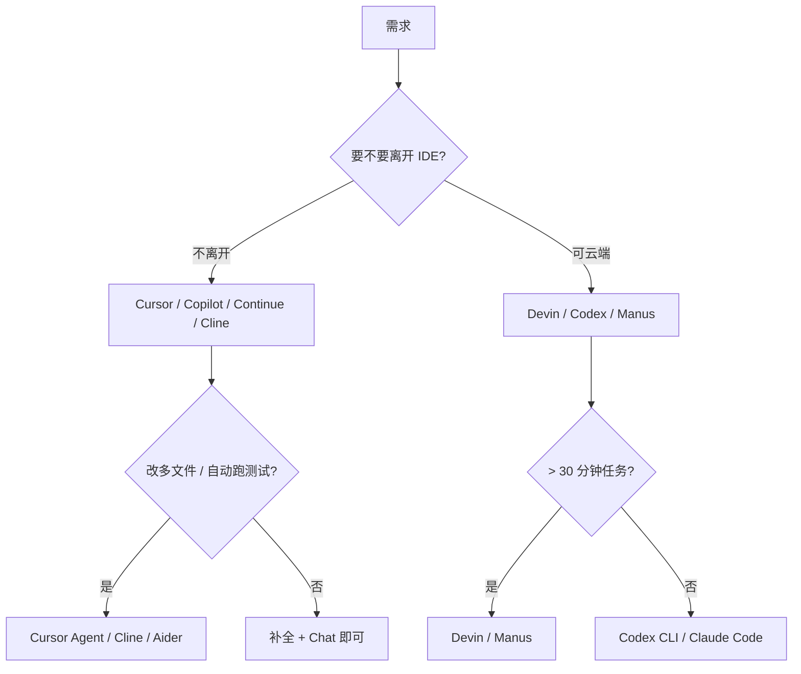

<KeyIdea>
**一句话**：代码 Agent 一年内从「**Tab 补全**」走到「**自己读 repo + 改多文件 + 跑测试**」。Cursor / Windsurf 是 IDE 派；Cline / Continue / Aider 是 VSCode 插件 + CLI 派；Devin / OpenAI Codex 是云端 Agent。
</KeyIdea>

## 主流工具速记

<KV items={[
  { k: "Cursor / Windsurf", v: "VSCode fork，**全功能 IDE**：Tab 续写、Chat、多文件 Agent、Terminal Agent。订阅制。" },
  { k: "GitHub Copilot", v: "VSCode/JetBrains 等插件 + 云 IDE。补全 + Chat + 新版 Workspace Agent。" },
  { k: "Cline / Roo Code", v: "VSCode 插件，自带 Agent loop（看文件 → 改 → 跑命令 → 读结果）。BYO API。" },
  { k: "Continue", v: "开源 VSCode/JetBrains 插件，自由配置后端模型。" },
  { k: "Aider", v: "命令行 + git diff 风格，**贴近 git 工作流**。" },
  { k: "Devin / Manus / Genspark", v: "云端真正的 Agent，包浏览器 + shell + IDE，能跑长任务。" },
  { k: "OpenAI Codex CLI / Claude Code", v: "本地 CLI 形态的 Agent。" },
  { k: "JetBrains AI / Junie", v: "JetBrains 全家桶官方 Agent。" },
]} />

## 打个比方

<Analogy>
**Tab 补全** = 你写一句他帮你接半句；  
**Chat-in-IDE** = 旁边坐了实习生答你问题；  
**Agent in IDE** = 实习生自己读项目 + 改文件 + 跑测试 + 提 PR；  
**云端 Agent** = 把任务交出去，**他自己开机自己干一晚上**。
</Analogy>

## 关键能力对比

<Terms items={[
  { term: "Repo Map / Indexing", en: "代码地图", def: "把整 repo 嵌入 + 结构化，让模型能 'jump to definition'。Cursor / Cline 都做。" },
  { term: "Tool Use", en: "工具调用", def: "shell / file edit / browser / git。决定 Agent 能干多少事。" },
  { term: "Diff-based Edit", en: "diff 编辑", def: "Aider / Cline 用 diff 而非 full-file overwrite，**省 token + 容易回滚**。" },
  { term: "Context Compression", en: "上下文压缩", def: "长任务下用摘要 / 检索保留关键上下文。" },
  { term: "BYO Model", en: "自带模型", def: "Cline / Continue / Aider 完全自由换 OpenAI / Claude / DeepSeek / 本地。" },
  { term: "MCP", en: "Model Context Protocol", def: "Anthropic 提的 LLM 与外部工具的标准接口；Cursor / Cline / Claude Desktop 都支持。" },
]} />

## 怎么选

## 实操要点

- **第一原则**：让 Agent 干**有明确验证**的任务（lint / 测试 / 构建过 = 完成），减少幻觉。
- **小任务用本地 IDE Agent**：Cline + DeepSeek-V3 / Claude / GPT-4o 已经能改一般代码。
- **大改 / 长任务用云端 Agent**：Devin / Manus 在自己环境里跑，**任务并行 + 持久**比本地强。
- **MCP server 配齐**：filesystem / git / web search / DB 查询 —— 工具决定 Agent 能力上限。
- **Code Review 是底线**：所有 Agent 改动都过 PR，**不接受直接 push main**。
- **成本控制**：Tab 补全模型用便宜的；大改用强模型；同一项目内可分级。
- **隐私 / 合规**：私有 repo 选支持「不上传训练 / 数据不出区域」的服务，或自托管 + 本地 / 私有 API。

## 易混点

<Compare
  leftTitle="Tab 补全（Copilot 早期）"
  rightTitle="Agent in IDE"
  left={<>
    单点 inline 续写。 
    被动响应你的当前光标。
  </>}
  right={<>
    主动读 repo + 改多文件 + 跑命令。 
    可以「整个任务交给它」。
  </>}
/>

## 延伸阅读

- [Agent 入门](/ai/beginner/agent)
- [MCP](/ai/beginner/mcp)
- [Function Calling](/ai/beginner/function-calling)
