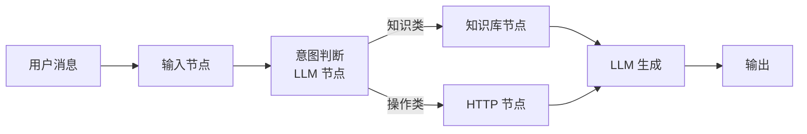

<KeyIdea>
**一句话**：Dify（开源）和 Coze（字节出品，云端为主）是把 **RAG、Workflow、Tools、Agent** 全部图形化的 AI 应用平台。**业务/产品/运营**也能拖拖拽拽搭出能用的智能体 —— 不必每行代码都让工程师写。
</KeyIdea>

## 是什么

进入它们的 Web 界面后你看到：

- **左侧**：节点库（LLM 节点、知识库节点、HTTP 节点、判断节点、变量节点）
- **中间**：画布，把节点拖出来连线
- **右侧**：调试面板，输入示例、看每个节点输出
- **顶部**：发布按钮 → 一键变成 API / 嵌入式 widget / 微信 bot

```
[输入] → [意图分类] → [知识库检索] → [LLM 生成] → [输出]
                ↘ [HTTP 调订单 API] ↗
```

整条链路**不用写代码**。

## 打个比方

<Analogy>
- LangGraph = **写代码连乐高** —— 灵活但要懂代码。  
- Dify / Coze = **乐高 LEGO® Friends 主题套装** —— 包装好、说明书在盒子上、所有零件兼容。**不是所有人都需要去车间组装**。
</Analogy>

## 关键概念

<Terms items={[
  { term: "App / Agent / Workflow", en: "三种应用类型", def: "App = 单 prompt 聊天；Agent = 自带工具循环；Workflow = 自由画图。" },
  { term: "Knowledge", en: "知识库", def: "上传文档自动切分 + embedding + 向量库。RAG 一站式。" },
  { term: "Tools / Plugins", en: "工具市场", def: "几百个内置插件：搜索、画图、代码、HTTP、API 调用…" },
  { term: "Variables / Branches", en: "变量与分支", def: "节点输出可以引用、画布支持条件分支与循环。" },
  { term: "Self-host vs Cloud", en: "自部署 vs 云", def: "Dify 完全开源可自部；Coze 主要 SaaS。" },
]} />

## 主流选型

| 平台 | 部署 | 适合 | 特色 |
|---|---|---|---|
| **Dify** | 自部署 / SaaS | 团队 + 数据敏感场景 | 开源、Workflow 强、企业级 |
| **Coze（中国 / 国际）** | SaaS | 中国生态 / 抖音号 / 飞书 bot | 模型 + 渠道一体化 |
| **n8n + AI nodes** | 自部署 | 已经在用 n8n 自动化 | 通用自动化 + AI |
| **Flowise / LangFlow** | 自部署 | 想要 LangChain 的可视化 | 直接画 LangChain |

## 怎么工作



可视化平台**底层就是 Workflow + Agent + RAG** —— 只是把 LangGraph 之类的代码包装成图。

## 实操要点

- **业务 / 运营首选可视化**：能让产品经理自己改 prompt、加节点，**比让他们提工单等开发上线快十倍**。
- **复杂业务还是混合栈**：核心后端用 LangGraph 写，**对业务暴露 Dify 这层做编排** —— 取两边的好处。
- **Dify 自部署适合 to B**：客户数据不出他们机房；社区版功能基本够用。
- **Coze 走「全家桶」打法**：模型、插件、发布渠道（抖音 / 飞书 / Telegram）都打通，**「**只想做 bot 不想懂技术**」选它最快**。
- **能导出 Workflow JSON 就导出**：方便版本控制、跨环境迁移、灾难备份。

## 易混点

<Compare
  leftTitle="可视化平台"
  rightTitle="代码框架"
  left={<>
    **拖拽 + 配置**。<br />
    业务 / 产品也能改。
  </>}
  right={<>
    **写代码**。<br />
    工程师才能改，但极度灵活。
  </>}
/>

<Compare
  leftTitle="Dify / Coze"
  rightTitle="ChatGPT GPTs"
  left={<>
    通用平台 —— 多模型 + 多渠道 + 自部署。
  </>}
  right={<>
    OpenAI 内嵌 —— 只在 ChatGPT 里跑。<br />
    分发广，扩展性弱。
  </>}
/>

## 延伸阅读

- [Workflow](/ai/beginner/workflow) —— 平台底层就是它
- [Skills](/ai/beginner/skills) / [Function Calling](/ai/beginner/function-calling) —— 平台「插件」的底层
- [LangGraph](/ai/ecosystem/langgraph) —— 同样思路的代码版
- 官网：[dify.ai](https://dify.ai) / [coze.com](https://www.coze.com)
