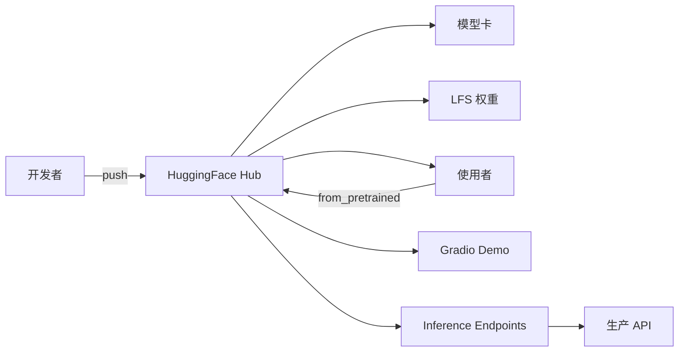

<KeyIdea>
**一句话**：HuggingFace（HF）是开源 AI 的**总仓库 + 应用商店**。模型、数据集、Spaces（在线 Demo）、Transformers / Datasets / PEFT / TRL / Accelerate 等全套库 —— 半数开源 LLM 工作绕不开它。
</KeyIdea>

## 主要部分

<KV items={[
  { k: "Hub（模型 + 数据集 + Spaces）", v: "huggingface.co —— 像 GitHub 一样有 PR / discussion / 模型卡。" },
  { k: "transformers", v: "Python 库，统一加载几乎所有模型架构（PyTorch / TF / Flax）。" },
  { k: "datasets", v: "标准化数据集加载、流式、版本管理。" },
  { k: "tokenizers", v: "Rust 实现的高速分词，BPE / Unigram / WordPiece。" },
  { k: "accelerate", v: "把单卡训练代码无痛扩到多卡 / 多机 / DeepSpeed / FSDP。" },
  { k: "peft", v: "LoRA / Adapter / Prefix Tuning 标准实现。" },
  { k: "trl", v: "SFT / DPO / RLHF 训练框架。" },
  { k: "evaluate", v: "评测指标统一 API（BLEU / ROUGE / HumanEval / pass@k）。" },
  { k: "Inference Endpoints / TGI", v: "把 Hub 模型一键变成生产 API。" },
]} />

## 打个比方

<Analogy>
GitHub 是**代码的家**；HuggingFace 是**模型的家**。Git push 模型 / 数据集 / Demo，社区 fork、PR、留言 —— 整个开源 AI 在这转。
</Analogy>

## 三行起飞

```python
from transformers import AutoModelForCausalLM, AutoTokenizer

mid = "Qwen/Qwen2.5-7B-Instruct"
tok = AutoTokenizer.from_pretrained(mid)
mdl = AutoModelForCausalLM.from_pretrained(mid, torch_dtype="bfloat16", device_map="auto")

prompt = tok.apply_chat_template([{"role":"user","content":"Hi"}], tokenize=False, add_generation_prompt=True)
inputs = tok(prompt, return_tensors="pt").to(mdl.device)
print(tok.decode(mdl.generate(**inputs, max_new_tokens=128)[0], skip_special_tokens=True))
```

或装个 LoRA：

```python
from peft import LoraConfig, get_peft_model
mdl = get_peft_model(mdl, LoraConfig(r=8, lora_alpha=16, target_modules=["q_proj","v_proj"]))
```

## 关键概念

<Terms items={[
  { term: "Model Card", en: "模型卡", def: "README.md + 自动元数据：架构、参数、license、benchmark。" },
  { term: "Repos with LFS", en: "大文件存储", def: "权重通过 LFS 存；clone 大模型用 git lfs install + 下载方式选择。" },
  { term: "Tokenizer Templates", en: "对话模板", def: "`apply_chat_template` 处理不同模型的 system/user/assistant 格式差异。" },
  { term: "Spaces", en: "在线 Demo", def: "Gradio / Streamlit / Static App，免费 / 付费 GPU 一键部署。" },
  { term: "Datasets streaming", en: "流式数据集", def: "TB 级数据无需下载，按 batch 流式读取。" },
  { term: "License", en: "许可", def: "Apache 2 / MIT / 自定义（Llama / Gemma / Qwen / DeepSeek 各家自定）—— **生产前看清**。" },
]} />

## 怎么工作



## 实操要点

- **`huggingface-cli login`**：先登 token，私有模型 / 评测榜需要。
- **`HF_HUB_OFFLINE=1`**：内网部署关掉自动联网检查。
- **镜像加速（国内）**：`HF_ENDPOINT=https://hf-mirror.com`，环境变量切到镜像。
- **模型选型**：先看 model card 的 benchmark + 社区评论，挑下载量 / star 多的做基线。
- **训练新手路径**：transformers + Trainer → accelerate 上多卡 → trl 的 SFTTrainer/DPOTrainer 接对齐。
- **license 务必读**：商用 / 衍生 / 分发条款各家差异大，部分（Llama 早期、某些垂直模型）**严禁商用**。
- **Spaces 灰度**：自家功能想给用户体验先放 Spaces 上不烧服务器。

## 易混点

<Compare
  leftTitle="HuggingFace Hub"
  rightTitle="ModelScope / 魔搭"
  left={<>
    全球开源 AI 中心。<br />
    国内直连慢。
  </>}
  right={<>
    阿里支持，国内访问快。<br />
    很多 HF 模型已镜像。
  </>}
/>

## 延伸阅读

- [LoRA](/ai/advanced/lora)
- [SFT](/ai/advanced/sft)
- [vLLM](/ai/ecosystem/vllm)
