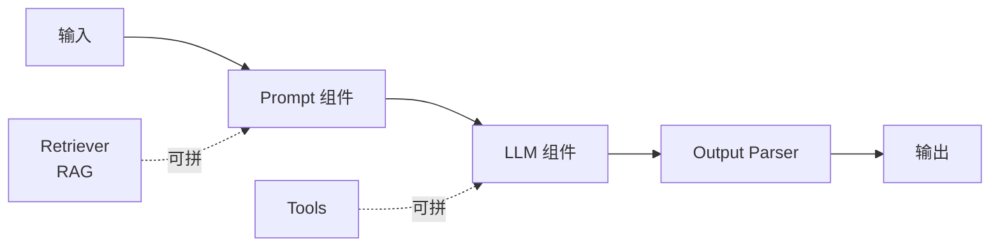

<KeyIdea>
**一句话**：LangChain 是用得最广的 **LLM 应用开发框架**。它把「调模型、调工具、做 RAG、串多步流程、跑 Agent」这些经常重复写的样板代码**抽象成统一接口**，让你**少写胶水多写业务**。Python 和 JS/TS 都有官方支持。
</KeyIdea>

## 是什么

没有框架时你要自己写：HTTP 调 OpenAI、解析回复、调向量库、拼 prompt、再调 OpenAI、再 parse……每个项目都重写一遍。

LangChain 把这些封装成可组合的「**组件**」：

```python
# Python LCEL 写法
from langchain_openai import ChatOpenAI
from langchain_core.prompts import ChatPromptTemplate

prompt = ChatPromptTemplate.from_template("用一句话解释：{topic}")
llm = ChatOpenAI(model="gpt-4o-mini")
chain = prompt | llm   # 用 | 串起来

chain.invoke({"topic": "RAG"})
```

`prompt | llm` 这种「**LCEL 表达式**」是 LangChain 现在的核心抽象 —— 任何组件都能这样串起来。

## 打个比方

<Analogy>
LangChain 像 Web 开发里的 **Express / FastAPI**：  
- 没框架你也能写 HTTP 服务，但每次都要造路由、解析、中间件。  
- 框架替你处理掉这些，**让你专注业务逻辑**。
</Analogy>

## 关键概念

<Terms items={[
  { term: "LCEL", en: "LangChain 表达式", def: "用 | 串组件，自动支持 streaming / batch / async / 异常重试。" },
  { term: "Runnable", en: "可执行单元", def: "LangChain 一切组件的统一接口 —— 任何 Runnable 都能 invoke / stream。" },
  { term: "Loaders / Splitters / Retrievers", en: "数据组件", def: "RAG 链路里的「读文件 / 切分块 / 检索」三件套。" },
  { term: "Tools", en: "工具", def: "把 Python 函数 / API 包装成 Function Calling tool 的标准。" },
  { term: "LangSmith", en: "可观测性平台", def: "官方 SaaS：追踪 trace、看每步 token / 时间 / 错误 —— 调试 LangChain 的最大救命稻草。" },
]} />

## 怎么工作



每个组件都遵循同一接口 —— **混搭组合**就能做出 RAG / Agent / Workflow。

## 实操要点

- **从 LCEL 起步，别用旧 Chain 类**：旧的 `LLMChain` / `RetrievalQA` 已经过时，**新项目一律用 LCEL**。
- **复杂 Agent 转 LangGraph**：LangChain 适合**线性 + 简单分支**；多 Agent / 长循环 / 状态机请直接用 LangGraph。
- **必上 LangSmith**：免费层就够个人开发者用。**有 trace 调 prompt 速度提升 5 倍**。
- **不要锁死生态**：LangChain 的封装非常厚，**你随时能用 OpenAI SDK 自己写**。**别一刀切，按需用**。
- **TS 版本接近功能对等**：langchainjs 适合前端 / Next.js 全栈，**不必非用 Python**。

## 易混点

<Compare
  leftTitle="LangChain"
  rightTitle="LlamaIndex"
  left={<>
    全栈框架 —— 通用 LLM 应用编排。
  </>}
  right={<>
    专注 **RAG / 数据接入**。<br />
    在数据层做得更深，但应用层更轻。
  </>}
/>

<Compare
  leftTitle="LangChain"
  rightTitle="原生 OpenAI SDK"
  left={<>
    抽象高 —— 换模型 / 换 vector db **改一行**。<br />
    学习曲线 + 黑盒。
  </>}
  right={<>
    透明、零依赖。<br />
    每个项目要写更多胶水。
  </>}
/>

## 延伸阅读

- [LlamaIndex](/ai/ecosystem/llamaindex) —— 同生态的 RAG 专精
- [LangGraph](/ai/ecosystem/langgraph) —— 同公司出品，适合 Agent 状态图
- 官网：[python.langchain.com](https://python.langchain.com) / [js.langchain.com](https://js.langchain.com)
