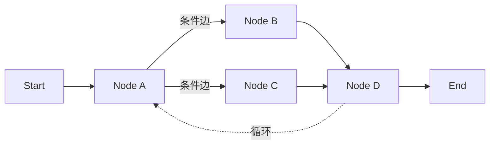

<KeyIdea>
**一句话**：LangGraph 把 Agent 和工作流抽象为「**节点 + 边 + 共享状态**」的有向图。它解决了 LangChain 难以表达的「**循环、分支、人工介入、长任务恢复**」 —— 是当前最受工业界信任的 Agent 编排框架。
</KeyIdea>

## 是什么

最简洁的样子：

```python
from langgraph.graph import StateGraph

def search_node(state):
    return {"docs": vector_db.search(state["query"])}

def answer_node(state):
    return {"answer": llm.invoke(state["query"], state["docs"])}

g = StateGraph(MyState)
g.add_node("search", search_node)
g.add_node("answer", answer_node)
g.add_edge("search", "answer")
g.set_entry_point("search")
app = g.compile()

app.invoke({"query": "Q3 退款政策"})
```

**节点是函数、边是流转**、状态在节点间传递。**复杂 Agent 用条件边 + 循环表达**。

## 打个比方

<Analogy>
- LangChain 的 `prompt | llm` = **直管子**，水从一头流到另一头。  
- LangGraph = **可循环的水电图** —— 有阀门（条件边）、有泵（循环）、有水箱（状态）、有人工开关（interrupt）。  
**真实业务**几乎都需要这种灵活度。
</Analogy>

## 关键概念

<Terms items={[
  { term: "Node", en: "节点", def: "一个普通 Python 函数，接收 state 返回 partial state。" },
  { term: "Edge / Conditional Edge", en: "边 / 条件边", def: "决定下一个节点。条件边可以根据 state 路由。" },
  { term: "State", en: "状态", def: "节点之间传递的 dict，可定义 reducer 决定字段如何合并。" },
  { term: "Checkpointer", en: "检查点", def: "把状态持久化到 SQLite / Postgres / Redis —— 长任务可中断、可恢复、可重放。" },
  { term: "Interrupt", en: "人工介入", def: "运行到某节点时停下，等人审批后继续 —— Human-in-the-loop 的标准方式。" },
]} />

## 怎么工作



整个图就是一段确定性的代码 —— **可以画图、可以调试、可以单元测试**。

## 实操要点

- **复杂 Agent 直接用 LangGraph，不要再用 LangChain Agent**：`AgentExecutor` 老 API 已经不再推荐。
- **Checkpointer 是杀手锏**：长任务（数据迁移、Multi-Agent 编程） **可恢复 + 时间旅行**调试，比手写状态机省一大堆代码。
- **interrupt 替代「自己写审批逻辑」**：关键节点（下单、发邮件）用 interrupt 等用户审批 —— **最干净的人工兜底**。
- **state 字段要细**：每个 reducer（appendable list / overwrite / merge）想清楚 —— **Agent 异常多半源于 state 的合并方式**。
- **配 LangSmith 一起用**：trace 把每条边、每个状态都记下来，**调 Agent 没这个简直没法过日子**。

## 易混点

<Compare
  leftTitle="LangGraph"
  rightTitle="LangChain"
  left={<>
    **图结构** —— 循环、分支、状态、人工介入都直接表达。<br />
    Agent / 长流程首选。
  </>}
  right={<>
    **直链结构 (LCEL)** —— 简单线性最舒服。<br />
    短链 RAG / 单轮调用首选。
  </>}
/>

<Compare
  leftTitle="LangGraph"
  rightTitle="Workflow GUI (Dify / Coze)"
  left={<>
    **代码定义图** —— 灵活、可 review、可 diff。
  </>}
  right={<>
    **拖拽定义图** —— 适合产品 / 业务人员。<br />
    工程化 / 复杂逻辑受限。
  </>}
/>

## 延伸阅读

- [Agent](/ai/beginner/agent) / [Workflow](/ai/beginner/workflow) —— LangGraph 既覆盖了
- [Multi-Agent](/ai/beginner/multi-agent) —— LangGraph 的拿手戏
- [LangChain](/ai/ecosystem/langchain) —— 同一家公司，互补使用
- 官网：[langchain-ai.github.io/langgraph](https://langchain-ai.github.io/langgraph)
