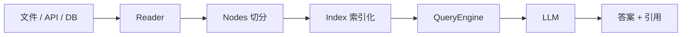

<KeyIdea>
**一句话**：LlamaIndex 把「**怎么把你公司的数据接进 LLM**」做成专精：从读文件、切分、做索引、做检索、到把检索结果喂模型 —— **整条 RAG 链路**它都给你抽好了。如果你的核心是「**让 AI 懂我的资料**」，它通常比 LangChain 上手更快。
</KeyIdea>

## 是什么

最经典的几行：

```python
from llama_index.core import VectorStoreIndex, SimpleDirectoryReader

# 读取目录里的文件
docs = SimpleDirectoryReader("./my_docs").load_data()

# 一行建索引（embedding + 向量库）
index = VectorStoreIndex.from_documents(docs)

# 一行问答
query_engine = index.as_query_engine()
print(query_engine.query("我们 Q3 的退款政策？"))
```

它的核心抽象是 **Index**（索引）和 **QueryEngine**（查询引擎） —— **不像 LangChain 那么通用，但 RAG 链路更顺手**。

## 打个比方

<Analogy>
- LangChain = **乐高总店** —— 各种零件都有，能拼万物。  
- LlamaIndex = **「家具拼装套餐」** —— 专门拼 RAG 这把椅子，**说明书更短、拼出来更稳**。
</Analogy>

## 关键概念

<Terms items={[
  { term: "Reader / Loader", en: "数据加载器", def: "几百种连接器：PDF / Notion / Slack / GitHub / SQL / 网页…" },
  { term: "Index", en: "索引", def: "向量索引 / 摘要索引 / 知识图索引 —— 不止于向量。" },
  { term: "QueryEngine", en: "查询引擎", def: "封装好「检索 + rerank + 生成」的入口。" },
  { term: "Node", en: "节点 (chunk)", def: "切分后的最小单位，附带元数据，便于过滤 / 引用。" },
  { term: "Workflow", en: "工作流", def: "新版本里加入了类似 LangGraph 的 Agent / 状态机能力。" },
]} />

## 怎么工作



它把整个 RAG 流程封装成「**插件式接管**」 —— 你只需选 Reader / Index / Engine，**少写胶水**。

## 实操要点

- **核心是 RAG 就用它**：客服知识库、企业私有问答、文档 QA —— **几小时就能拼出可用 demo**。
- **Reader 是宝藏**：Notion / Confluence / Jira / GitHub 都有官方读取器，**比自己 scrape 快得多**。
- **不只是向量索引**：长文档先做「Summary Index」，再下钻到具体节点 —— **比纯向量召回准很多**。
- **生产用 `IngestionPipeline`**：把「读 → 切 → embed → 写库」做成增量 pipeline，**新增文档不重建**。
- **复杂 Agent 仍推荐 LangGraph**：LlamaIndex 的 Workflow 还在追赶。

## 易混点

<Compare
  leftTitle="LlamaIndex"
  rightTitle="LangChain"
  left={<>
    专注 **RAG / 数据**。<br />
    上手快、约束更强。
  </>}
  right={<>
    通用编排 —— 流程、Agent、Tools 都覆盖。
  </>}
/>

<Compare
  leftTitle="LlamaIndex"
  rightTitle="自己写 RAG"
  left={<>
    几行代码出 demo。<br />
    适合中等规模知识库。
  </>}
  right={<>
    完全可控，能上各种花式优化。<br />
    极致大规模场景往往要这条路。
  </>}
/>

## 延伸阅读

- [RAG](/ai/beginner/rag) —— 它的核心使命
- [Embeddings](/ai/beginner/embeddings) / [Vector Database](/ai/beginner/vector-db) —— 内部依赖
- [LangChain](/ai/ecosystem/langchain) —— 通用框架对比
- 官网：[llamaindex.ai](https://www.llamaindex.ai)
