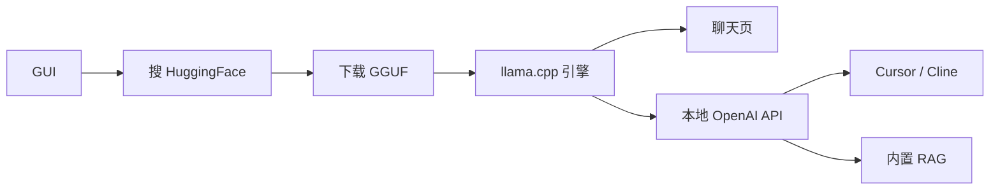

<KeyIdea>
**一句话**：LM Studio 是跨平台桌面 App，把「**搜模型 → 下载 → 调 GPU → 聊天 / 起 API**」做成图形界面。背后还是 llama.cpp，**对不想敲命令的人最友好**。
</KeyIdea>

## 主要能力

<KV items={[
  { k: "模型库", v: "内置搜索 HuggingFace GGUF；按显存 / RAM 自动推荐。" },
  { k: "聊天 UI", v: "多 session、system prompt、参数旋钮、长上下文。" },
  { k: "本地服务器", v: "一键起 OpenAI 兼容 API（http://localhost:1234）。" },
  { k: "RAG", v: "上传文档自动 chunk + embed + 检索。" },
  { k: "结构化输出", v: "原生 JSON / GBNF 语法约束，强 function calling。" },
  { k: "本地 SDK", v: "lmstudio-python / lmstudio-js 客户端封装。" },
]} />

## 打个比方

<Analogy>
Ollama 是**装 Linux 的极客**喜欢的方式；LM Studio 是**装 macOS 的设计师**也能直接用 LLM 的方式。功能差不多，**面向人群不同**。
</Analogy>

## 关键概念

<Terms items={[
  { term: "GGUF 量化", en: "Q4_K_M / Q5_K / Q8_0", def: "在模型卡右上角自动给「能不能跑」的颜色提示。" },
  { term: "Server", en: "本地 API 服务", def: "Developer 标签里一键开启，API key 可填任意值。" },
  { term: "Hardware Detection", en: "硬件识别", def: "自动用 Metal (mac) / CUDA / Vulkan / ROCm。" },
  { term: "Multi-model", en: "多模型并存", def: "可同时载入多个模型，根据请求路由。" },
  { term: "Prompt Templates", en: "对话模板", def: "ChatML / Llama / Qwen 等内置；导入新模型时自动选。" },
]} />

## 怎么工作

## 实操要点

- **不会调参**：默认参数对常见对话场景已经够用；调温度 / Top-P 直接拖滑块。
- **API 当 OpenAI 用**：`OPENAI_API_BASE=http://localhost:1234/v1 OPENAI_API_KEY=lm-studio` 即可。
- **macOS Metal 性能很强**：M3 Max 跑 70B Q4 也不算慢。
- **想长期跑后台**：开启 `Headless` 模式 / 用 `lms server start` CLI；GUI 关了 API 还在。
- **RAG 局限**：内置 RAG 是「**轻量级**」，企业级场景仍建议接专业向量库 + LangChain / LlamaIndex。
- **离线场景友好**：模型下载完整离线可用 —— 隐私 / 涉密场景的合规之选。

## 易混点

<Compare
  leftTitle="LM Studio"
  rightTitle="Ollama"
  left={<>
    GUI + 一键 API。 
    桌面用户友好。
  </>}
  right={<>
    CLI + 守护进程。 
    脚本 / 工具集成顺手。
  </>}
/>

## 延伸阅读

- [Ollama](/ai/ecosystem/ollama)
- [Local Inference](/ai/advanced/local-inference)
- [Quantization](/ai/advanced/quantization)
