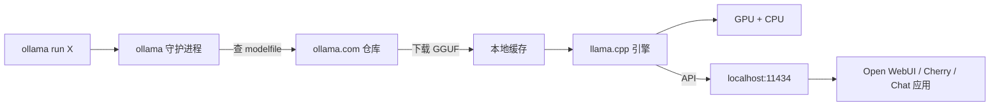

<KeyIdea>
**一句话**：Ollama 把 llama.cpp 包成「**像 Docker 一样**」的 CLI，**`ollama run llama3.2`** 一行就跑起来。自动量化下载、API 服务、模型库 —— 个人 / 本地开发不用碰 GPU 配置。
</KeyIdea>

## 速查

```bash
# 装：mac/linux 一行；windows 有 installer
curl -fsSL https://ollama.com/install.sh | sh

# 跑
ollama run qwen2.5:7b
ollama run llama3.2
ollama run deepseek-r1:8b

# 列 / 删
ollama list
ollama rm qwen2.5:7b

# 暴露 API（默认 http://localhost:11434）
ollama serve
```

API 兼容 OpenAI v1（带 `OLLAMA_HOST=0.0.0.0:11434` + `/v1/chat/completions`），主流前端 / 工具都直连。

## 打个比方

<Analogy>
原来本地跑 LLM 像**自己装显卡 + 编译 CUDA + 找 GGUF 量化**：能跑但门槛高。  
Ollama 像**App Store**：搜模型 → 一键安装 → 立即用。
</Analogy>

## 关键概念

<Terms items={[
  { term: "Modelfile", en: "模型描述", def: "类似 Dockerfile：FROM 基模型 + SYSTEM 指令 + PARAMETER 调温度。" },
  { term: "Tag", en: "版本", def: "qwen2.5:7b、qwen2.5:14b-instruct-q4_0；冒号后是大小 / 量化 / 变体。" },
  { term: "GGUF", en: "量化格式", def: "llama.cpp 的高效推理格式，支持 q4 / q5 / q8 / fp16。" },
  { term: "GPU offload", en: "GPU 卸载", def: "OLLAMA_NUM_GPU 设几层放 GPU；剩下放内存。" },
  { term: "Context Length", en: "上下文长度", def: "`PARAMETER num_ctx 32768`；超过原模型上下文需要 RoPE 外推。" },
  { term: "Embeddings", en: "向量", def: "也支持 `ollama embed` 做本地向量。" },
]} />

## 怎么工作



## 实操要点

- **挑模型**：mac M 系列 16GB 跑 7-8B Q4 流畅；32GB 上 14B；70B 需要 64GB+ 或量化更狠。
- **自定义 system prompt**：`Modelfile` 里 `SYSTEM "..."` + `PARAMETER temperature 0.4`，`ollama create my-llama -f Modelfile`。
- **API 默认仅 localhost**：要给同网段机器用，`OLLAMA_HOST=0.0.0.0:11434 ollama serve` 并配防火墙。
- **GPU 没用上**：`ollama ps` 看 GPU offload 行；nvidia-smi / Activity Monitor 配合查。
- **接 Cherry Studio / LobeChat / Open WebUI**：当 OpenAI 兼容 endpoint 即可。
- **嵌入向量**：`ollama embed -m nomic-embed-text "句子"`，本地 RAG 不再需要在线 embedding API。
- **生产替代**：高并发请用 vLLM / TGI；Ollama 更适合单用户 / 个人 / 边缘。

## 易混点

<Compare
  leftTitle="Ollama"
  rightTitle="LM Studio"
  left={<>
    CLI + 后台服务。<br />
    可被前端 / 工具直接调用。
  </>}
  right={<>
    桌面 GUI。<br />
    适合纯交互式使用。
  </>}
/>

## 延伸阅读

- [LM Studio](/ai/ecosystem/lm-studio)
- [Local Inference](/ai/advanced/local-inference)
- [Quantization](/ai/advanced/quantization)
