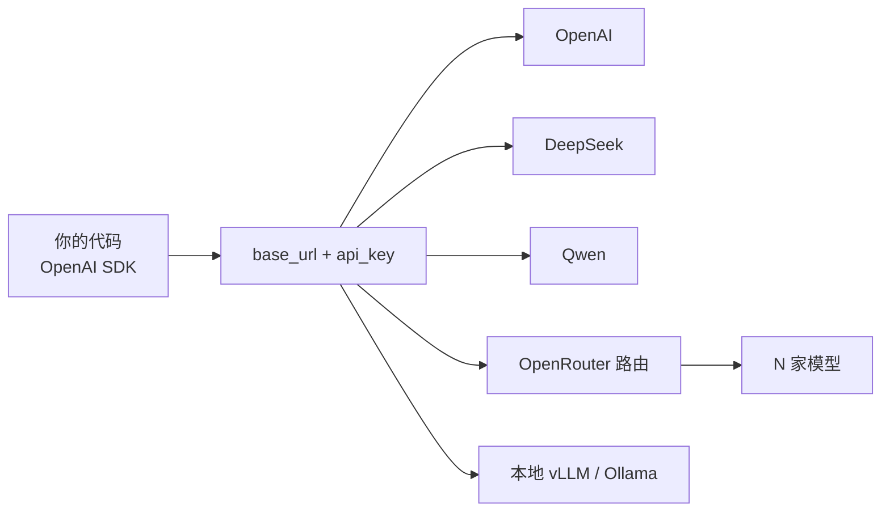

<KeyIdea>
**一句话**：OpenAI 的 `/v1/chat/completions` 已经成为 LLM API **事实标准**。DeepSeek / Qwen / GLM / 月之暗面 / 硅基流动 / Together / OpenRouter / vLLM / Ollama / LM Studio —— **几乎人人兼容**。一份代码切换提供商就改 `base_url` 和 `api_key`。
</KeyIdea>

## 是什么

```python
from openai import OpenAI

# 任意一家
client = OpenAI(
    base_url="https://api.deepseek.com/v1",   # 换 url 就换厂
    api_key="sk-xxx",
)

resp = client.chat.completions.create(
    model="deepseek-chat",
    messages=[{"role": "user", "content": "hello"}],
    stream=True,
)
for chunk in resp:
    print(chunk.choices[0].delta.content or "", end="")
```

## 打个比方

<Analogy>
就像 USB 接口：手机 / 鼠标 / 摄像头**形态各不同**，但都做成 USB —— 你换设备只需要插上线。OpenAI API 就是**LLM 行业的 USB**。
</Analogy>

## 主要兼容方

<KV items={[
  { k: "原版 OpenAI", v: "https://api.openai.com/v1 —— gpt-4o, o-系列, gpt-5。" },
  { k: "Anthropic", v: "https://api.anthropic.com 不完全一样（独立协议），但官方 SDK 体验类似。" },
  { k: "DeepSeek", v: "https://api.deepseek.com —— deepseek-chat / deepseek-reasoner。便宜且强。" },
  { k: "Qwen / 通义", v: "https://dashscope.aliyuncs.com/compatible-mode/v1 —— qwen-max / qwen-plus / qwen3。" },
  { k: "智谱 GLM", v: "https://open.bigmodel.cn/api/paas/v4 —— glm-4.6, glm-4.5-air。" },
  { k: "月之暗面 Kimi", v: "https://api.moonshot.cn/v1 —— moonshot-v1-32k 等。" },
  { k: "OpenRouter", v: "https://openrouter.ai/api/v1 —— 同一个 endpoint 调几十家厂模型。" },
  { k: "硅基流动 / Together / Fireworks / Groq", v: "聚合开源模型，按 token 计费。" },
  { k: "本地", v: "vLLM / Ollama / LM Studio / Llama.cpp server / Mistral.rs —— 全部 OpenAI 兼容。" },
]} />

## 怎么工作



## 关键差异

虽然兼容，但每家细节有微妙不同：

- **`tools` 工具调用**：OpenAI 标准 / Anthropic 不同 schema；DeepSeek、Qwen 大体兼容 OpenAI。
- **结构化输出**：`response_format: { type: "json_schema" }` 各家支持度不同。
- **流式 chunk**：DeepSeek-R1 等推理模型在 `delta.reasoning_content` 里输出思考过程。
- **多模态**：OpenAI 用 `image_url`，Qwen 用 `image_url` 也支持，但有些厂用自家私有 schema。
- **Token / 上下文**：每家对最大 input/output 长度有差。

## 实操要点

- **代码层抽出 `LLM_PROVIDER`** + `BASE_URL` 配置：换厂只动 env。
- **不要写死 model 名**：production 用 alias / wrapper（你的层叫 `chat-fast`，下面映射到具体模型）。
- **限流 / 重试 / 退避**：每家速率不同，统一在 client 层处理；OpenRouter 提供回退路由。
- **成本对比**：DeepSeek-V3 / GLM 系列 / Qwen 主流模型，**比 OpenAI 同档便宜 5-20 倍**。开发用 OpenAI，生产可考虑国内或开源托管。
- **数据合规**：国内 / 境外、数据驻留区域、是否被用于训练 —— 都看条款。
- **流式断线**：网络抖动时 SSE 流会断，client 端要重试 + idempotency。

## 易混点

<Compare
  leftTitle="OpenAI 兼容 API"
  rightTitle="OpenAI 官方功能"
  left={<>
    `chat.completions` 等基本接口。<br />
    各家都努力对齐。
  </>}
  right={<>
    Realtime API、Assistants、Files、Fine-tune、batch。<br />
    多数第三方不实现 / 实现部分。
  </>}
/>

## 延伸阅读

- [国产 API（DeepSeek / Qwen / GLM）](/ai/ecosystem/cn-api-providers)
- [OpenRouter / 模型聚合](/ai/ecosystem/openrouter)
- [Function Calling](/ai/beginner/function-calling)
