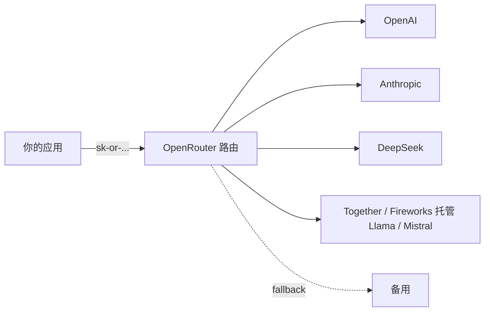

<KeyIdea>
**一句话**：OpenRouter 是**LLM 的批发市场** —— 接 OpenAI / Anthropic / Google / Meta / DeepSeek / Mistral / 多家开源托管，同一个 OpenAI 兼容 endpoint。**省钱 + 多备份 + 横向比价**一站到位。
</KeyIdea>

## 是什么

```python
from openai import OpenAI

c = OpenAI(
    base_url="https://openrouter.ai/api/v1",
    api_key="sk-or-...",
)

# 直接指定模型
c.chat.completions.create(model="anthropic/claude-3.5-sonnet", messages=[...])
c.chat.completions.create(model="deepseek/deepseek-chat",     messages=[...])
c.chat.completions.create(model="meta-llama/llama-3.1-70b-instruct", messages=[...])
```

模型名格式：`vendor/model-id`。

## 打个比方

<Analogy>
直接接每家 API 像**一家家开会员卡**：N 家就 N 张卡 + N 套额度。  
OpenRouter 像**一卡通** —— 一张卡刷遍所有商户，账单合并。
</Analogy>

## 关键能力

<Terms items={[
  { term: "统一计费", en: "Unified Billing", def: "所有模型走 OpenRouter 余额，**一份发票**。" },
  { term: "自动路由 / 回退", en: "Routing / Fallback", def: "models 数组多个候选，主模型挂自动切下一家。" },
  { term: "比价透明", en: "Per-Model Pricing", def: "/models 接口实时返回每个模型的输入 / 输出价格。" },
  { term: "Provider Preference", en: "供应商选择", def: "同一开源模型有多家托管（Together / Fireworks / Lepton），可指定偏好。" },
  { term: "Stream / Tools / Vision", en: "功能透传", def: "原家有的功能多数透传可用。" },
  { term: "App 标识", en: "HTTP-Referer / X-Title", def: "OpenRouter 用这两个头识别请求来源应用。" },
]} />

## 怎么工作



OpenRouter 在中间做**鉴权 / 计费 / 路由 / 配额**。

## 实操要点

- **多模型回退**：

  ```json
  {
    "models": [
      "anthropic/claude-3.5-sonnet",
      "openai/gpt-4o",
      "deepseek/deepseek-chat"
    ]
  }
  ```

  顺序 fallback。前一家 5xx / 限流自动切。

- **追踪指标**：OpenRouter Dashboard 直接看每个模型的成功率 / 延迟 / 花费。
- **数据条款**：每家 provider 上传请求会不会被训练，OpenRouter 在模型卡上写得很清楚 —— 敏感数据选 `--data-policy strict`。
- **Streaming 行为**：每家具体差异（reasoning content / tool deltas）OpenRouter 会做适配但不是 100%；接受 `metadata` 字段查看实际后端。
- **限流**：OpenRouter 自身有总量限流，再叠加 provider 限流。**注意**短时间高并发要分散。
- **国内访问**：直连 OpenRouter 国内可能慢；通过自建代理 + Cloudflare Tunnel 是常用方案。

## 易混点

<Compare
  leftTitle="OpenRouter（聚合）"
  rightTitle="LiteLLM（本地代理）"
  left={<>
    SaaS，统一计费。<br />
    省事但所有调用经过他。
  </>}
  right={<>
    本地跑的 OpenAI 兼容 proxy。<br />
    数据不经第三方，但要自己接每家 key。
  </>}
/>

## 延伸阅读

- [OpenAI 兼容 API](/ai/ecosystem/openai-compatible)
- [国产 API 提供商](/ai/ecosystem/cn-api-providers)
- [vLLM](/ai/ecosystem/vllm)
