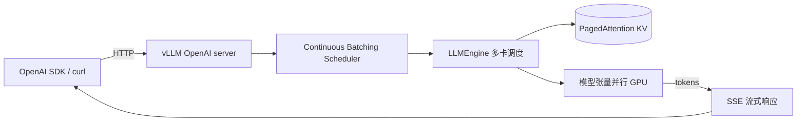

<KeyIdea>
**一句话**：vLLM 是面向 GPU 的高吞吐 LLM 推理引擎。**PagedAttention** 让 KV cache 像内存分页一样省、**Continuous Batching** 让吞吐拉满。生产部署 OpenAI 兼容 API 的首选。
</KeyIdea>

## 一行起服务

```bash
pip install vllm

# 单卡 7B
python -m vllm.entrypoints.openai.api_server \
  --model Qwen/Qwen2.5-7B-Instruct \
  --port 8000

# 多卡张量并行
... --tensor-parallel-size 2

# 量化
... --quantization awq
```

API 完全兼容 OpenAI（`/v1/chat/completions` / `/v1/completions` / `/v1/models`），`openai` SDK 改 `base_url` 就能用。

## 打个比方

<Analogy>
HuggingFace `transformers` 自带的 `generate()` 像**家用打印机**：可以打，量大了排队。  
vLLM 像**印刷厂**：分版、合批、流水线，一小时印一万张不抖。
</Analogy>

## 关键概念

<Terms items={[
  { term: "PagedAttention", en: "分页 KV", def: "KV cache 切 16-token 等大 block，按需分配 → 几乎零碎片。" },
  { term: "Continuous Batching", en: "持续合批", def: "新请求中途也能加入正在跑的 batch，吞吐 vs vanilla 5-20 倍。" },
  { term: "Tensor Parallel", en: "张量并行", def: "把每层切到多卡。--tp 2/4/8。多卡同 NUMA / NVLink 时效果最好。" },
  { term: "Pipeline Parallel", en: "流水并行", def: "把不同层放不同卡，大模型多机时用。" },
  { term: "AWQ / GPTQ / FP8", en: "量化", def: "vLLM 支持多种量化格式直接加载。" },
  { term: "Prefix Cache", en: "前缀缓存", def: "system prompt 等共享前缀只算一次。--enable-prefix-caching。" },
  { term: "Speculative Decoding", en: "投机解码", def: "vLLM 内置 draft model / Medusa 支持。" },
  { term: "LoRA Adapter", en: "LoRA 切换", def: "运行时加载多个 LoRA，按请求路由。" },
]} />

## 怎么工作



## 实操要点

- **`--max-model-len`**：根据显存容量调；默认按模型最大上下文，会 OOM。
- **`--gpu-memory-utilization`**：默认 0.9，留 10% 给系统。多模型共卡可降到 0.45。
- **量化选型**：AWQ 通常质量最好；GPTQ 兼容性最广；FP8 仅 H100/H200 等支持。
- **多 LoRA 一键切换**：`--enable-lora --lora-modules name1=path1 name2=path2`，按请求 `model: name1` 选不同 adapter。
- **Speculative Decoding**：搭配 draft 模型 `--speculative-model`，常见加速 1.5-2x。
- **K8s 部署**：搭配 KubeRay 或 LWS（LeaderWorkerSet）做多机张量并行。
- **替代品**：TensorRT-LLM（NVIDIA 生态）/ SGLang（路由更灵活）/ TGI（HuggingFace）/ llama.cpp（CPU）。

## 易混点

<Compare
  leftTitle="vLLM"
  rightTitle="Ollama / llama.cpp"
  left={<>
    GPU 推理服务，**生产高并发**。<br />
    OpenAI 兼容 API。
  </>}
  right={<>
    CPU + GPU 通用，**单机便利**。<br />
    跑得动 70B 但吞吐低。
  </>}
/>

## 延伸阅读

- [Ollama](/ai/ecosystem/ollama)
- [KV Cache](/ai/advanced/kv-cache)
- [Speculative Decoding](/ai/advanced/speculative-decoding)
