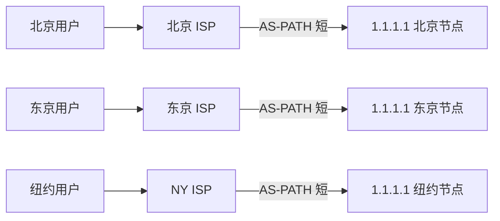

<KeyIdea>
**一句话**：**BGP** 是互联网骨干的路由协议，AS（自治域）之间用它互通。**Anycast** 是「**多个地方宣告同一个 IP**」的玩法 —— 用户的包**自然而然走到最近的节点**。
</KeyIdea>

## 是什么

- **AS（Autonomous System）**：拥有独立路由策略的网络（每个运营商、每个云厂商、大企业都有 AS 号）。
- **BGP**：AS 之间交换「我能到哪些 IP 段」的协议。
- **Anycast**：你在 N 个 AS / N 个城市都对外宣告 `1.1.1.1/32` —— 别人发过来的包**走 BGP 选最优路径**到最近的那个节点。

```
1.1.1.1 在北京、东京、新加坡、伦敦……都被宣告为「我这里有」
路由器看到目的 IP 1.1.1.1 → 选 AS-PATH 最短的路径 → 自然就近
```

## 打个比方

<Analogy>
你在每个城市都开了**同名的咖啡店**（Anycast）。顾客只问「咖啡店在哪」（路由），导航就**自动指他到最近的那家**。
</Analogy>

## 关键概念

<Terms items={[
  { term: "ASN", en: "AS Number", def: "全球唯一的 AS 编号，由 RIR 分配。" },
  { term: "BGP Peering", en: "对等连接", def: "两个 AS 间互换路由信息，可以是 transit（付费上联）或 peering（互惠）。" },
  { term: "AS Path", en: "AS 路径", def: "BGP 路由通告里包含一连串 AS，反映物理走向。" },
  { term: "Looking Glass", en: "查看工具", def: "公开网页让你从某 AS 视角看路由 / ping / traceroute（如 he.net）。" },
  { term: "Anycast", en: "任播", def: "多点宣告同一 IP；与 Unicast（一对一）/ Multicast（一对多）相对。" },
]} />

## 怎么工作



每个边缘 PoP 同时跑相同的服务实例，**BGP 帮你做地理路由**，不需要 GeoDNS。

## 实操要点

- **谁能玩 Anycast**：拥有 ASN + 全球 PoP + 与多家运营商 BGP peering 的玩家（Cloudflare / Google / 阿里等）。
- **小用户用 GeoDNS 就够**：基于解析地按地域返回不同 IP —— 比 Anycast 简单但不如它精准。
- **看 BGP 路由**：公网工具如 [bgp.he.net](https://bgp.he.net) 输入 IP 或 AS 看 peering / 路由。
- **Anycast UDP（DNS）天然适配**：每个 query 独立，路由切换无害。**TCP 在 Anycast 上**则需要保证「**同一连接落到同一节点**」（路由稳定性 + 哈希策略）。
- **BGP 劫持**：恶意 AS 宣告别人的 IP 段，分流真实流量。RPKI 是部分缓解方案。

## 易混点

<Compare
  leftTitle="Anycast"
  rightTitle="GeoDNS"
  left={<>
    **路由层**做地理感知。<br />
    一个 IP 全球可达，自动最近。
  </>}
  right={<>
    **DNS 层**返回不同 IP。<br />
    简单可控，但解析端 IP 不准会偏。
  </>}
/>

## 延伸阅读

- [CDN](/network/advanced/cdn)
- [负载均衡](/network/advanced/load-balancing)
- [DNS](/network/beginner/dns)
