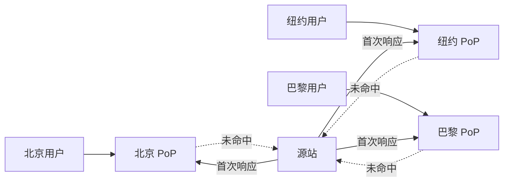

<KeyIdea>
**一句话**：CDN 把静态资源**缓存到全球数百个边缘节点**，用户访问时就近响应。源站只承担「**回源**」流量，承压能力大幅提升，跨洲访问速度也从秒级降到毫秒级。
</KeyIdea>

## 是什么

```
用户 → 离自己最近的边缘节点
        命中缓存 → 直接返回
        未命中  → 回源拉数据 → 缓存 → 返回
```

DNS 在解析域名时把用户引到「**最近的边缘 IP**」，靠的是**Anycast** + **GeoDNS**。

## 打个比方

<Analogy>
源站像**总仓库**，CDN 边缘节点像**遍布全国的便利店**。买热门商品（缓存命中）直接在便利店买；冷门货（未命中）便利店替你去仓库拉，**下次也变成便利店有货**。
</Analogy>

## 关键概念

<Terms items={[
  { term: "Origin", en: "源站", def: "你真正的服务器，CDN 未命中时去这里拉。" },
  { term: "Edge / PoP", en: "边缘节点", def: "全球分布的缓存服务器（Point of Presence）。" },
  { term: "TTL", en: "缓存时长", def: "由响应头 Cache-Control / Expires 决定。" },
  { term: "Cache Key", en: "缓存键", def: "决定哪些请求被视为同一份缓存（默认 URL，可加 query / cookie）。" },
  { term: "Purge", en: "清缓存", def: "强制让 CDN 丢弃旧版本，立即回源。" },
  { term: "Anycast", en: "任播", def: "多个节点宣告同一个 IP，BGP 把用户路由到最近的节点。" },
]} />

## 怎么工作



源站永远只看到 N 次回源，承压上百倍 / 上千倍流量。

## 实操要点

- **设置正确的 Cache-Control**：

  ```
  Cache-Control: public, max-age=31536000, immutable    # 静态资源
  Cache-Control: no-store                               # 用户私有数据
  Cache-Control: public, max-age=60, s-maxage=600       # 页面：浏览器 1min，CDN 10min
  ```

- **用版本化文件名**（`/app.abc123.js`）：发版直接换 hash，CDN 自然换缓存。
- **Vary 头别滥用**：`Vary: Cookie` 会按 cookie 拆分缓存，**命中率暴跌**。
- **HTTPS 必走 CDN**：把回源也设成 HTTPS（不要用「灵活 SSL」之类的明文回源模式）。
- **Edge Compute**：Cloudflare Workers / AWS Lambda@Edge，可以在边缘**改请求 / 响应**而不必回源。

## 易混点

<Compare
  leftTitle="CDN"
  rightTitle="反向代理 (nginx)"
  left={<>
    全球**多个**节点。<br />
    主要为缓存 + 加速 + 抗压。
  </>}
  right={<>
    通常**单个**前置代理。<br />
    主要为路由 / 鉴权 / 灰度 / TLS 终止。
  </>}
/>

## 延伸阅读

- [负载均衡](/network/advanced/load-balancing)
- [Anycast 与 BGP](/network/advanced/anycast-bgp)
- [Cloudflare](/network/ecosystem/cloudflare)
