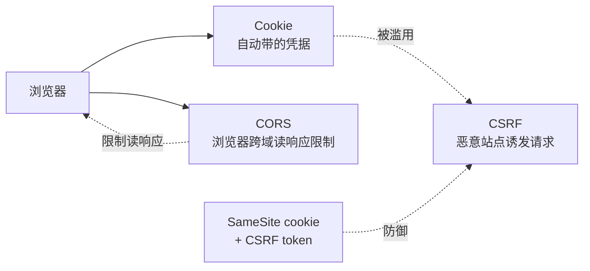

<KeyIdea>
**一句话**：**Cookie** 是浏览器自动带在请求里的小数据包；**CORS** 是浏览器对"跨域请求"的安全策略；**CSRF** 是利用浏览器自动带 cookie 这一行为的攻击。三者总被混在一起，**搞清各自管什么 = 90% 的网络安全 bug 不再发生**。
</KeyIdea>

## Cookie

```http
Set-Cookie: session=abc; Domain=.example.com; Path=/; HttpOnly; Secure; SameSite=Lax; Max-Age=3600
```

<Terms items={[
  { term: "Domain / Path", en: "作用范围", def: "决定 cookie 会被发送到哪些请求里。" },
  { term: "HttpOnly", en: "禁 JS 读", def: "JS 读不到 → 防 XSS 偷会话。" },
  { term: "Secure", en: "仅 HTTPS", def: "只在 https 请求里发送。" },
  { term: "SameSite", en: "同站策略", def: "Strict / Lax（默认）/ None。控制跨站请求是否带上。**SameSite=Lax 是现代防 CSRF 第一道墙**。" },
  { term: "__Host-", en: "前缀", def: "强制 Secure + Path=/ + 无 Domain，最严的 cookie 类别。" },
]} />

## CORS（Cross-Origin Resource Sharing）

CORS 是**浏览器的策略**：默认禁止 JS 读跨域响应。服务器要明确**用响应头同意**才能放行。

```http
# 简单请求
GET /api  Origin: https://app.com
→ Access-Control-Allow-Origin: https://app.com

# 复杂请求先发 OPTIONS preflight
OPTIONS /api Origin: https://app.com
       Access-Control-Request-Method: PUT
       Access-Control-Request-Headers: X-Auth
→ Access-Control-Allow-Origin: https://app.com
  Access-Control-Allow-Methods: GET, POST, PUT
  Access-Control-Allow-Headers: X-Auth
  Access-Control-Allow-Credentials: true
  Access-Control-Max-Age: 600
```

**重点**：CORS **不是为了保护服务器**，是浏览器**保护用户**。你后端用 curl 永远不需要 CORS 头。

## CSRF（跨站请求伪造）

经典场景：

```
你登录了 bank.com，cookie 还在
→ 你打开 evil.com，里面有 
→ 浏览器自动带上 bank.com cookie 发请求
→ 银行执行转账（如果没防）
```

**防御**（按现代优先级）：

1. **`SameSite=Lax/Strict` cookie** —— 跨站请求不带 cookie，从根上断。
2. **CSRF token** —— 服务端在表单里塞一个一次性 token，跨站攻击者拿不到。
3. **Double-submit cookie** —— 头部 + cookie 同步比对，无服务端状态。
4. **检查 Origin / Referer** 头作为补充。
5. **修改类操作不接受 GET** —— GET 永远不应该改状态。

## 三者关系



## 实操要点

- **登录态用 HttpOnly + Secure + SameSite=Lax cookie**。**不要把 token 放 localStorage**（XSS 即丢号）。
- **CORS 配置最常见误区**：`Allow-Origin: *` + `Allow-Credentials: true` —— 浏览器会拒绝。带凭据时必须明确 origin。
- **OPTIONS 预检失败 = CORS 错误**：开发者面板里看清是哪一条响应头不齐 / origin 不匹配。
- **API 子域分离 cookie**：`api.example.com` 和 `www.example.com` 共享 `.example.com` 顶域 cookie 时，明确 `Domain=.example.com`。
- **跨设备 SSO**：跨顶域必须走 OAuth / SAML，不能靠 cookie。
- **API 服务给原生 App / 服务器端调用** —— 不依赖浏览器 → CORS / CSRF 概念都不适用，但**仍需身份认证（API Key / OAuth / mTLS）**。

## 易混点

<Compare
  leftTitle="CORS"
  rightTitle="CSRF"
  left={<>
    浏览器**主动限制**跨域读响应。<br />
    管"我能不能拿到数据"。
  </>}
  right={<>
    攻击者**利用**自动带 cookie。<br />
    管"我会不会被冒充提交"。
  </>}
/>

## 延伸阅读

- [HTTP 协议](/network/beginner/http)
- [HTTPS 与证书](/network/beginner/https)
- [TLS 握手](/network/advanced/tls-handshake)
