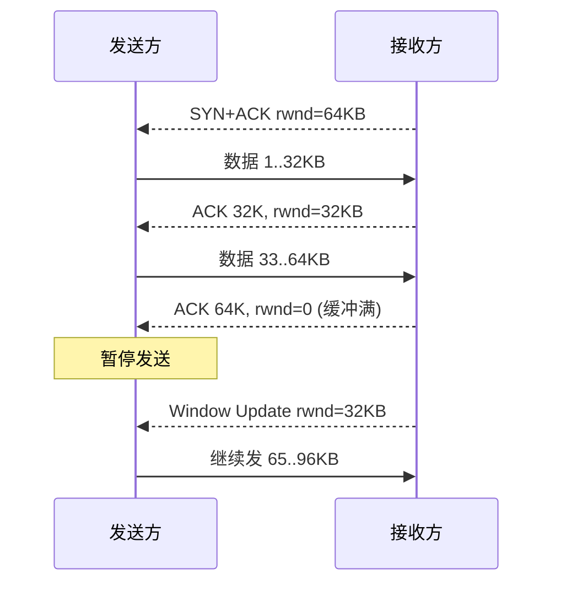

<KeyIdea>
**一句话**：TCP 接收方在每个 ACK 里告诉发送方「**我现在还能接 N 字节**」（接收窗口 rwnd）。发送方**永远不超过 rwnd**，从机制上避免接收端缓冲被打爆。
</KeyIdea>

## 是什么

```
发送窗口 = min(rwnd, cwnd)
        ↑              ↑
    对端告知接收能力   本端估计网络能力
```

发送方维护一个滑动窗口：**已确认 / 已发未确认 / 可发未发 / 暂不可发**四段。每次收到 ACK 把窗口右移。

## 打个比方

<Analogy>
你给朋友家送水。朋友说「**我家还能放 5 桶**」（rwnd=5），你就最多送 5 桶；他喝掉 3 桶后告诉你「**还能放 3 桶**」（rwnd=3），你接着送。**你绝不会送到放不下的程度**。
</Analogy>

## 关键概念

<Terms items={[
  { term: "rwnd", en: "Receive Window", def: "对端通告的剩余接收缓冲区大小。" },
  { term: "Window Scaling", en: "窗口缩放", def: "rwnd 字段只有 16 位（最大 64KB），靠 TCP option 把它放大到最大 1GB。" },
  { term: "Zero Window", en: "零窗口", def: "对端 rwnd=0，发送方暂停。后续靠 Window Probe 探测恢复。" },
  { term: "Nagle 算法", en: "Nagle", def: "把多个小段合并发送，减小开销。代价是**额外延迟**。" },
  { term: "Delayed ACK", en: "延迟确认", def: "接收方不立即 ACK，凑一段再回。和 Nagle 配对会导致**死等**，是经典坑。" },
]} />

## 怎么工作



接收方应用读得越慢，rwnd 越快变小，发送方就跟着减速。

## 实操要点

- **现代 OS 默认开 Window Scaling**，跨洋长肥管道（高 BDP）必备。
- **服务器接收缓冲调优**：

  ```bash
  sysctl -w net.core.rmem_max=16777216
  sysctl -w net.ipv4.tcp_rmem='4096 87380 16777216'
  ```

  缓冲不够 = rwnd 小 = 拉不满带宽。
- **应用 read 不勤**：会让 rwnd 长时间为 0，发送方挂起 —— 看起来像「丢包」其实是「**收得慢**」。
- **关 Nagle（`TCP_NODELAY`）**：对实时性敏感的小包（IM、游戏、SSH 交互）必须关。
- **不要混淆 rwnd 与 cwnd**：rwnd 是**接收能力**，cwnd 是**网络能力**，发送方取较小值。

## 易混点

<Compare
  leftTitle="rwnd 满了"
  rightTitle="cwnd 减半"
  left={<>
    **接收方应用读太慢**。<br />
    解：调大缓冲 / 让应用更快读。
  </>}
  right={<>
    **网络上有丢包**。<br />
    解：换更稳定的链路 / 拥塞算法（BBR）。
  </>}
/>

## 延伸阅读

- [TCP 三次握手](/network/advanced/tcp-handshake)
- [TCP 拥塞控制](/network/advanced/congestion-control)
