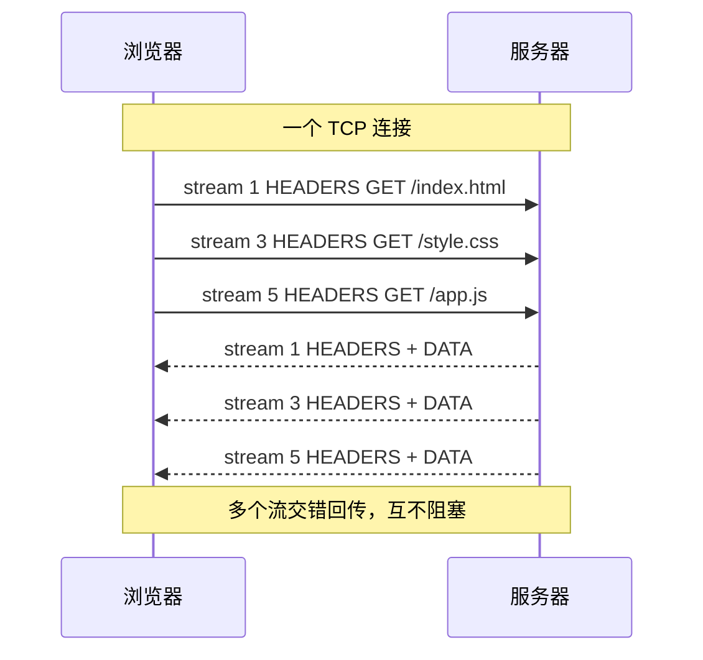

<KeyIdea>
**一句话**：HTTP/2 把 1.1 的纯文本协议改成**二进制帧（frame）**，并在**一个 TCP 连接上多路复用**多个请求 —— 大幅减少建连开销和队头阻塞。
</KeyIdea>

## 是什么

HTTP/1.1 的痛点：
- 一个连接一次只能发一个请求等响应，**串行**。
- 浏览器只好为每个域名开 6 个 TCP 连接，仍然不够。

HTTP/2 的改造：

| 特性               | 含义                                                        |
| ------------------ | ----------------------------------------------------------- |
| **二进制分帧**     | 请求 / 响应被切成 frame，多个 stream 在同一连接上交错传输。 |
| **多路复用**       | 同一连接里可同时有几十个 stream，互不阻塞。                 |
| **HPACK 头压缩**   | 头部用静态表 + 动态表压缩，重复请求几乎不再传 header。      |
| **服务端推送**     | 服务器可主动推送资源（已基本被 ditching，浏览器在弃用）。   |
| **优先级**         | 流可设权重，让浏览器先要 HTML / CSS。                       |

## 打个比方

<Analogy>
HTTP/1.1 = **单车道**：一辆车走完下一辆才能上。  
HTTP/2 = **多车道高速**：同一条路（TCP 连接）上**几十辆车并排开**。
</Analogy>

## 关键概念

<Terms items={[
  { term: "Stream", en: "流", def: "一对请求 / 响应。每个 stream 有唯一 ID。" },
  { term: "Frame", en: "帧", def: "stream 内的最小单元：HEADERS / DATA / SETTINGS / PING / GOAWAY 等。" },
  { term: "HPACK", en: "头压缩", def: "用预定义的静态表（80 多个常见头）+ 双方共享的动态表，把重复 header 压成几个字节。" },
  { term: "Stream Priority", en: "流优先级", def: "树状权重，浏览器告诉服务器哪些流先发。" },
  { term: "队头阻塞", en: "HoL Blocking", def: "HTTP/2 解决了应用层 HoL，但 TCP 层 HoL 仍在 —— HTTP/3 才彻底解决。" },
]} />

## 怎么工作

浏览器一打开页面，几十个静态资源**并行**到达。

## 实操要点

- **必须 HTTPS**：现代浏览器只在 TLS 上跑 HTTP/2（h2 over TLS）。明文 h2c 仅服务器之间用。
- **看是不是 H2**：`curl -I --http2 https://...` 或 Chrome DevTools Network 看 Protocol 列。
- **服务端开启**：nginx `listen 443 ssl http2;`、Caddy 默认开。
- **不要再做 1.1 的优化**：domain sharding（多域名分流）、合并雪碧图、内联资源 —— 这些在 H2 下**反而有害**。
- **TCP 队头阻塞仍在**：丢包时同一 TCP 连接上的所有 stream 都得等 —— 升级到 HTTP/3 才解决。

## 易混点

<Compare
  leftTitle="HTTP/2"
  rightTitle="HTTP/3"
  left={<>
    跑在 **TCP + TLS** 上。 
    应用层多路复用，**TCP 层仍 HoL**。
  </>}
  right={<>
    跑在 **QUIC（UDP）** 上。 
    流之间真正独立，**真无 HoL**。
  </>}
/>

## 延伸阅读

- [HTTP 基础](/network/beginner/http)
- [HTTP/3 与 QUIC](/network/advanced/http3-quic)
- [TLS 握手细节](/network/advanced/tls-handshake)
