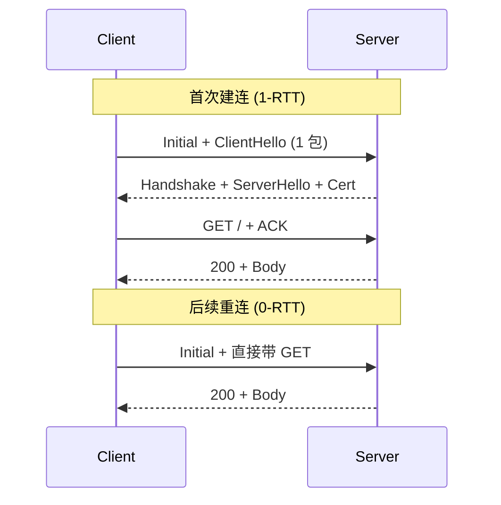

<KeyIdea>
**一句话**：**QUIC** 是 Google 提出的传输层协议，跑在 UDP 之上，**自带 TLS 1.3 + 多路复用 + 流量控制 + 拥塞控制**。HTTP/3 = HTTP over QUIC，**1-RTT 建连，连接迁移，无 TCP 队头阻塞**。
</KeyIdea>

## 是什么

```
HTTP/1.1: HTTP   over TCP
HTTP/2:   HTTP   over TLS over TCP
HTTP/3:   HTTP   over QUIC over UDP
```

QUIC 把传输层重做：因为 TCP 是内核协议、改不动，干脆**在用户态自己写一个**跑在 UDP 上。这样能快速演进，浏览器和服务器一起更新就行。

## 打个比方

<Analogy>
TCP 像**老火车**：守规矩、可靠、改不了。  
QUIC 像**自家造的高铁**：你想加什么功能就加 —— 新算法、连接迁移、0-RTT，今天发布明天上线。
</Analogy>

## 关键概念

<Terms items={[
  { term: "0-RTT 恢复", en: "0-RTT Resumption", def: "重连同一服务器时，第一个包就能携带 HTTP 请求 —— 节省一个 RTT。" },
  { term: "连接迁移", en: "Connection Migration", def: "QUIC 用 Connection ID 标识连接，**4G→Wi-Fi 切换不掉线**，IP 变了不重连。" },
  { term: "无 TCP HoL", en: "No HoL Blocking", def: "QUIC 的 stream 在传输层就独立，丢一个包只影响那一个 stream。" },
  { term: "内置 TLS 1.3", en: "Always Encrypted", def: "QUIC 没有「明文模式」，连握手都加密。" },
  { term: "用户态实现", en: "Userspace", def: "服务器在应用层处理 QUIC，迭代速度快。" },
]} />

## 怎么工作



QUIC 把 TLS 握手 + 协议握手合并；客户端一来就发数据。

## 实操要点

- **看页面用的协议**：Chrome DevTools Protocol 列显示 `h3-29` / `h3` 等就是 HTTP/3。
- **服务器开启**：
  - nginx 1.25+ `quic` 模块；
  - Caddy 2 默认开 H3；
  - Cloudflare / Fastly 一键开关。
- **要 HTTPS 才有 H3**：和 H2 一样必须 TLS（且只能 1.3）。
- **公司 / 校园网常封 UDP**：QUIC 走 UDP 443，部分防火墙会丢，浏览器会自动 fallback HTTP/2。
- **`Alt-Svc` 头**：服务器告诉浏览器「我这里也支持 H3，下次直接用 UDP」。

## 易混点

<Compare
  leftTitle="HTTP/3 over QUIC"
  rightTitle="HTTP/2 over TCP"
  left={<>
    跑在 **UDP 443**。<br />
    1-RTT / 0-RTT 建连。<br />
    流真正独立，丢包只影响一个流。
  </>}
  right={<>
    跑在 **TCP 443**。<br />
    建连 ≥ 2 RTT（TCP + TLS）。<br />
    丢包阻塞所有流。
  </>}
/>

## 延伸阅读

- [HTTP/2](/network/advanced/http2)
- [TLS 握手细节](/network/advanced/tls-handshake)
- [TCP 拥塞控制](/network/advanced/congestion-control) —— QUIC 自己实现了类似 BBR 的算法
