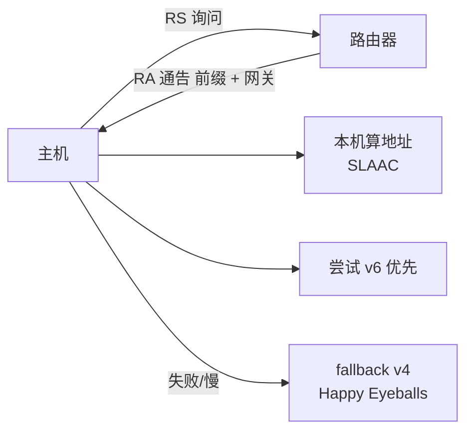

<KeyIdea>
**一句话**：IPv6 把地址从 32 位（43 亿）升到 **128 位（3.4×10³⁸）**，顺便干掉了 NAT、广播、分片在转发节点上的开销，地址自动配置更友好。
</KeyIdea>

## 是什么

格式：8 段 16 位十六进制，用 `:` 分隔，连续 0 可缩成 `::`：

```
2001:0db8:85a3:0000:0000:8a2e:0370:7334
   ↓ 缩写
2001:db8:85a3::8a2e:370:7334
```

每台主机通常**同时拥有 IPv4 和 IPv6**（双栈）。

## 打个比方

<Analogy>
IPv4 像**城市电话号码 8 位**：地区分配后总会用尽，于是大家用**总机+分机号**（NAT）拼凑。  
IPv6 像**全球 38 位的统一号码**：每台设备甚至每个进程都能拥有自己的全球唯一号码，不再需要总机。
</Analogy>

## 关键概念

<Terms items={[
  { term: "前缀长度", en: "Prefix Length", def: "和 IPv4 CIDR 一样：/64 是单个子网，/56 / /48 是分配给客户的常见大小。" },
  { term: "Link-local", en: "fe80::/10", def: "本链路自动地址，每个 IPv6 接口都有。" },
  { term: "ULA", en: "fc00::/7", def: "类似 IPv4 私网地址，本组织内用。" },
  { term: "SLAAC", en: "无状态自动配置", def: "主机看到路由器通告就自动算出全球唯一地址，不依赖 DHCP。" },
  { term: "Dual Stack", en: "双栈", def: "v4/v6 同时运行，应用按 Happy Eyeballs 选更快的一边。" },
  { term: "NAT64 / 464XLAT", en: "过渡技术", def: "纯 v6 网络访问 v4 互联网时用，常见于运营商。" },
]} />

## 怎么工作



SLAAC + RA 让主机**像 DHCP 那样自动**拿到地址，但不需要中心 DHCP 服务器。

## 实操要点

- **`ip -6 addr`**：看本机 IPv6 地址（Linux）。
- **检测连通**：`ping6 ipv6.google.com` 或 [test-ipv6.com](https://test-ipv6.com)。
- **服务器同时绑 v4/v6**：nginx `listen [::]:443 ssl;`，后端日志格式记得加 `[%h]` 兼容方括号。
- **DNS 配 AAAA**：双栈服务一定要配 AAAA，浏览器用 Happy Eyeballs 自动选最快。
- **防火墙**：iptables → ip6tables（或用 nftables 一并管），**不要忘记**给 v6 也写规则，否则可能裸奔。
- **常见误区**：「公司内部不用 IPv6」 —— 但移动 / 家宽很多默认 v6，**对外服务支持 v6 是用户体验问题**。

## 易混点

<Compare
  leftTitle="IPv4 + NAT"
  rightTitle="IPv6"
  left={<>
    地址不够 → 多设备共享。<br />
    带来打洞 / P2P 难题。
  </>}
  right={<>
    每台设备真公网地址。<br />
    防火墙默认拦入站，**仍需加固**。
  </>}
/>

## 延伸阅读

- [IP 地址](/network/beginner/ip-address)
- [NAT](/network/beginner/nat)
- [子网与 CIDR](/network/beginner/subnet-cidr)
