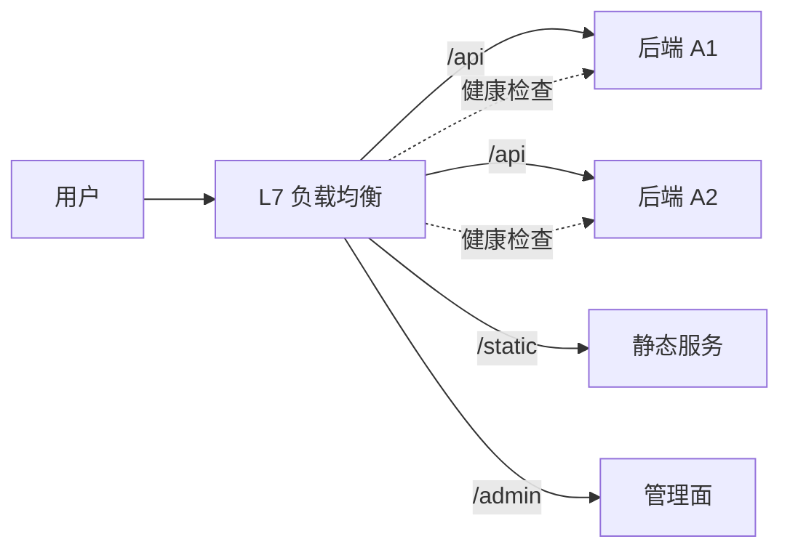

<KeyIdea>
**一句话**：负载均衡把外部流量**分给后端的多台服务**。**L4** 在 TCP 层做（看不到 HTTP），**L7** 在 HTTP 层做（能按路径 / 头 / cookie 路由）。生产环境通常**两层并存**。
</KeyIdea>

## 是什么

```
[客户端] → [L4 LB（IPVS/LVS）] → [L7 LB（nginx）] → [后端实例]
```

- **L4**：只看 IP / 端口，转发 TCP 连接。性能极高，能扛百万 QPS。
- **L7**：解析 HTTP，按 path / header / cookie 决定打到哪个后端。功能强但开销大。

## 打个比方

<Analogy>
**L4** 像**机场分流**：根据**航线**（端口）把人分到不同航站楼，不管你出差还是旅游。  
**L7** 像**酒店前台**：根据**房型偏好 / 会员等级**（HTTP 头）把你分到不同房间。
</Analogy>

## 关键概念

<Terms items={[
  { term: "轮询", en: "Round Robin", def: "依次发给每台后端。简单。" },
  { term: "最少连接", en: "Least Connections", def: "把新请求发给当前连接数最少的。适合长连接场景。" },
  { term: "一致性哈希", en: "Consistent Hashing", def: "按某个 key（如 user-id）哈希到固定后端 —— 保证亲和性，扩缩容时只影响一小部分键。" },
  { term: "加权", en: "Weighted", def: "性能不同的实例配不同权重。" },
  { term: "健康检查", en: "Health Check", def: "主动探测后端是否存活，挂掉的自动摘除。" },
  { term: "粘性会话", en: "Sticky Session", def: "同一用户每次都打到同一后端，缺点是**伸缩不友好**，应优先用无状态 + 共享 session 存储。" },
]} />

## 怎么工作



健康检查不通过的实例自动摘除，恢复后再加回来。

## 实操要点

- **常见软件**：
  - L4：LVS / IPVS（内核态，超高性能）、HAProxy（也能 L4）；
  - L7：nginx / HAProxy / Traefik / Envoy / Caddy。
- **公有云**：ALB（L7）/ NLB（L4），AWS / GCP / Aliyun 都有。
- **健康检查别太宽松也别太频**：每 2–5 秒一次、连续 2 次失败摘除、连续 2 次成功恢复 是常见配置。
- **超时配齐**：`connect_timeout`（拨号）/ `read_timeout`（响应）/ `send_timeout`（发送） —— 缺一个都可能造成连接堆积。
- **优雅下线**：发布时先把实例从 LB 摘掉、等存量请求走完，再杀进程。
- **DNS 也算"穷人版 LB"**：返回多个 A 记录由客户端选 —— 缺点是**慢、刷新差、不健康检查**，仅作为 LB 之上的多区域分流。

## 易混点

<Compare
  leftTitle="L4 (TCP)"
  rightTitle="L7 (HTTP)"
  left={<>
    转发 TCP 连接。<br />
    性能极高、不能看 URL。<br />
    适合数据库 / 自定义协议。
  </>}
  right={<>
    解析 HTTP 头。<br />
    可按 path / cookie 路由。<br />
    适合 web / API gateway。
  </>}
/>

## 延伸阅读

- [CDN](/network/advanced/cdn)
- [Anycast 与 BGP](/network/advanced/anycast-bgp)
- [nginx](/network/ecosystem/nginx)
- [HAProxy](/network/ecosystem/haproxy)
