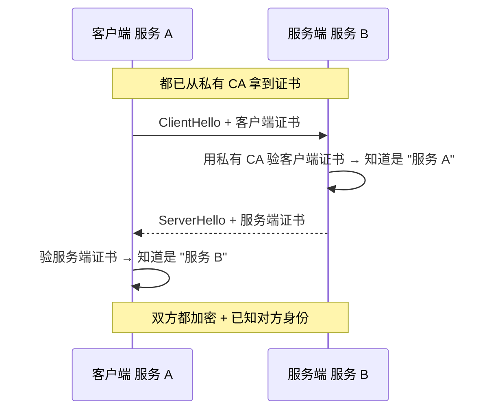

<KeyIdea>
**一句话**：mTLS = mutual TLS，**双方都验证对方证书**。在内网 / 服务网格里替代「IP 白名单 + 共享 Token」，做到**密码学级别**的服务身份认证。
</KeyIdea>

## 是什么

普通 HTTPS：客户端验服务器证书。
mTLS：客户端**自己也持证书**，握手时一并发给服务端，**服务端用自己的 CA 验签**。

```
普通 TLS：       客户 → 验 → 服务端证书
mTLS：    客户 ⇄ 互验 ⇄ 服务端 + 客户端证书
```

## 打个比方

<Analogy>
普通 HTTPS 像**进商场**：你看到商场的招牌就放心走进来。  
mTLS 像**进公司大厦**：保安要看你的**员工卡**才放你进；同时你也确认这是**公司正门**而不是钓鱼办公室。
</Analogy>

## 关键概念

<Terms items={[
  { term: "客户端证书", en: "Client Certificate", def: "由组织内部 CA 签发，标识一个服务 / 一台机器 / 一个用户。" },
  { term: "私有 CA", en: "Internal CA", def: "组织自己的根证书，分发给所有服务，签发短期证书。" },
  { term: "SPIFFE / SPIRE", en: "服务身份框架", def: "云原生标准：自动发证、轮换、绑定 K8s ServiceAccount。" },
  { term: "证书轮换", en: "Cert Rotation", def: "短期证书（小时 / 天级），自动续签。被偷的证书自然过期。" },
  { term: "零信任", en: "Zero Trust", def: "不假设任何网络位置安全 —— 每次访问都靠身份证书 + 策略验证。" },
]} />

## 怎么工作



服务网格（Istio / Linkerd）把这套在 sidecar 里**完全自动化**。

## 实操要点

- **手动配 nginx mTLS**：

  ```nginx
  ssl_client_certificate /etc/nginx/ca.crt;
  ssl_verify_client on;
  ```

- **服务网格自动 mTLS**：Istio / Linkerd 默认开启，sidecar 之间所有流量都是 mTLS。
- **API Gateway 上的 mTLS**：金融 / 银行常用 —— 移动 App 用客户端证书证明「你是真 App」。
- **证书生命周期**：用 cert-manager（K8s）/ Vault PKI 自动签发短期证书，避免人工运维。
- **撤销**：CRL / OCSP 实操困难，**短期证书 + 不续签**是更现实的撤销手段。

## 易混点

<Compare
  leftTitle="API Token / JWT"
  rightTitle="mTLS"
  left={<>
    应用层 bearer。<br />
    一次泄漏多次使用。
  </>}
  right={<>
    传输层证书。<br />
    每次握手互验，**密码学绑定**到具体服务实例。
  </>}
/>

## 延伸阅读

- [TLS 握手细节](/network/advanced/tls-handshake)
- [HTTPS](/network/beginner/https) / [TLS](/network/beginner/tls)
