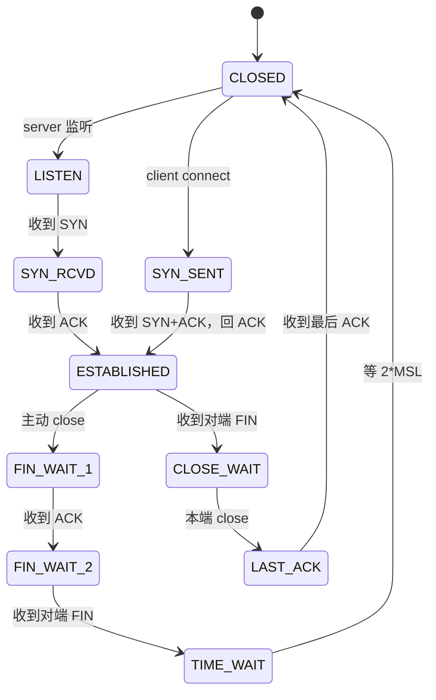

<KeyIdea>
**一句话**：**三次握手**是为了让双方都确认「**我能发 / 你能收 / 你能发 / 我能收**」；**四次挥手**是因为 TCP **全双工**，每个方向**单独**关闭。
</KeyIdea>

## 是什么

```
握手：
  C → S  SYN seq=x
  C ← S  SYN+ACK seq=y, ack=x+1
  C → S  ACK ack=y+1
  连接建立。

挥手：
  C → S  FIN
  C ← S  ACK         （我收到你说要关，等我把数据发完）
  C ← S  FIN         （我也发完了）
  C → S  ACK
  连接关闭。
```

## 打个比方

<Analogy>
**握手**像电话拨通：「喂？」「喂！」「好，开始说话。」 —— 双方各确认一次自己「**能听 + 对方能听**」。
**挥手**像两人都同意挂电话：「我说完了。」「好，等我也说完。」（中间还有可能继续发）「我也说完了。」「好，挂。」
</Analogy>

## 关键概念

<Terms items={[
  { term: "SYN", en: "Synchronize", def: "握手第一步，请求建立连接，附带初始序号。" },
  { term: "ACK", en: "Acknowledge", def: "确认收到对方的字节范围。所有 TCP 包都带 ACK 字段。" },
  { term: "FIN", en: "Finish", def: "本端发送结束。" },
  { term: "TIME_WAIT", en: "时间等待", def: "主动关闭方握完手后等 2*MSL（约 60 秒）才彻底释放，防止延迟包错乱。" },
  { term: "半关闭", en: "Half-close", def: "一方 FIN 之后，另一方还能继续发数据。" },
  { term: "RST", en: "Reset", def: "强制断连，跳过挥手 —— 异常 / 端口未监听时常见。" },
]} />

## 状态机



实战中**最常碰到**的是 `TIME_WAIT` 堆积（高并发短连接服务器）和 `CLOSE_WAIT` 不退（应用没关 socket）。

## 实操要点

- **`netstat -an | awk '{print $6}' | sort | uniq -c`** 看本机各状态连接数。
- **`TIME_WAIT` 太多**：开启 `tcp_tw_reuse`（Linux）允许复用，**不要**轻易开 `tcp_tw_recycle`（4.12 之后已删除，曾导致 NAT 后丢连接）。
- **`CLOSE_WAIT` 是 bug**：你的应用收到对方 FIN 但没调 close()。看 lsof 找漏洞。
- **`SYN flood`** 攻击：大量伪造 SYN 占满半连接队列。开 `syncookies` 防御。
- **TFO（TCP Fast Open）**：握手时就携带 payload，减一个 RTT。但**对端 / 中间设备**支持参差，不普及。

## 易混点

<Compare
  leftTitle="正常 FIN 关闭"
  rightTitle="RST 强制断连"
  left={<>
    四次挥手，**已发数据保送**。<br />
    应用主动 close()。
  </>}
  right={<>
    单包 RST，**已发数据可能丢**。<br />
    端口没监听 / 应用崩溃 / SO_LINGER 0。
  </>}
/>

## 延伸阅读

- [TCP 拥塞控制](/network/advanced/congestion-control)
- [TCP 流量控制](/network/advanced/flow-control)
- [TCP vs UDP](/network/beginner/tcp-vs-udp)
