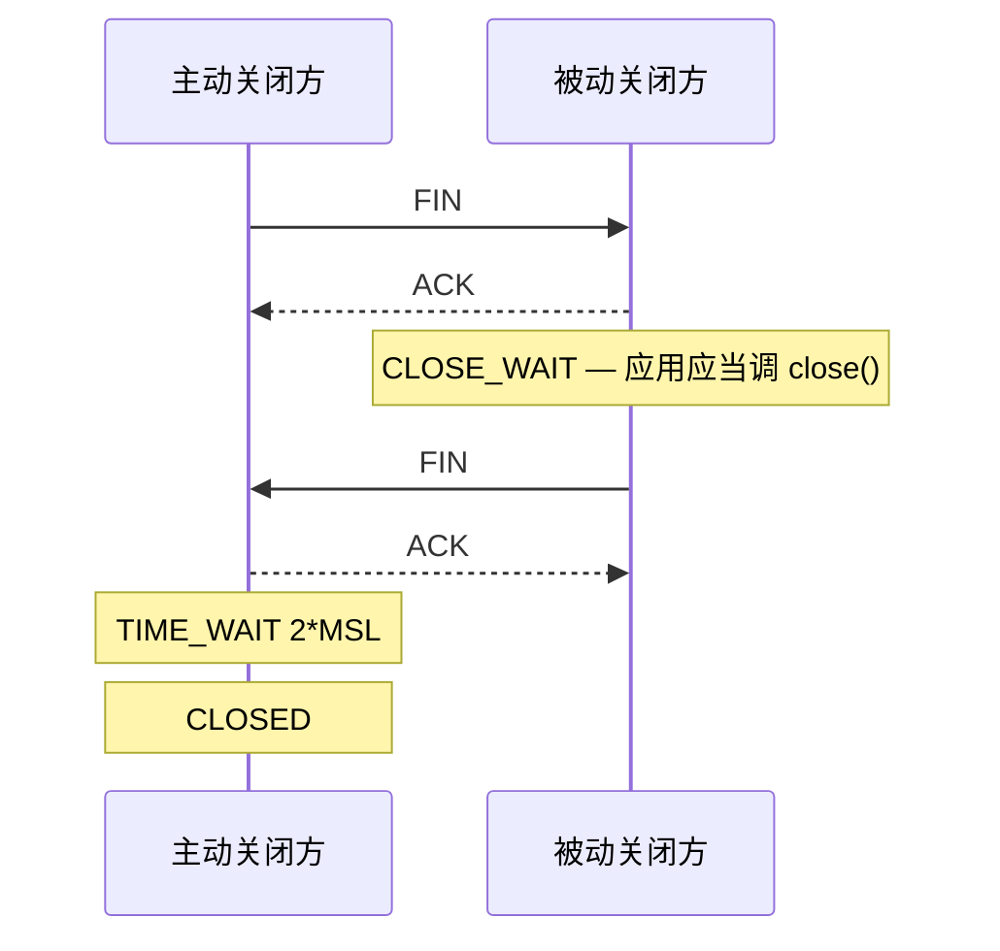

<KeyIdea>
**一句话**：`TIME_WAIT` 是 **TCP 设计要求**的等待期，主动关闭方必经；`CLOSE_WAIT` 是**应用代码 bug** —— 你收到对端 FIN 却没调 `close()`。
</KeyIdea>

## 是什么

主动关闭方完整流程：

```
ESTABLISHED → FIN_WAIT_1 → FIN_WAIT_2 → TIME_WAIT (2*MSL ≈ 60s) → CLOSED
```

被动关闭方流程：

```
ESTABLISHED → CLOSE_WAIT → LAST_ACK → CLOSED
                  ↑
       应用没 close() 就卡这里不走
```

## 打个比方

<Analogy>
**TIME_WAIT** = 挂电话后还把话筒贴耳朵听一会儿，**确认没有迟到的回声**才安心放下。
**CLOSE_WAIT** = 对方说挂了，你 **「嗯」答应了一声却忘了真的把话筒挂上**，电话一直占线。
</Analogy>

## 关键概念

<Terms items={[
  { term: "MSL", en: "Max Segment Lifetime", def: "网络上一个 segment 最多存活时间（典型 30s）。TIME_WAIT 等 2*MSL 是为了让两边的迟到包都自然消亡。" },
  { term: "TIME_WAIT 风险", en: "源端口耗尽", def: "高频短连接的客户端，本地端口（约 28K 个）很快被 TIME_WAIT 占满。" },
  { term: "CLOSE_WAIT 风险", en: "fd 泄漏", def: "应用 fd 慢慢漏，最终 'too many open files'。" },
  { term: "tcp_tw_reuse", en: "TW 复用", def: "Linux 选项，允许新连接复用 TIME_WAIT 占用的本地端口。" },
  { term: "SO_LINGER 0", en: "强行 RST 关闭", def: "跳过四次挥手直接发 RST，**慎用**：未发数据丢失。" },
]} />

## 怎么工作



**应用层 `close()` 决定**自己是主动还是被动 —— 谁先关谁是主动方。

## 实操要点

- **统计状态**：

  ```bash
  ss -tan | awk '{print $1}' | sort | uniq -c
  ```

- **TIME_WAIT 太多**（万级）：
  - 客户端：`net.ipv4.tcp_tw_reuse=1`，`ip_local_port_range` 调宽；
  - 服务端：通常无害（服务端被动关闭时不会进 TIME_WAIT，**连接保活 / 长连接**）；
  - **不要**开 `tcp_tw_recycle`（已被 Linux 删除）。
- **CLOSE_WAIT 持续涨**：
  - 用 `lsof -p <pid> | grep CLOSE_WAIT` 找 fd；
  - 检查代码：异常路径忘了 `defer conn.Close()`；
  - 反向代理后端：超时机制是否触发关闭。
- **HTTP keep-alive / 连接池**：复用连接而不是每次新建是最根本的解法。

## 易混点

<Compare
  leftTitle="TIME_WAIT"
  rightTitle="CLOSE_WAIT"
  left={<>
    **协议要求**。<br />
    一段时间后自动消失。<br />
    通常调参解决。
  </>}
  right={<>
    **应用 bug**。<br />
    不修永远卡着。<br />
    必须改代码。
  </>}
/>

## 延伸阅读

- [TCP 三次握手](/network/advanced/tcp-handshake)
- [TCP 流量控制](/network/advanced/flow-control)
