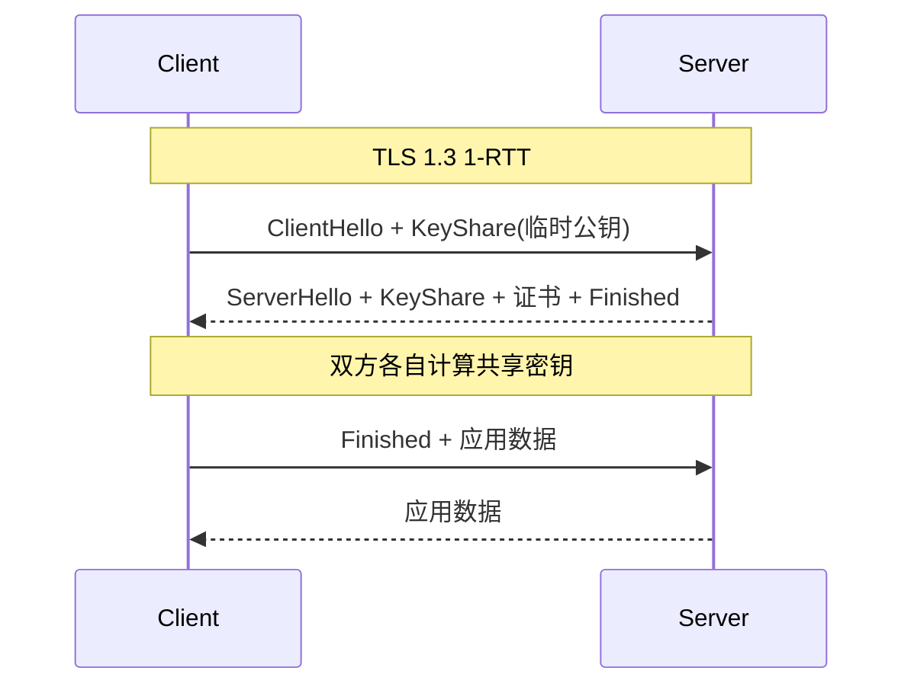

<KeyIdea>
**一句话**：TLS 握手协商**加密算法、验证服务器身份、生成会话密钥**。1.3 相比 1.2 砍掉了一个 RTT（握手期间就能开始发应用数据），并强制使用前向安全。
</KeyIdea>

## 是什么

TLS 1.2 完整握手：

```
ClientHello             →
                        ←  ServerHello, 证书, ServerKeyExchange, Done
ClientKeyExchange,
ChangeCipherSpec,
Finished                →
                        ←  ChangeCipherSpec, Finished
─── 应用数据 ───
```

总计 **2 RTT** 才能开始发应用数据。

TLS 1.3：

```
ClientHello + KeyShare  →
                        ←  ServerHello + KeyShare + 证书 + Finished
Finished, 应用数据      →
```

**1 RTT** 即可，且支持 0-RTT 复用旧会话密钥。

## 打个比方

<Analogy>
**TLS 1.2** = 两个人见面要握三次手才能开始说话。  
**TLS 1.3** = 你一伸手，对方伸手 + 名片 + 证件 + 暗号一并递过来；你回个 OK 就**开始正题**。
</Analogy>

## 关键概念

<Terms items={[
  { term: "Cipher Suite", en: "加密套件", def: "握手协商出的「密钥交换 + 签名 + 对称加密 + MAC」组合。1.3 大幅精简（强制 AEAD）。" },
  { term: "ECDHE", en: "椭圆曲线 Diffie-Hellman", def: "1.3 唯一允许的密钥交换。每次握手都生成临时密钥 → 前向安全。" },
  { term: "PFS", en: "前向安全", def: "即使私钥之后泄露，过去截获的流量仍然解不开。1.3 强制要求。" },
  { term: "Session Ticket", en: "会话票据", def: "服务器加密的恢复凭据，发给客户端，下次连进来直接 0-RTT。" },
  { term: "ALPN", en: "Application-Layer Protocol Negotiation", def: "TLS 握手里协商应用层协议（h2 / http/1.1 / h3）。" },
]} />

## 怎么工作



QUIC 把 TLS 1.3 内嵌进自己的握手，**HTTP/3 的 1-RTT 由此而来**。

## 实操要点

- **强制 1.3**：nginx `ssl_protocols TLSv1.2 TLSv1.3;`，关掉 1.0/1.1。
- **测当前 cipher**：`openssl s_client -connect host:443 -tls1_3` 看握手详情。
- **OCSP Stapling**：让服务器替客户端验证证书状态，省一次外部查询。
- **OCSP Must-Staple** + **CT 日志**：用于额外的安全保障。
- **0-RTT 慎用**：早期数据不防重放，**对幂等接口（GET）才安全**。
- **mTLS（双向认证）**：服务端也验客户端证书，企业内部 / 服务网格常用。

## 易混点

<Compare
  leftTitle="TLS 1.2"
  rightTitle="TLS 1.3"
  left={<>
    2 RTT 完整握手。<br />
    支持 RSA 密钥交换（无 PFS）。
  </>}
  right={<>
    1 RTT，可 0-RTT 恢复。<br />
    强制 ECDHE + AEAD，**前向安全是底线**。
  </>}
/>

## 延伸阅读

- [HTTPS](/network/beginner/https) / [TLS](/network/beginner/tls)
- [HTTP/3 与 QUIC](/network/advanced/http3-quic)
- [mTLS](/network/advanced/mtls)
