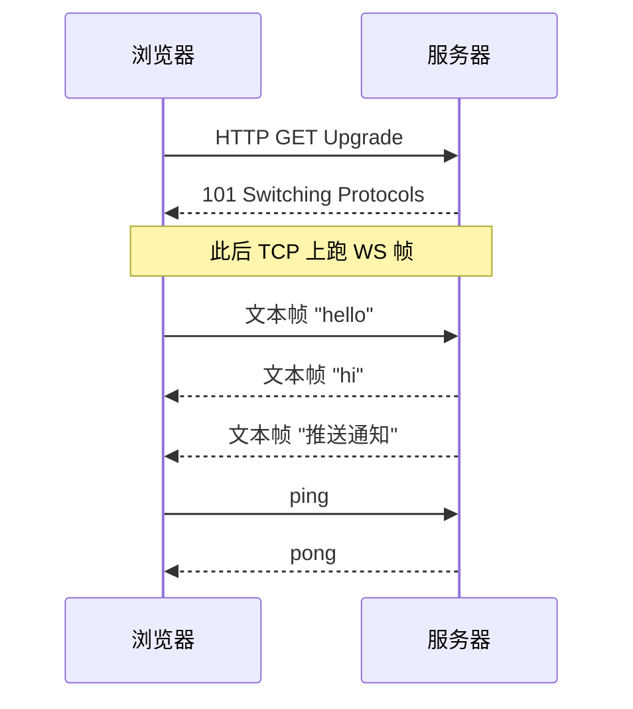

<KeyIdea>
**一句话**：WebSocket 通过一次 HTTP **Upgrade** 把 TCP 连接「升级」成**全双工长连接**，之后双方可以**任意时刻互发消息**，不再受请求-响应模式约束。
</KeyIdea>

## 是什么

```
浏览器:                      服务器:
GET /chat HTTP/1.1
Upgrade: websocket
Connection: Upgrade
Sec-WebSocket-Key: dGhl...
                              HTTP/1.1 101 Switching Protocols
                              Upgrade: websocket
                              Connection: Upgrade
                              Sec-WebSocket-Accept: s3pPLM...
─── 之后 TCP 上跑 WebSocket 帧 ───
```

握手用 HTTP/1.1（兼容防火墙），握完之后**这个 TCP 上的语义就变了**。

## 打个比方

<Analogy>
HTTP 像**短信**：你发一条等回一条。  
WebSocket 像**接通的电话**：双方可以**随时讲话**，谁都不必等对方先说。
</Analogy>

## 关键概念

<Terms items={[
  { term: "Upgrade 握手", en: "Handshake", def: "用 HTTP 升级头切到 WebSocket，握完返回 101。" },
  { term: "帧", en: "Frame", def: "WebSocket 数据单位，含 opcode（text/binary/close/ping/pong）和 payload。" },
  { term: "Mask", en: "掩码", def: "客户端发往服务器的帧必须 mask（4 字节随机 XOR），防止中间设备误判。" },
  { term: "Ping / Pong", en: "心跳", def: "应用层心跳保活，避免被中间设备 / 负载均衡 idle 超时杀掉。" },
  { term: "Sub-protocol", en: "子协议", def: "握手时声明 `Sec-WebSocket-Protocol`，应用层语义自己定（mqtt / graphql-ws）。" },
]} />

## 怎么工作



适合的场景：**实时聊天、协同编辑、行情推送、游戏、IoT 控制**。

## 实操要点

- **走 HTTPS 时用 `wss://`**：避免代理 / 浏览器拦掉。
- **必须心跳**：每 30s 发 ping，否则中间设备会因为 60s 空闲杀连接。
- **反向代理要开 Upgrade**：

  ```nginx
  proxy_http_version 1.1;
  proxy_set_header Upgrade $http_upgrade;
  proxy_set_header Connection "upgrade";
  proxy_read_timeout 300s;
  ```

- **不要在 WebSocket 上自己造 RPC**：用 [graphql-ws](https://github.com/enisdenjo/graphql-ws) / [socket.io](https://socket.io) / mqtt / signalr 这种成熟子协议，省去造轮子。
- **HTTP/2 不替代 WS**：H2 也支持双向流，但浏览器 fetch API **不暴露**。WebSocket 仍然是浏览器实时通信的事实标准。
- **HTTP/3 的 WebTransport** 是未来：基于 QUIC，更轻、支持不可靠流。

## 易混点

<Compare
  leftTitle="WebSocket"
  rightTitle="SSE (Server-Sent Events)"
  left={<>
    全双工。<br />
    复杂，需服务器 / 反代支持。
  </>}
  right={<>
    单向（服务器推客户端）。<br />
    纯 HTTP，浏览器 EventSource API 直接用。
  </>}
/>

## 延伸阅读

- [HTTP 基础](/network/beginner/http)
- [HTTP/3 与 QUIC](/network/advanced/http3-quic)
- [TCP 三次握手](/network/advanced/tcp-handshake)
