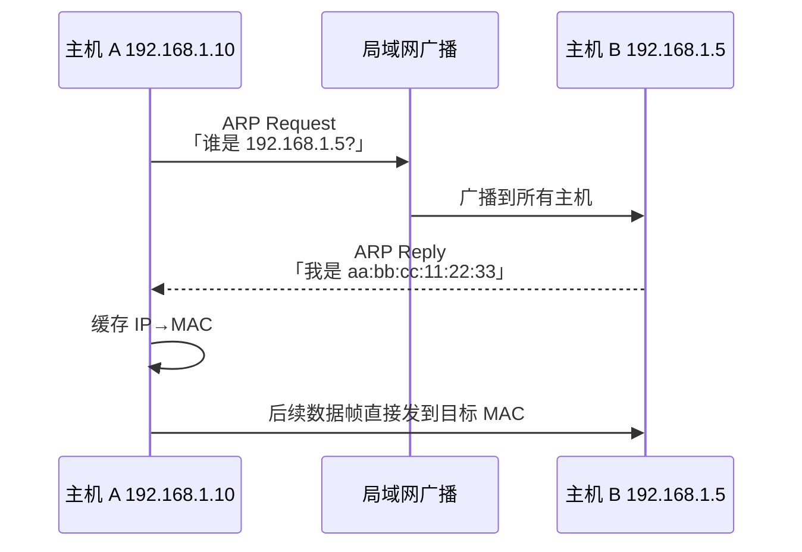

<KeyIdea>
**一句话**：**ARP** 在同一局域网里把 IP 地址翻译成 MAC 地址。要给同网段的某个 IP 发包前，主机会先广播一句「**谁是这个 IP**」，目标主机回应自己的 MAC，**结果会缓存**几分钟。
</KeyIdea>

## 是什么

ARP 报文运行在**链路层之上、IP 之外**：它不是 IP 包，而是和 IP 平行的另一种以太网帧（EtherType `0x0806`）。

```
ARP Request (广播):
  "Who has 192.168.1.5? Tell 192.168.1.10"
ARP Reply (单播):
  "192.168.1.5 is at aa:bb:cc:11:22:33"
```

## 打个比方

<Analogy>
你知道朋友家**地址**（IP），但快递员要敲哪扇**门**？快递员先在小区里大喊一声「**192.168.1.5 是哪家？**」，回应的人告诉他**门牌识别码**（MAC），然后他记下来 —— 下次直接敲那扇门。
</Analogy>

## 关键概念

<Terms items={[
  { term: "ARP Request", en: "ARP 请求", def: "广播帧（dst MAC = ff:ff:ff:ff:ff:ff），问「谁有这个 IP」。" },
  { term: "ARP Reply", en: "ARP 响应", def: "对应主机单播回应「我的 MAC 是 xx」。" },
  { term: "ARP Cache", en: "ARP 缓存", def: "操作系统记录的 IP→MAC 表；几分钟过期。" },
  { term: "Gratuitous ARP", en: "免费 ARP", def: "主动广播自己的 IP-MAC，常用于 IP 切换 / 故障转移。" },
  { term: "Proxy ARP", en: "代理 ARP", def: "路由器代替对端回应 ARP，用于把不同 LAN 让对方以为在同一网段。" },
]} />

## 怎么工作



跨网段时，A **解析的不是最终目标的 MAC**，而是**默认网关的 MAC**：包到了网关再往下走。

## 实操要点

- **`arp -a`** 查 ARP 缓存；**`ip neigh`** 是更现代的 Linux 命令。
- **`arping 192.168.1.5`** 主动测试某 IP 是否在线（绕过 ICMP 防火墙）。
- **ARP 欺骗**（Spoofing）：攻击者伪造 ARP 响应骗局域网里的主机把流量发给自己 —— 公共 Wi-Fi 经典中间人攻击手法。**对策**：交换机端口绑定、动态 ARP 检查（DAI）、网关静态 ARP。
- **静态 ARP**：`arp -s 192.168.1.1 aa:bb:..` 在不信任的 LAN 里把网关 MAC 钉死。
- **VRRP / HSRP** 虚 IP 切换时会发**免费 ARP** 让 LAN 内主机更新缓存指向新主网关。

## 易混点

<Compare
  leftTitle="ARP"
  rightTitle="DNS"
  left={<>
    **本网段** 内：IP → MAC。<br />
    链路层广播实现。
  </>}
  right={<>
    **互联网级别**：域名 → IP。<br />
    应用层 UDP/TCP 实现。
  </>}
/>

## 延伸阅读

- [MAC 地址](/network/beginner/mac-address)
- [IP 地址](/network/beginner/ip-address)
- [DNS](/network/beginner/dns)
