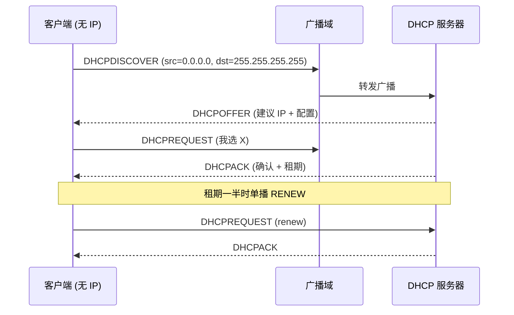

<KeyIdea>
**一句话**：DHCP 让一台**新插上网线 / 连上 Wi-Fi 的设备**在不需要人工配置的情况下，**自动拿到 IP 地址、子网掩码、网关、DNS**。它运行在 UDP 之上，端口 **67（服务器）/ 68（客户端）**。
</KeyIdea>

## 是什么

经典的四步握手 **DORA**：

```
1. Discover (广播)  : 客户端→广播 「有 DHCP 服务器吗？」
2. Offer    (单播/广播) : 服务器→ 「我能给你 192.168.1.50 + 网关 + DNS + 租期 24h」
3. Request  (广播)  : 客户端→广播 「我接受 X 的 offer」（多服务器选一个）
4. ACK      (单播/广播) : 服务器→ 「确认配置」
```

之后客户端可以用这个 IP；**租期到期前一半时间**会再请求续租（不广播，直接 unicast 给原服务器）。

## 打个比方

<Analogy>
DHCP 像**酒店前台**：你拿身份证（MAC）到柜台 → 前台分配房间号（IP）+ 房卡密码 + 楼层路线图（子网掩码 + 网关 + DNS）+ **退房时间**（租期）。退房前可以续住。
</Analogy>

## 关键概念

<Terms items={[
  { term: "Lease", en: "租期", def: "IP 借给你多久；过期不续就回收。家用 24h，企业可能短到 1h。" },
  { term: "Reservation", en: "保留地址", def: "按 MAC 绑死某个 IP —— 服务器 / 打印机常用。" },
  { term: "Scope / Pool", en: "地址池", def: "DHCP 服务器能发放的 IP 段，例如 192.168.1.100-200。" },
  { term: "DHCP Relay", en: "DHCP 中继", def: "DHCP 是广播，跨网段需要路由器把 Discover 转发到中央 DHCP 服务器。" },
  { term: "DHCPv6 / SLAAC", en: "IPv6 自动配置", def: "IPv6 既可用 DHCPv6，也可用 SLAAC（路由器广告 prefix，主机自己生成 IP）。" },
  { term: "Option 43 / 60 / 66", en: "DHCP 选项", def: "下发更多信息：PXE 引导、TFTP 服务器、域、NTP……" },
]} />

## 怎么工作



跨网段时路由器开 **DHCP relay (ip helper-address)** 把广播单播到中央 DHCP 服务器。

## 实操要点

- **`ip a` / `ipconfig /all`** 查当前 IP 是不是 DHCP 分配（有 DHCP server 字段）。
- **续租 / 重申**：Linux `dhclient -r && dhclient`；Windows `ipconfig /release && /renew`；macOS 在网络偏好里"续租"。
- **`169.254.x.x`（APIPA）**：拿不到 DHCP 时主机自己分一个 169.254 链路本地地址 —— **看到这个就是 DHCP 失败**。
- **服务器端**：家庭用路由器自带；企业用 ISC DHCP / Kea / Windows Server / RouterOS。
- **PXE 网络启动**：DHCP option 66/67 告诉客户端 TFTP 服务器和引导文件。
- **安全**：**DHCP Snooping** 在交换机上识别合法 DHCP 服务器，防止野生 DHCP 服务器劫持网络。
- **静态 vs DHCP**：服务器、打印机、监控建议**保留地址**而不是纯静态 —— 既稳定又集中可改。

## 易混点

<Compare
  leftTitle="DHCP"
  rightTitle="DNS"
  left={<>
    **拿到 IP** 配置（地址、网关、DNS）。<br />
    上网前一步。
  </>}
  right={<>
    **域名 → IP** 解析。<br />
    上网时每次访问都用。
  </>}
/>

## 延伸阅读

- [IP 地址](/network/beginner/ip-address)
- [子网与 CIDR](/network/beginner/subnet-cidr)
- [DNS](/network/beginner/dns)
