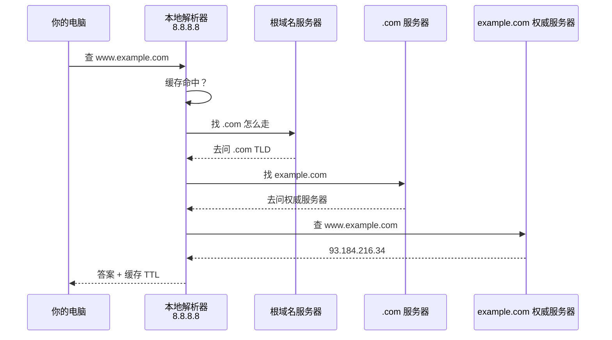

<KeyIdea>
**一句话**：**DNS** 把 `www.example.com` 这种人类记得住的域名，**翻译成 `93.184.216.34` 这种机器才能用的 IP 地址**。访问任何域名前都先做 DNS 查询。
</KeyIdea>

## 是什么

DNS 是个**全球分布式数据库**，按层级组织：

```
. (根域)
└── com (顶级域 TLD)
    └── example.com (二级域)
        ├── www.example.com  → A 记录 → 93.184.216.34
        └── mail.example.com → A 记录 → 93.184.216.50
```

你电脑发起查询时，会**逐级**向上问，直到找到答案。

## 打个比方

<Analogy>
DNS 像一层层的**通讯录**：
- 你先问公司前台「市场部李总怎么联系？」
- 前台问总公司，总公司问省公司……
- 最后给你一个具体电话号 —— 然后**记住下次直接用**（缓存）。
</Analogy>

## 关键概念

<Terms items={[
  { term: "A 记录", en: "A Record", def: "域名 → IPv4 地址。最常用。" },
  { term: "AAAA 记录", en: "AAAA Record", def: "域名 → IPv6 地址。" },
  { term: "CNAME", en: "Canonical Name", def: "域名 → 另一个域名的别名。CDN 常用。" },
  { term: "MX", en: "Mail Exchange", def: "收邮件用的服务器域名。" },
  { term: "TXT", en: "TXT Record", def: "任意文本，常用于域名所有权验证 / SPF / DKIM。" },
  { term: "TTL", en: "Time To Live", def: "缓存秒数，决定记录改了多久全网生效。" },
  { term: "递归查询", en: "Recursive", def: "你只问一次，由解析器替你跑完整个流程。" },
]} />

## 怎么工作



实践中绝大多数查询都**命中本地解析器缓存**，看不到完整流程。

## 实操要点

- **`dig www.example.com`**：最常用调试工具。Windows 用 `nslookup`。
- **`dig +trace`**：从根域开始走完整流程，看每一步。
- **改 DNS 不立即生效**：等 TTL 过期。**改之前**先把 TTL 调小（比如 60 秒）等几小时再改记录。
- **常用公共 DNS**：1.1.1.1（Cloudflare）、8.8.8.8（Google）、223.5.5.5（阿里）。
- **DoH / DoT**：DNS over HTTPS / TLS，把 DNS 加密，避免运营商劫持和窥探。
- **DNS 污染**：有些环境会返回错的 IP —— 用 DoH 或换上游 DNS 能绕过。

## 易混点

<Compare
  leftTitle="域名"
  rightTitle="URL"
  left={<>
    `example.com`<br />
    DNS 解析的对象。
  </>}
  right={<>
    `https://example.com/path?x=1`<br />
    完整定位一个资源。
  </>}
/>

## 延伸阅读

- [HTTP](/network/beginner/http)
- [HTTPS](/network/beginner/https) / [TLS](/network/beginner/tls)
- [Cloudflare](/network/ecosystem/cloudflare) —— 集成了权威 DNS 与递归 DNS
