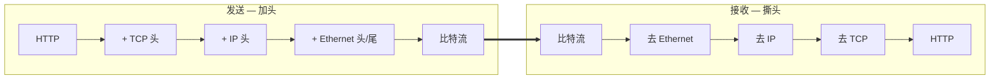

<KeyIdea>
**一句话**：发送方从应用层往下走，**每一层都在数据外面加一个本层的头部**（有时还加尾部）；接收方反过来一层层拆开。这个过程叫**封装 / 解封装**。
</KeyIdea>

## 是什么

应用程序写出的就是一段字节，比如一个 HTTP 请求：

```
GET /index.html HTTP/1.1
Host: example.com
```

它不会"赤裸"地跑在网线上。从上往下走的过程：

```
HTTP 报文                                              ← 应用层
[TCP 头 | HTTP 报文]                                   ← 传输层
[IP 头 | TCP 头 | HTTP 报文]                           ← 网络层
[以太网头 | IP 头 | TCP 头 | HTTP 报文 | 以太网尾]      ← 链路层
比特流                                                 ← 物理层
```

每加一层头部，都是为了**让下一层知道怎么处理这个包**。

## 打个比方

<Analogy>
你写完一封信（HTTP 报文），先装进**信封 1**（TCP，写明发件号）；再放进**信封 2**（IP，写明最终地址）；最后给快递员打包成**信封 3**（以太网，写明本段从哪到哪）。每个中转站只拆最外层信封看下一段送哪，**不拆里面**。
</Analogy>

## 关键概念

<Terms items={[
  { term: "Frame", en: "帧", def: "链路层的 PDU。以太网帧有源 / 目的 MAC、类型、CRC。" },
  { term: "Packet", en: "包", def: "网络层的 PDU。IP 包有源 / 目的 IP、TTL、协议号。" },
  { term: "Segment", en: "段", def: "TCP 的 PDU，含端口、序号、窗口。UDP 称 datagram。" },
  { term: "MTU", en: "最大传输单元", def: "链路层一帧能装的最大字节数（以太网默认 1500）。超过就要分片。" },
  { term: "Payload", en: "载荷", def: "本层头部之后真正要传输的数据。" },
]} />

## 怎么工作



中间每个路由器到了网络层就会**重写以太网头**（因为下一跳变了），但**不会动 IP 以上**。

## 实操要点

- **MTU 不匹配就麻烦**：IP 层会分片（fragmentation）。VPN / 隧道场景常见 MTU 偏小，TCP 性能下降。可以 `ping -s 1472 -M do` 测最大不分片大小。
- **抓包就是按层看头**：Wireshark 把每个包按 frame / IP / TCP / HTTP 展开，**手动撕了**给你看。
- **每层有最大长度限制**：以太网 1500、IP 包理论 65535、TCP segment 受 MSS 限制。
- **加密发生在哪层很关键**：HTTPS 在应用 / 传输之间加 TLS，链路层看到的还是密文 —— 但 IP 头还是明文，运营商能看到你访问哪个 IP。

## 易混点

<Compare
  leftTitle="头部 (Header)"
  rightTitle="尾部 (Trailer)"
  left={<>
    多数协议只有头部。<br />
    比如 IP、TCP。
  </>}
  right={<>
    链路层（以太网）会加 4 字节 CRC 校验尾部。
  </>}
/>

## 延伸阅读

- [OSI 七层](/network/beginner/osi-model) / [TCP/IP 五层](/network/beginner/tcpip-model)
- [IP 地址与子网](/network/beginner/ip-address)
- [TCP vs UDP](/network/beginner/tcp-vs-udp)
