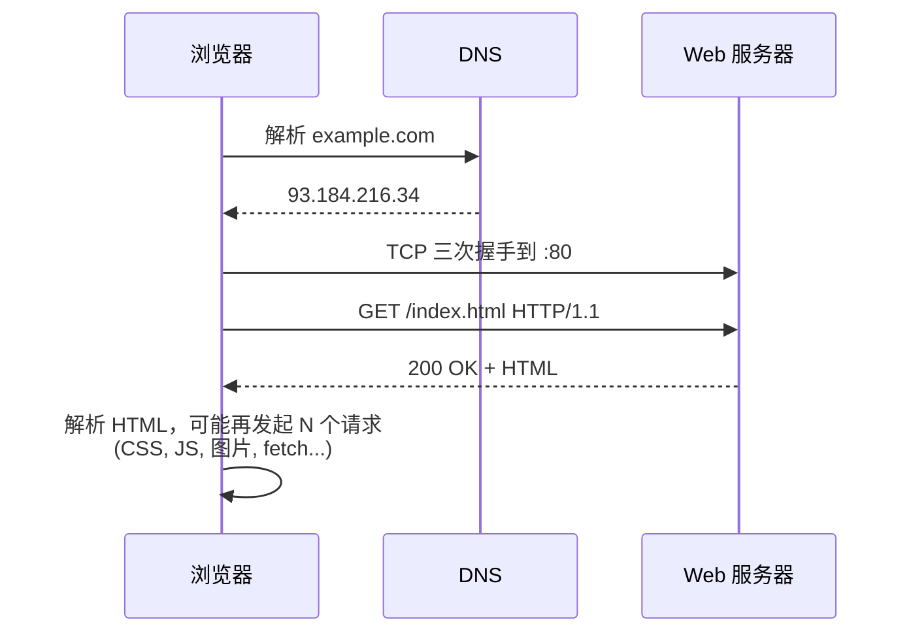

<KeyIdea>
**一句话**：**HTTP** 是浏览器和服务器之间的**请求-响应**协议。客户端发一个请求（方法 + URL + headers + body），服务器回一个响应（状态码 + headers + body）。
</KeyIdea>

## 是什么

最朴素的一次 HTTP 1.1 请求长这样：

```http
GET /index.html HTTP/1.1
Host: example.com
User-Agent: curl/8.0
Accept: */*

```

服务器回：

```http
HTTP/1.1 200 OK
Content-Type: text/html; charset=utf-8
Content-Length: 1234

<html>...
```

**纯文本协议**，可以肉眼读懂 —— 这是 HTTP 流行的关键。

## 打个比方

<Analogy>
HTTP 像**点餐**：
- 客户端：「**GET**（我要拿）/索引页 1.1 协议；我是 curl」 = 服务员我要这个；
- 服务端：「**200 OK**，下面是 HTML，1234 字节」 = 好的，菜上来了。

每次都是**一问一答**，服务器**默认不记得你**（无状态）。
</Analogy>

## 关键概念

<Terms items={[
  { term: "方法", en: "Method", def: "GET 拿 / POST 提交 / PUT 替换 / PATCH 局部改 / DELETE 删 / HEAD 只要头 / OPTIONS 询问能力。" },
  { term: "状态码", en: "Status Code", def: "1xx 信息 / 2xx 成功 / 3xx 重定向 / 4xx 客户端错 / 5xx 服务端错。" },
  { term: "请求头", en: "Headers", def: "键值对，描述请求 / 响应的元信息：Host、Accept、Content-Type、Authorization。" },
  { term: "Body", en: "正文", def: "POST/PUT 携带的数据。GET 不带 body。" },
  { term: "无状态", en: "Stateless", def: "HTTP 本身不记忆。会话通过 Cookie / Token 在每个请求里重发实现。" },
  { term: "幂等", en: "Idempotent", def: "GET / PUT / DELETE 多次调用结果一致；POST 不一定。" },
]} />

## 怎么工作



打开一个网页**通常发出几十个 HTTP 请求**，每个静态资源、API 调用都是一次。

## 实操要点

- **常用状态码记几个**：`200` OK、`301/302` 重定向、`304` 没变、`400` 参数错、`401` 没鉴权、`403` 没权限、`404` 没这资源、`500` 服务器炸了、`502/504` 网关 / 上游问题。
- **`curl -i URL`**：看响应头。`curl -v URL`：看完整收发。
- **POST 别滥用**：能用 GET 就 GET（可缓存、可书签、可重放）。
- **Content-Type 决定 body 怎么解析**：`application/json` / `application/x-www-form-urlencoded` / `multipart/form-data`。
- **跨域是浏览器做的**：CORS 不是 HTTP 规则、是浏览器**安全策略**。后端配响应头（`Access-Control-Allow-Origin`）放行。

## 易混点

<Compare
  leftTitle="HTTP/1.1"
  rightTitle="HTTP/2"
  left={<>
    文本协议，一个 TCP 连接一次只能跑一个请求。<br />
    并发靠多开连接。
  </>}
  right={<>
    二进制 + 多路复用，一个连接跑很多并发。<br />
    Header 压缩。
  </>}
/>

## 延伸阅读

- [HTTPS](/network/beginner/https) / [TLS](/network/beginner/tls)
- [HTTP/2](/network/advanced/http2)
- [HTTP/3 与 QUIC](/network/advanced/http3-quic)
