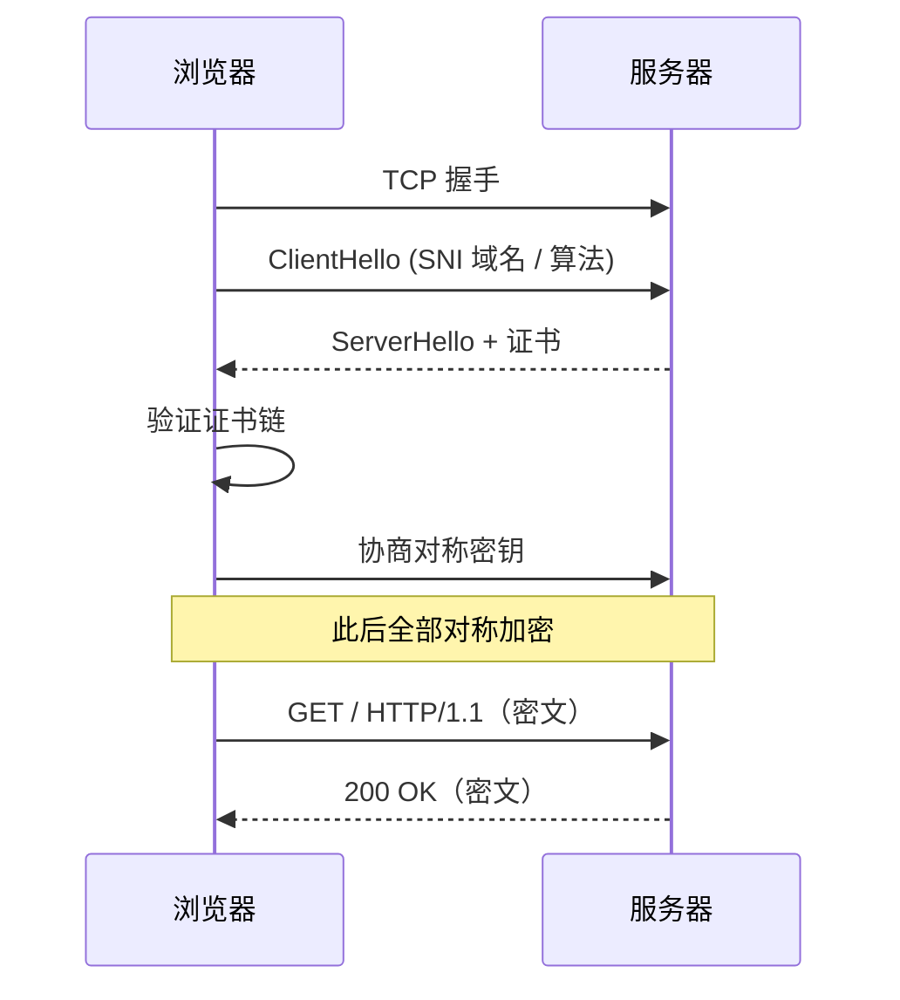

<KeyIdea>
**一句话**：**HTTPS = HTTP over TLS**。它把 HTTP 的明文报文塞进一条由 TLS 建立的加密通道，让运营商 / 公共 Wi-Fi 看不到内容、改不了响应；同时通过证书验证服务端身份。
</KeyIdea>

## 是什么

```
HTTP:   [TCP]────[HTTP 明文]
HTTPS:  [TCP]────[TLS 加密]────[HTTP]
```

TCP 握手完成后，TLS 再握一次：交换密钥、验证证书、协商算法 —— 之后双向通信都被对称加密。

## 打个比方

<Analogy>
HTTP 像**明信片**：邮递员路上谁都能瞄一眼。HTTPS 像**保险箱**：双方先在握手时安全交换钥匙，之后所有信都锁在箱子里寄出去 —— 路上的人**只看到锁着的箱子**。
</Analogy>

## 关键概念

<Terms items={[
  { term: "证书", en: "Certificate", def: "X.509 文件，包含域名、公钥、签发者。证明「这个公钥确实属于这个域名」。" },
  { term: "CA", en: "Certificate Authority", def: "证书签发机构。浏览器内置受信 CA 列表（Let's Encrypt、DigiCert 等）。" },
  { term: "SNI", en: "Server Name Indication", def: "TLS 握手时客户端告诉服务器要访问哪个域名 —— 同一 IP 多证书的关键。" },
  { term: "HSTS", en: "HTTP Strict Transport Security", def: "服务器告诉浏览器「以后只准用 HTTPS 访问我」。" },
  { term: "混合内容", en: "Mixed Content", def: "HTTPS 页面里加载 HTTP 资源 —— 浏览器会拦截。" },
]} />

## 怎么工作



TLS 1.3 握手压到 1-RTT，还能 0-RTT 复用 —— 大幅提速。

## 实操要点

- **Let's Encrypt + ACME**：免费签发证书、90 天自动续期。Caddy / Traefik 内置自动化，nginx 配 certbot。
- **证书过期是事故第一名**：监控提前 7 天 / 14 天告警。
- **`curl -v https://...`**：看 TLS 版本、cipher、证书。
- **`openssl s_client -connect host:443 -servername host`**：debug 证书 / SNI 问题。
- **混合内容**：HTTPS 页面里加载 HTTP 资源会被浏览器拦截。**全站 HTTPS** 才能避免。
- **HSTS preload**：把域名提交到浏览器内置列表，**强制 HTTPS** 永久生效。

## 易混点

<Compare
  leftTitle="HTTPS"
  rightTitle="VPN"
  left={<>
    只加密**单条 HTTP 连接**。<br />
    SNI / IP 仍然暴露。
  </>}
  right={<>
    把**所有**流量打包加密发到 VPN 服务器。<br />
    运营商只看到你连了 VPN。
  </>}
/>

## 延伸阅读

- [HTTP 基础](/network/beginner/http)
- [TLS](/network/beginner/tls)
- [TLS 握手细节](/network/advanced/tls-handshake)
- [DNS](/network/beginner/dns)
