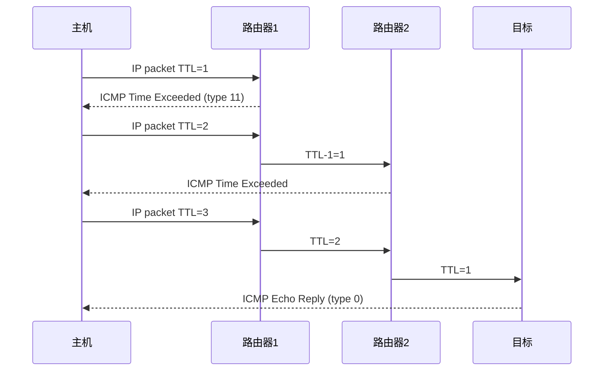

<KeyIdea>
**一句话**：**ICMP** 跟 IP 一起运行（直接跑在 IP 之上，没用 TCP/UDP），专门干**控制和诊断**的活：路由不可达、TTL 超时、Ping 探测。**它不传业务数据**，是网络的"客服 + 体检"通道。
</KeyIdea>

## 是什么

ICMP 报文是 IP 包的 payload（协议号 `1`，IPv6 是 `58`，叫 ICMPv6）：

```
IP header(protocol=1) | ICMP header(type, code) | data
```

常见 type：

```
type 0   Echo Reply        ← Ping 的应答
type 8   Echo Request      ← Ping 的请求
type 3   Destination Unreachable  (code 0=网络不可达, 1=主机, 3=端口, 4=分片需要但 DF 设置)
type 11  Time Exceeded     ← TTL 用完，traceroute 靠它
type 5   Redirect          ← 路由器告诉你"换条路"
```

## 打个比方

<Analogy>
IP / TCP 像**快递业务**；ICMP 像**快递公司的客服**：包裹丢了打电话告诉你"地址不存在"、"楼层超出"、"我帮你测一下能不能送达"。**ICMP 自己不送货**。
</Analogy>

## 关键概念

<Terms items={[
  { term: "Echo Request / Reply", en: "回显请求 / 应答", def: "Ping 用的两个 type（8 / 0）。" },
  { term: "Destination Unreachable", en: "目的不可达", def: "type 3 + 各 code 解释为什么到不了：网络 / 主机 / 端口 / 协议。" },
  { term: "Time Exceeded", en: "TTL 超时", def: "type 11，traceroute 利用它一跳一跳暴露中间路由器。" },
  { term: "Redirect", en: "重定向", def: "type 5，路由器建议主机换网关；现代网络多禁用以防被滥用。" },
  { term: "PMTUD", en: "路径 MTU 发现", def: "靠 type 3 code 4 提示发送方降低分片；防火墙误屏蔽会导致『黑洞』。" },
  { term: "ICMPv6", en: "ICMPv6", def: "IPv6 必需，承担邻居发现（NDP）+ 路由发现，**禁不得**。" },
]} />

## 怎么工作



Traceroute 就是**故意让 TTL 一跳就死**，靠中间路由器发的 Time Exceeded 把路径暴露出来。

## 实操要点

- **`ping`** 用 ICMP type 8/0；服务器拒 ping 不代表不在线，可能只屏蔽了 ICMP。
- **不要无脑屏蔽 ICMP**：`type 3 code 4`（PMTUD）被屏蔽 = 网络黑洞，大包丢、小包通；`ICMPv6` 屏蔽 = IPv6 直接断。
- **传输层方案**：`tcping` / `nc -zv host port` / `mtr --tcp` 在屏蔽 ICMP 的网络里也能测。
- **风险**：**ICMP 隧道**（数据塞 echo payload 里）被用来内网渗透 / 出口外联，企业出网防火墙建议限流 + DPI。
- **诊断分级**：`ping → traceroute → mtr → tcpdump icmp` 是经典四步排错。

## 易混点

<Compare
  leftTitle="ICMP"
  rightTitle="UDP / TCP"
  left={<>
    **网络层**控制信令。<br />
    无端口、不传业务数据。
  </>}
  right={<>
    **传输层**应用通信。<br />
    有端口、承载真正的负载。
  </>}
/>

## 延伸阅读

- [Ping](/network/beginner/ping)
- [Traceroute](/network/beginner/traceroute)
- [IP 地址](/network/beginner/ip-address)
