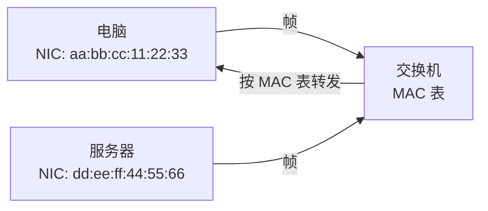

<KeyIdea>
**一句话**：MAC 地址是 6 字节（48 位）的硬件标识符，**烧在网卡里**，写成 `aa:bb:cc:dd:ee:ff`。它在**同一二层广播域**内用于寻址，跨网段没意义。
</KeyIdea>

## 是什么

```
aa:bb:cc:dd:ee:ff
└─ OUI ──┘ └─ 厂商内部 ──┘
   24 位        24 位
```

- 前 24 位 **OUI**（Organizationally Unique Identifier）由 IEEE 分给厂商：苹果、Intel、华为各自有专属前缀。
- 后 24 位由厂商自管。
- 理论全球唯一，实际可以软改。

## 打个比方

<Analogy>
**IP** 是**门牌号**（可以临时换房间），**MAC** 是**身份证号**（出厂时刻好的）。但身份证号也可以伪造，所以**不要把 MAC 当作可信身份**。
</Analogy>

## 关键概念

<Terms items={[
  { term: "单播 MAC", en: "Unicast", def: "首字节最低位为 0；发给特定主机。" },
  { term: "组播 MAC", en: "Multicast", def: "首字节最低位为 1；发给一组主机。例如 IPv6 邻居发现用 33:33:xx:xx:xx:xx。" },
  { term: "广播 MAC", en: "Broadcast", def: "ff:ff:ff:ff:ff:ff，发给本网段所有主机。" },
  { term: "本地管理 / 全球管理", en: "U/L bit", def: "首字节第二位：0 = 厂商烧录，1 = 本地管理（如虚拟机虚拟网卡）。" },
  { term: "MAC 随机化", en: "MAC Randomization", def: "iOS / Android 在 Wi-Fi 探测中使用随机 MAC，避免被追踪。" },
]} />

## 怎么工作



交换机看每个帧的**目的 MAC**：
- 在 MAC 表里 → 转发到对应端口；
- 不在 → 泛洪到所有端口（除来源端口）。

## 实操要点

- **`ip link show` / `ifconfig`** 查本机 MAC。
- **改 MAC**：`ip link set eth0 address xx:xx:xx:xx:xx:xx`。
- **MAC 漂移**：同一 MAC 在多个端口出现，常因为环路 / 多 NIC 共享，**交换机告警**。
- **MAC 表老化**：默认 5 分钟，长时间不通信的条目被清理。
- **隐私**：手机扫 Wi-Fi 时使用随机 MAC（iOS 默认开），**入网后**才用真实 MAC（取决于设置）。

## 易混点

<Compare
  leftTitle="IP"
  rightTitle="MAC"
  left={<>
    **逻辑地址**，可变。<br />
    跨网段路由用。
  </>}
  right={<>
    **物理地址**，烧在网卡。<br />
    只在同一网段内有意义。
  </>}
/>

## 延伸阅读

- [ARP](/network/beginner/arp) —— 已知 IP 求 MAC
- [物理与链路层](/network/beginner/physical-link)
- [IP 地址](/network/beginner/ip-address)
