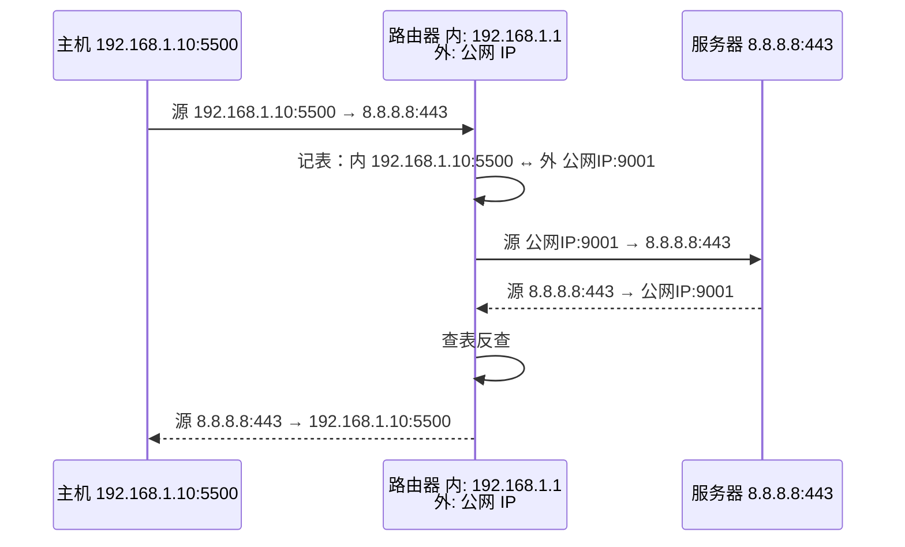

<KeyIdea>
**一句话**：**NAT** 让局域网里的私网 IP（`192.168.x.x`）出门时**临时被替换成公网 IP**，回包再换回来 —— 这是现在 IPv4 互联网还能撑到现在的关键。
</KeyIdea>

## 是什么

家里路由器（也叫网关）做的事：

```
LAN 里：  192.168.1.10:5500 → 8.8.8.8:443
           ↓ NAT 改写
公网上： 公网IP:外部端口 → 8.8.8.8:443
           ← 回包反向改写
```

家里十台设备同时上网，路由器**用「外部端口号」区分谁是谁** —— 这种一对多的 NAT 叫 **NAPT / PAT**（端口地址转换），是绝对主流。

## 打个比方

<Analogy>
公司前台总机：员工对外都用同一个公司电话；前台用**分机号**区分内部哪个员工接的电话。NAT 就是路由器在做「前台总机」。
</Analogy>

## 关键概念

<Terms items={[
  { term: "SNAT", en: "Source NAT", def: "改源 IP，私网→公网出门时用。家用路由器的默认行为。" },
  { term: "DNAT", en: "Destination NAT", def: "改目的 IP，公网→私网回来时用，常用于端口转发 / 暴露内网服务。" },
  { term: "NAPT / PAT", en: "Port Address Translation", def: "一对多 NAT：用端口号区分内网主机。家用唯一可行方案。" },
  { term: "NAT 类型", en: "Cone / Symmetric", def: "影响 P2P 打洞难度。Symmetric NAT 最严，常常打不通。" },
  { term: "端口转发", en: "Port Forwarding", def: "DNAT 的一种：路由器配置「公网 8080 → 内网 192.168.1.5:80」。" },
]} />

## 怎么工作



每条 NAT 映射在路由器上是一条**会话表项**，TCP 连接断开或 UDP 闲置一段时间后**会被清掉**。

## 实操要点

- **私网设备主动连出**：NAT 自动建表，没问题。
- **公网主动连内网设备**：默认进不来，需要**端口转发**或**反向隧道**（frp / ngrok / Cloudflare Tunnel）。
- **P2P 打洞**：双方各自向对方的「公网 IP:端口」发 UDP，靠中间服务器协调时机让两边的 NAT 都建好表项 —— 这是 STUN / TURN 的工作。
- **NAT 影响游戏 / 视频通话**：「**NAT Type 严格**」就是说你这边是 Symmetric NAT，对端打不进来。
- **CGNAT**（运营商级 NAT）：很多家庭宽带连公网 IP 都没有，**多家用户共享公网 IP** —— 自建服务必须靠隧道穿透。

## 易混点

<Compare
  leftTitle="NAT"
  rightTitle="代理 (Proxy)"
  left={<>
    **网络层**做地址改写。<br />
    应用层无感知。
  </>}
  right={<>
    **应用层**代收发数据。<br />
    应用要知道代理存在（HTTP_PROXY 等）。
  </>}
/>

## 延伸阅读

- [IP 地址](/network/beginner/ip-address)
- [子网与 CIDR](/network/beginner/subnet-cidr)
- [WireGuard / Tailscale](/network/ecosystem/wireguard-tailscale) —— 解决 NAT 穿透的现代方案
