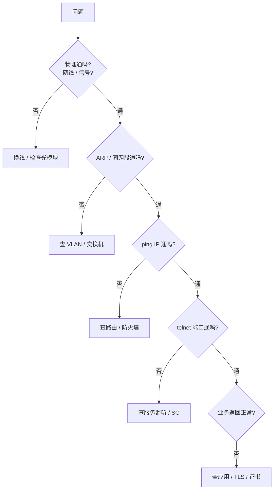

<KeyIdea>
**一句话**：OSI 七层模型把网络从「光信号」到「应用语义」切成七层 —— 物理 / 链路 / 网络 / 传输 / 会话 / 表示 / 应用，**每一层只用下一层的服务**。它是**理论模型**，工程实现里多数厂家走 TCP/IP 五层。
</KeyIdea>

## 七层一句话表

| 层 | 名称 | 干什么 | 例子 |
| --- | --- | --- | --- |
| 7 | 应用层 | 业务语义 | HTTP / SMTP / DNS / SSH |
| 6 | 表示层 | 编码、加密、压缩 | TLS（部分）/ JPEG / ASCII |
| 5 | 会话层 | 建立 / 维护会话 | RPC 会话、SQL 会话 |
| 4 | 传输层 | 端到端可靠或快速 | TCP / UDP |
| 3 | 网络层 | 跨网段路由 | IP / ICMP / OSPF |
| 2 | 数据链路层 | 同一链路传输 | Ethernet / Wi-Fi / PPP |
| 1 | 物理层 | 比特变信号 | 铜线 / 光纤 / 射频 |

## 打个比方

<Analogy>
寄一封信：
- 物理层 = 邮政车 / 路；
- 链路层 = 同城配送员；
- 网络层 = 跨城邮政路由；
- 传输层 = 「保证签收」（TCP）vs「丢就丢」（UDP）；
- 会话层 = 「这是我们俩的对话上下文」；
- 表示层 = 中英翻译 / 加密；
- 应用层 = 信里写的内容本身。
</Analogy>

## 为什么 5、6 层「在工程里很模糊」

**表示层与会话层**在 TCP/IP 实现里几乎没有独立的协议。这两层的功能：
- 表示层 → 通常被**应用层协议自己**处理（HTTP 头里的 `Content-Encoding` / `Content-Type`、TLS 加密）；
- 会话层 → 通常被**应用层 + 传输层**共同处理（HTTP 的 Cookie、TLS 的 session resume）。

所以**工业实践的 TCP/IP 模型只有 5 层（甚至 4 层合并）**。

## 关键概念

<Terms items={[
  { term: "封装", en: "Encapsulation", def: "下行时每层加自己的头部。" },
  { term: "解封装", en: "De-encapsulation", def: "上行时每层撕掉头部。" },
  { term: "PDU", en: "Protocol Data Unit", def: "每层对自己单位的称呼：bit / frame / packet / segment / message。" },
  { term: "对等通信", en: "Peer-to-peer", def: "通信双方在同一层逻辑上对话，下层只是搬运工。" },
]} />

## 怎么用 OSI 模型排错

**分层排错** = 自下而上，每层先排除再上。

## 实操要点

- **OSI 七层是「能描述」而非「必须实现」**。
- **工业里讲 TCP/IP 模型即可**：物理 / 链路 / 网络 / 传输 / 应用。
- **运维 / 安全经常说「L4 / L7」**：L4 = 传输层（TCP/UDP 端口），L7 = 应用层（HTTP / TLS / SQL）。
- **抓包**（Wireshark）默认按层展开，**OSI 是看抓包的最佳坐标系**。

## 易混点

<Compare
  leftTitle="OSI 七层"
  rightTitle="TCP/IP 五层"
  left={<>
    教学模型，理论清晰。 
    表示 / 会话层在工程里没人单独实现。
  </>}
  right={<>
    工业实践模型。 
    今天互联网真正跑的就是它。
  </>}
/>

## 延伸阅读

- [TCP/IP 模型](/network/beginner/tcpip-model)
- [封装与解封装](/network/beginner/encapsulation)
- [物理与链路层](/network/beginner/physical-link)
