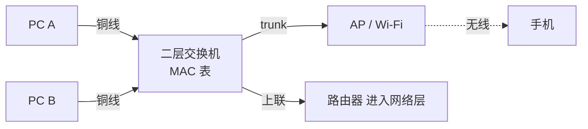

<KeyIdea>
**一句话**：物理层负责**把比特变成电 / 光 / 电波信号**，链路层负责**在同一段网线 / 同一个 Wi-Fi 范围内把数据帧准确送到下一跳**。
</KeyIdea>

## 是什么

- **物理层**：电压、调制方式、光强度、射频功率 —— 怎么把 `0` 和 `1` 通过物理介质传出去。
- **链路层**：以太网帧、Wi-Fi 帧的格式；CRC 校验；MAC 地址寻址；半双工 / 全双工。

```
[Wi-Fi 帧 / Ethernet 帧]   ← 链路层
        ↓
[二进制信号]               ← 物理层（铜线 / 光纤 / 2.4GHz 5GHz 6GHz）
```

## 打个比方

<Analogy>
**物理层** = **马路**（柏油路 / 高速公路）。
**链路层** = **同一条街上的快递员**：他只关心从这家送到那家、不操心目的地有多远。下一个城市的事归网络层（路由器）管。
</Analogy>

## 关键概念

<Terms items={[
  { term: "Ethernet", en: "以太网", def: "有线 LAN 主流。10M / 100M / 1G / 10G / 25G / 100G。RJ45 + 双绞线 / 光模块。" },
  { term: "Wi-Fi", en: "无线局域网", def: "802.11 标准。a/b/g/n/ac/ax/be 一代代演进，速率与抗干扰能力提升。" },
  { term: "交换机", en: "Switch", def: "二层设备，按 MAC 地址表把帧只发给目标端口（不像 hub 全发）。" },
  { term: "VLAN", en: "Virtual LAN", def: "把一台交换机切成多个逻辑广播域。一根上联线带多个 VLAN（trunk）。" },
  { term: "MTU", en: "最大传输单元", def: "以太网默认 1500 字节，巨型帧（jumbo）9000 字节。" },
  { term: "全双工", en: "Full Duplex", def: "收发可以同时进行，现代交换机端口都是。" },
]} />

## 怎么工作



交换机收到帧 → 查 MAC 表 → 知道目的 MAC 在哪个端口 → 只往那个端口转发。**不知道则泛洪**（除来源端口外全发）。

## 实操要点

- **网线分类**：Cat5e（1G）→ Cat6（1G/2.5G/10G 短距）→ Cat6a（10G）→ Cat7/8（数据中心）。家里 Cat6 够用。
- **光模块**：SFP（1G）/ SFP+（10G）/ SFP28（25G）/ QSFP+（40G）/ QSFP28（100G）。要看自己交换机口支持哪种。
- **Wi-Fi 信道选 5/6 GHz 优先**：2.4 GHz 拥挤、穿墙强；5/6 GHz 干净、速率高、穿墙差。
- **MTU 改了别忘对端**：链路两边 MTU 不一致会丢大包。VPN 内部建议 1420 上下。
- **半双工早绝迹**：除非接的是老旧设备，**不要再调成 half duplex**。

## 易混点

<Compare
  leftTitle="Hub"
  rightTitle="Switch"
  left={<>
    一进多出全转发，**冲突域共享**。<br />
    现在基本绝迹。
  </>}
  right={<>
    按 MAC 表精准转发。<br />
    每个口独立冲突域。
  </>}
/>

## 延伸阅读

- [OSI 七层](/network/beginner/osi-model) / [TCP/IP 五层](/network/beginner/tcpip-model)
- [MAC 地址](/network/beginner/mac-address) / [ARP](/network/beginner/arp)
- [子网与 CIDR](/network/beginner/subnet-cidr)
