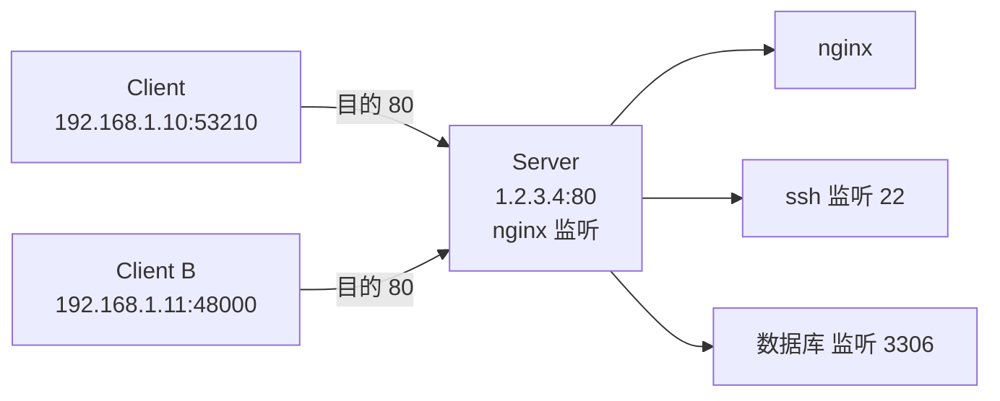

<KeyIdea>
**一句话**：**端口**是 16 位整数（0–65535），**IP 找到主机，端口找到主机上的具体服务**。一个连接由 5 元组唯一标识：**协议 + 源 IP + 源端口 + 目的 IP + 目的端口**。
</KeyIdea>

## 是什么

主机可能同时跑 Web、SSH、数据库、Redis……操作系统怎么知道一个收到的包要交给谁？看端口号。

```
你访问 https://example.com
  → 默认目的端口 443 (HTTPS)
  → 你的电脑随便挑个空闲端口当源端口（比如 53210）
  → 服务器从「目的 443」知道是给 nginx 的
```

## 打个比方

<Analogy>
**IP** 是**写字楼地址**，**端口**是**楼里某个公司前台的电话分机号**。一栋楼能容纳很多公司，每家公司有自己的分机。
</Analogy>

## 关键概念

<Terms items={[
  { term: "知名端口", en: "Well-known", def: "0–1023，分配给标准协议（HTTP 80、HTTPS 443、SSH 22、DNS 53）。Linux 默认非 root 不能监听。" },
  { term: "注册端口", en: "Registered", def: "1024–49151，应用厂商向 IANA 注册（MySQL 3306、PostgreSQL 5432、Redis 6379）。" },
  { term: "动态端口", en: "Ephemeral", def: "49152–65535（Linux 默认 32768–60999），客户端发起连接时临时分配。" },
  { term: "5 元组", en: "5-tuple", def: "(协议, 源 IP, 源端口, 目的 IP, 目的端口) —— 唯一标识一个连接。" },
  { term: "监听 vs 连接", en: "Listen vs Connect", def: "服务器 listen 一个端口；客户端 connect 时本地端口由 OS 自动分配。" },
]} />

## 怎么工作



同一台服务器、同一个端口可以**同时被多个客户端连接** —— 因为 5 元组里**源 IP / 源端口不同**，连接就不同。

## 实操要点

- **`netstat -tlnp` / `ss -tlnp`**：查本机正在监听哪些端口。
- **`lsof -i :3000`**：哪个进程占了 3000 端口？
- **绑定 0.0.0.0 vs 127.0.0.1**：前者监听所有网络接口（含外网），后者只监听本机 —— **生产环境注意**。
- **端口冲突**：要起服务先 `ss -ltn | grep :3000` 看一眼，被占了就换或者杀进程。
- **小于 1024 默认要 root**：用 `setcap` 或 `iptables` 转发 80→8080 是常见绕过。

## 易混点

<Compare
  leftTitle="同一端口被多个连接共用"
  rightTitle="端口冲突"
  left={<>
    server 监听 80，**N 个客户端都能连**。<br />
    每条连接 5 元组不同 = 不同 socket。
  </>}
  right={<>
    同一台机器**两个进程都想 listen 80**。<br />
    后启动的报 `Address already in use`。
  </>}
/>

## 延伸阅读

- [TCP vs UDP](/network/beginner/tcp-vs-udp)
- [TCP 三次握手](/network/advanced/tcp-handshake)
- [NAT](/network/beginner/nat) —— NAT 改写的就是端口号
