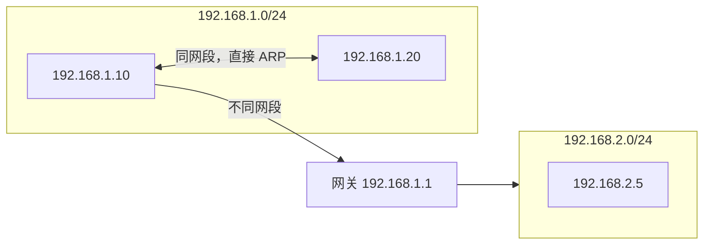

<KeyIdea>
**一句话**：**子网掩码**告诉主机 IP 地址的「**前几位是网络部分、后几位是主机部分**」。CIDR 用 `/N` 表示前 N 位是网络位 —— 现代网络里**不要再背 ABC 类**了。
</KeyIdea>

## 是什么

`192.168.1.10/24` 中：

- 前 24 位 (`192.168.1`) 是**网络部分** —— 这一段所有主机共享；
- 后 8 位 (`.10`) 是**主机部分** —— 区分同一网段里的不同主机。

```
192.168.1.10/24 二进制：
  11000000.10101000.00000001 . 00001010
  └─────── 网络 24 位 ──────┘ └ 主机 8 位 ┘
```

整个网段 `192.168.1.0/24` 能容纳 256 个地址，但首尾两个保留：`.0`（网络号）、`.255`（广播）。**真正可用 254 个**。

## 打个比方

<Analogy>
**邮政编码**：`100000` 表示北京，前面几位区分省 / 市，后面几位区分小区 / 楼栋。子网掩码就是告诉你「**邮编前几位代表大区域**」的那把尺子。
</Analogy>

## 关键概念

<Terms items={[
  { term: "Subnet Mask", en: "子网掩码", def: "和 IP 同长 32 位，1 表示网络位、0 表示主机位。例如 /24 = 255.255.255.0。" },
  { term: "CIDR 表示法", en: "Classless Inter-Domain Routing", def: "用 IP/前缀长度 表示，比如 10.0.0.0/8、172.16.0.0/12。" },
  { term: "网络号", en: "Network Address", def: "主机位全 0，标识整个网段，不分给主机。" },
  { term: "广播地址", en: "Broadcast Address", def: "主机位全 1，发到这里所有人都收。" },
  { term: "可用主机数", en: "Usable Hosts", def: "2^主机位 - 2（减去网络号和广播）。" },
]} />

## 怎么工作



主机要发包前会用**自己的子网掩码**判断目标 IP **是否在同一网段**：是 → 直接通过 ARP 找 MAC 发出去；否 → 发给默认网关。

## 实操要点

- **常用 CIDR 速查**：

| CIDR | 子网掩码         | 可用主机数 |
| ---- | ---------------- | ---------- |
| /24  | 255.255.255.0    | 254        |
| /25  | 255.255.255.128  | 126        |
| /26  | 255.255.255.192  | 62         |
| /28  | 255.255.255.240  | 14         |
| /30  | 255.255.255.252  | 2 (点对点) |

- **`/32` 表示一个具体 IP**，常见于路由表里的精确条目。
- **`/0` 表示「所有 IP」**，默认路由 `0.0.0.0/0` 就是它。
- **算 IP 范围别手算**：用 `ipcalc 192.168.1.0/26` 直接出网络号 / 广播 / 可用范围。
- **子网划得越小越省 IP，但路由表越大**：实际工程里都是按业务拆 /24，**好管理胜过省地址**。

## 易混点

<Compare
  leftTitle="A/B/C 类"
  rightTitle="CIDR"
  left={<>
    早期固定划分：A 类 /8、B 类 /16、C 类 /24。<br />
    粒度太粗，浪费严重，**已废弃**。
  </>}
  right={<>
    任意前缀长度 /N。<br />
    现代互联网通用方案。
  </>}
/>

## 延伸阅读

- [IP 地址](/network/beginner/ip-address)
- [NAT](/network/beginner/nat)
- [TCP vs UDP](/network/beginner/tcp-vs-udp)
