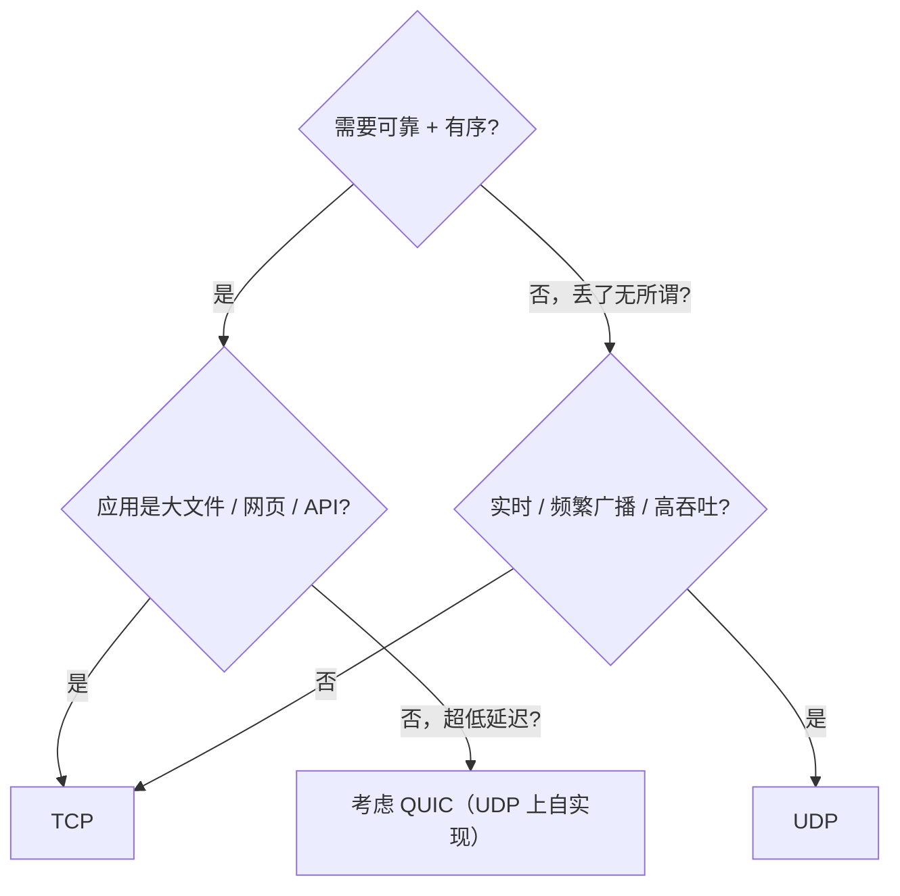

<KeyIdea>
**一句话**：TCP 提供**可靠**，UDP 提供**简单 + 实时**。场景需要"绝对送到、按顺序"选 TCP；需要"低延迟、丢一点没关系"选 UDP。**HTTP/3 选 UDP** 是因为它把可靠性自己实现在了 QUIC 里。
</KeyIdea>

## 一表对比

| 维度       | TCP                              | UDP                          |
| ---------- | -------------------------------- | ---------------------------- |
| 连接       | 三次握手建立                     | 无连接                       |
| 可靠性     | 序号 + ACK + 重传，保证不丢      | 不保证                       |
| 顺序       | 保证有序                         | 不保证                       |
| 流控       | 滑动窗口                         | 无                           |
| 拥塞控制   | Reno / CUBIC / BBR               | 无（应用层自理）             |
| 数据形式   | 字节流（无边界）                 | 数据报（有边界）             |
| 头部大小   | 20+ 字节                         | 8 字节                       |
| 广播 / 组播 | 不支持                           | 原生支持                     |
| 典型协议   | HTTP/1/2、SSH、SMTP、数据库、TLS | DNS、DHCP、NTP、VoIP、QUIC   |
| NAT 穿透   | 容易（路由器看 SYN/FIN）         | 较难（依赖超时）             |

## 怎么选

## 实操经验

- **HTTP/1/2、SSH、SMTP、IMAP、数据库连接**：TCP。
- **DNS、DHCP、NTP**：UDP（轻量、单次问答）。
- **VoIP / 视频会议 / 直播 / 游戏**：UDP，丢一两个帧无关大局。
- **HTTP/3**：UDP 上跑 QUIC —— 既要可靠又要避免 TCP 队头阻塞。
- **追求极致吞吐**（数据中心内部 / 高频交易）：UDP + 自实现可靠（如 KCP / DPDK）。

## 易混点

<Compare
  leftTitle="TCP"
  rightTitle="UDP"
  left={<>
    可靠 + 有序 + 拥塞控制。 
    握手开销，**正确性优先**。
  </>}
  right={<>
    无连接 + 不保证。 
    无握手零开销，**实时性优先**。
  </>}
/>

## 延伸阅读

- [TCP](/network/beginner/tcp)
- [UDP](/network/beginner/udp)
- [TCP 三次握手](/network/advanced/tcp-handshake)
- [HTTP/3 与 QUIC](/network/advanced/http3-quic)
