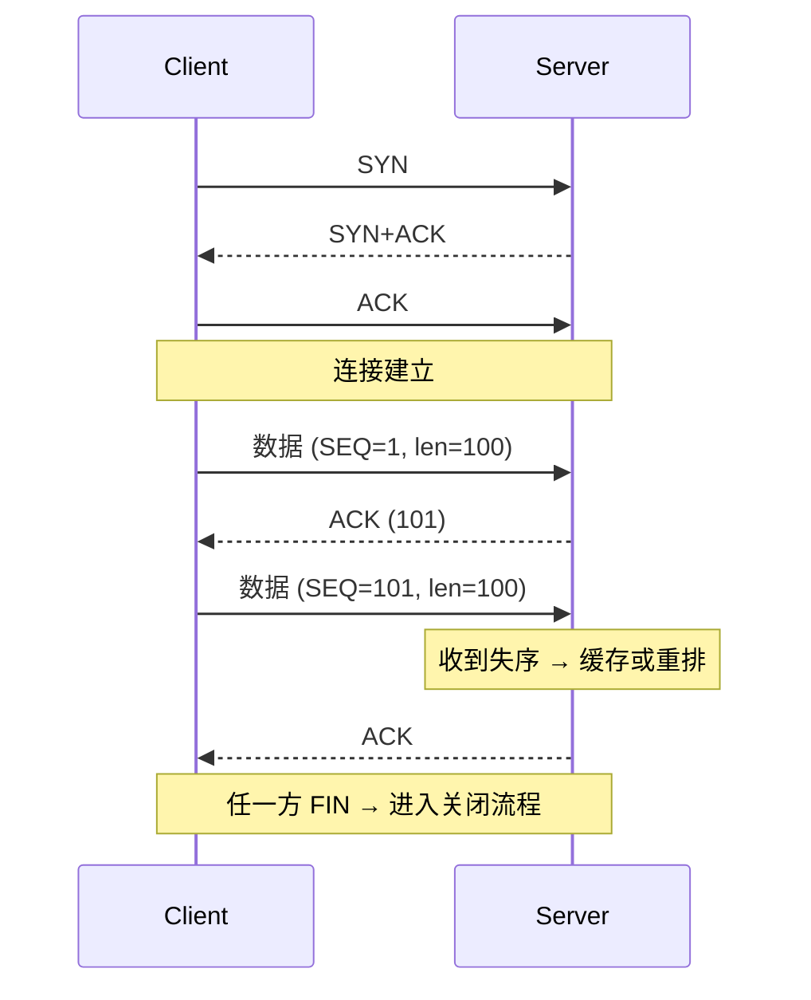

<KeyIdea>
**一句话**：**TCP** 在两台主机之间**建立一条逻辑连接**，把上层字节流可靠、有序地送达，丢了重传、堵了减速。它是 HTTP/SSH/SMTP/数据库等绝大多数协议的底座。
</KeyIdea>

## 是什么

TCP 提供：
- **面向连接**：先三次握手再发数据；
- **可靠交付**：序号 + ACK + 重传；
- **有序**：按发送顺序还原；
- **流量控制**：滑动窗口让接收方反馈「还能收多少」；
- **拥塞控制**：检测到丢包就降速（Reno / CUBIC / BBR）。

代价是**握手 / 重传开销** —— 不适合实时场景。

## 打个比方

<Analogy>
**TCP** 像**挂号信**：
- 发出去要签收（ACK）；
- 丢了快递员重新送（重传）；
- 必须按顺序到（序号）；
- 收件人快爆仓时通知你慢点发（滑动窗口）。
</Analogy>

## 关键概念

<Terms items={[
  { term: "三次握手", en: "3-way handshake", def: "SYN → SYN+ACK → ACK，建立连接。详见 TCP 三次握手页面。" },
  { term: "四次挥手", en: "4-way close", def: "FIN/ACK 双向关闭。" },
  { term: "序号 / 确认号", en: "SEQ / ACK", def: "按字节计数，接收方告知期望的下一字节。" },
  { term: "滑动窗口", en: "Sliding window", def: "接收方动态告知发送方「还能收多少字节」，实现流控。" },
  { term: "MSS", en: "Maximum Segment Size", def: "TCP 一段最大数据字节数，常 = MTU - 40。" },
  { term: "拥塞控制", en: "Congestion control", def: "Reno / CUBIC / BBR 等算法，根据丢包 / RTT 调速。" },
]} />

## 怎么工作

TCP 头部至少 20 字节，包含序号、确认号、窗口、校验和、各种 flag（SYN / ACK / FIN / RST / PSH / URG）。

## 实操要点

- **`ss -ti`** 看 TCP 连接当前的拥塞算法、RTT、cwnd。
- **`sysctl net.ipv4.tcp_congestion_control`** 改默认拥塞算法。BBR 在跨洋链路通常显著优于 CUBIC。
- **TIME_WAIT 多**：高并发短连接服务**会留一堆 TIME_WAIT**，调 `tcp_tw_reuse` 或改用长连接 / 连接池。
- **半连接队列 / 全连接队列满**：监听端口被打爆时 SYN 被丢；调 `somaxconn` 与 `tcp_max_syn_backlog`。
- **TCP keepalive**：默认 7200 秒太长，长连接服务通常调到 60–120 秒。

## 易混点

<Compare
  leftTitle="TCP"
  rightTitle="UDP"
  left={<>
    面向连接、可靠、有序、有拥塞控制。 
    握手 + 重传开销大。
  </>}
  right={<>
    无连接、不保证、无序、无拥塞控制。 
    零开销，适合实时。
  </>}
/>

## 延伸阅读

- [UDP](/network/beginner/udp)
- [TCP vs UDP 对照](/network/beginner/tcp-vs-udp)
- [TCP 三次握手](/network/advanced/tcp-handshake)
- [TCP 状态机](/network/advanced/tcp-state)
- [拥塞控制](/network/advanced/congestion-control)
