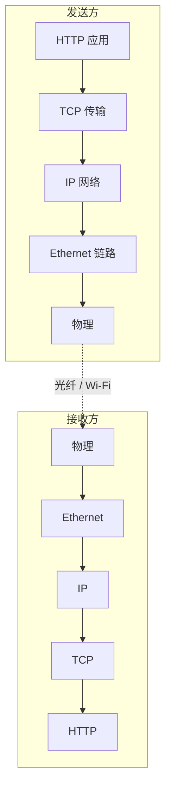

<KeyIdea>
**一句话**：TCP/IP 模型是**今天互联网真正在跑的分层**：应用 / 传输 / 网络 / 链路 / 物理（有时归为「四层」把链路和物理合并）。它由实际协议族**自下而上长出来**，不是设计文档。
</KeyIdea>

## 五层一览

```
+---------------------+
| 应用层 (Application) | HTTP / DNS / SSH / SMTP / gRPC
+---------------------+
| 传输层 (Transport)   | TCP / UDP / QUIC
+---------------------+
| 网络层 (Network)     | IP / ICMP / 路由协议
+---------------------+
| 链路层 (Link)        | Ethernet / Wi-Fi / PPP
+---------------------+
| 物理层 (Physical)    | 铜线 / 光纤 / 电波
+---------------------+
```

## 为什么不是七层

OSI 标准有应用 / 表示 / 会话 / 传输 / 网络 / 链路 / 物理。**TCP/IP 实现里**：
- 没有独立的会话层、表示层 —— 它们的活儿被应用层（HTTP / TLS）和传输层一起承担。
- 链路层与物理层在协议栈里其实分得开，但实现时常常合在一张网卡里说。

## 打个比方

<Analogy>
- OSI 像**理论物理**：完美对称、漂亮。  
- TCP/IP 像**工程物理**：能让飞船飞起来 —— **少几层但实际可用**。
</Analogy>

## 关键概念

<Terms items={[
  { term: "应用层", en: "Application", def: "业务语义。HTTP / DNS / gRPC / SSH —— 你能直接调用的协议。" },
  { term: "传输层", en: "Transport", def: "端到端的「可靠」（TCP）或「不可靠快速」（UDP）。" },
  { term: "网络层", en: "Network / Internet", def: "跨网段路由。IP 在数据包上写「从哪到哪」。" },
  { term: "链路层", en: "Link", def: "在同一物理链路上传输帧。" },
  { term: "物理层", en: "Physical", def: "比特和信号。" },
]} />

## 怎么工作



每层加自己的头部 → 收方一层层撕开 → 上交给应用。

## 实操要点

- **新手只需记 TCP/IP 五层**：物理 / 链路 / 网络 / 传输 / 应用。
- **L4 / L7 是日常术语**：负载均衡按 L4（端口）或 L7（HTTP）做调度，**面试常问**。
- **Wireshark / tcpdump 抓包就是按这个分层展开的**。
- **TLS 在哪一层？** 严格说在「应用与传输之间」，工程上当作应用层的一部分理解最方便。

## 易混点

<Compare
  leftTitle="TCP/IP 五层"
  rightTitle="OSI 七层"
  left={<>
    工业实际：物理 / 链路 / 网络 / 传输 / 应用。<br />
    够用、与现实协议对得上。
  </>}
  right={<>
    教学模型：多了表示 / 会话两层。<br />
    实现里没人单独做。
  </>}
/>

## 延伸阅读

- [OSI 七层模型](/network/beginner/osi-model)
- [封装与解封装](/network/beginner/encapsulation)
- [TCP vs UDP](/network/beginner/tcp-vs-udp)
