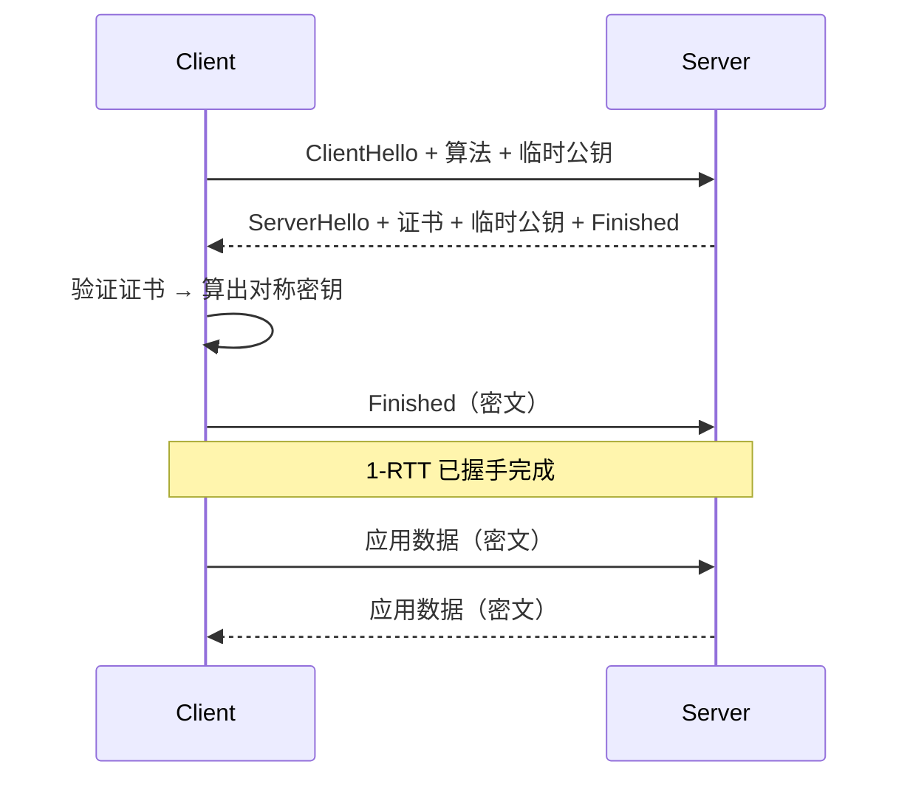

<KeyIdea>
**一句话**：**TLS** 在 TCP 之上提供**保密性、完整性、身份认证**：双方先用证书 + 公钥交换出一个对称会话密钥，之后所有数据用它加密。HTTPS / SMTPS / IMAPS / DoT / mTLS / gRPC 全都靠它。
</KeyIdea>

## 是什么

TLS 不是某一个协议，而是「**为另一个协议加上加密通道**」的通用协议。常见用法：

| 协议 | TLS 版本 |
| --- | --- |
| HTTP | HTTPS |
| SMTP | SMTPS / STARTTLS |
| IMAP | IMAPS |
| DNS | DoT (DNS over TLS) |
| MQTT | MQTTS |

主流版本：**TLS 1.2**（旧但仍广泛使用）/ **TLS 1.3**（推荐，更安全更快）。

## 打个比方

<Analogy>
TLS 是**保险箱机制**：
- 出厂前在双方之间安全交换一把通用钥匙（握手）；
- 之后双向所有信件都锁进同一型号保险箱（对称加密）；
- 就算邮递员（运营商）拿到箱子也开不了。
</Analogy>

## 关键概念

<Terms items={[
  { term: "对称密钥", en: "Symmetric Key", def: "握手协商出的会话密钥，加密 / 解密都用它，速度快（AES）。" },
  { term: "非对称密钥", en: "Asymmetric Key", def: "公钥 + 私钥，用于握手阶段安全交换对称密钥（RSA / ECDHE）。" },
  { term: "证书链", en: "Cert Chain", def: "服务器证书 → 中间证书 → 根 CA。浏览器一路验签。" },
  { term: "PFS", en: "Perfect Forward Secrecy", def: "每次会话用临时密钥（ECDHE），即使私钥事后泄露也解不开历史会话。" },
  { term: "0-RTT", en: "0-RTT", def: "TLS 1.3 复用上次会话信息直接发数据，零握手开销但有重放风险。" },
  { term: "mTLS", en: "Mutual TLS", def: "双向证书认证，常用于服务间通信、零信任网络。" },
]} />

## 怎么工作（TLS 1.3 简化）

TLS 1.3 抛弃了 RSA 静态密钥交换，**强制 PFS**，握手压缩到 1-RTT。

## 实操要点

- **优先 TLS 1.3**：禁用 1.0 / 1.1（PCI / ISO 已要求）。
- **证书自动续签**：Let's Encrypt + Caddy / Traefik / certbot —— 别再人工续签。
- **`openssl s_client -connect host:443 -tls1_3 -servername host`**：调试 1.3 握手。
- **`testssl.sh`**：开源脚本，扫描站点支持的版本 / cipher / 漏洞。
- **mTLS 部署**：每个服务一张证书 → 服务网格（Istio / Linkerd）自动签发与轮换。
- **不要把私钥提交到 git**：生产私钥放 Vault / KMS / Secret Manager。

## 易混点

<Compare
  leftTitle="TLS"
  rightTitle="SSL"
  left={<>
    1999 年起的标准，已迭代到 1.3。 
    现代术语应统一叫 TLS。
  </>}
  right={<>
    SSL 1/2/3 是 TLS 的前身，**已全部废弃**。 
    "SSL 证书" 是历史习惯叫法。
  </>}
/>

## 延伸阅读

- [HTTPS](/network/beginner/https)
- [TLS 握手细节](/network/advanced/tls-handshake)
- [mTLS](/network/advanced/mtls)
