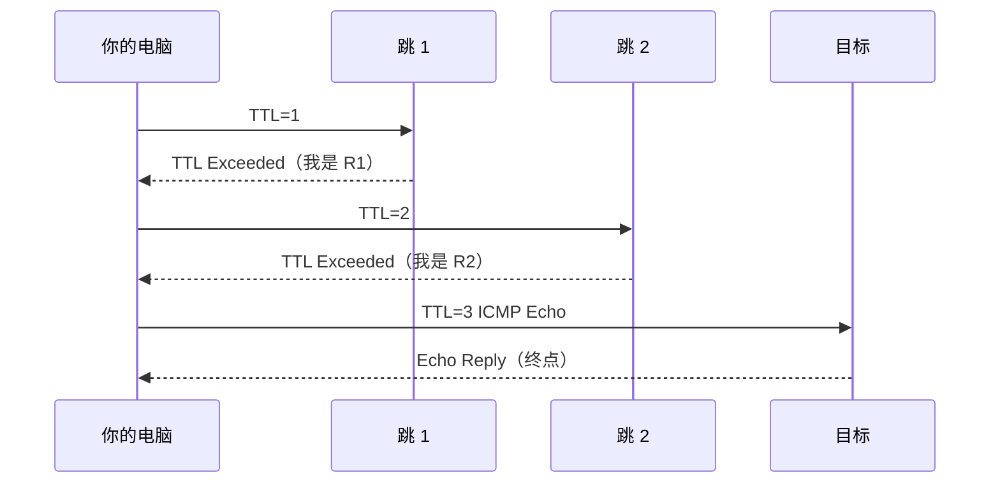

<KeyIdea>
**一句话**：**traceroute** 通过逐步增大 TTL 让沿途每个路由器返回「**TTL 超时**」错误，从而拼出包从你到目标走过的整条路径与每一跳延迟。
</KeyIdea>

## 是什么

```
$ traceroute -n 8.8.8.8
 1  192.168.1.1   1.2 ms   1.0 ms   1.1 ms
 2  100.64.0.1    8.5 ms   8.2 ms   8.4 ms
 3  202.97.x.x   12.0 ms  11.8 ms  12.1 ms
 ...
 9  8.8.8.8      11.9 ms  12.0 ms  11.8 ms
```

每行 = 一跳路由器。三列 RTT 是连发三次取样。

## 怎么工作



每一跳报告耗时，组合起来就能看出**慢在 / 丢在哪一段**。

## 关键概念

<Terms items={[
  { term: "TTL", en: "Time To Live", def: "IP 头部里的字段，每经过一跳 -1，到 0 路由器丢包并回报。" },
  { term: "TTL Exceeded", en: "ICMP Type 11", def: "「我把它丢了」消息，是 traceroute 拿到中间路由地址的关键。" },
  { term: "UDP / ICMP / TCP traceroute", en: "三种探测方式", def: "Linux 默认 UDP 高端口；macOS/Windows 默认 ICMP；-T 走 TCP（穿越防火墙最稳）。" },
  { term: "* * *", en: "星号跳", def: "该跳不回 ICMP（防火墙过滤），不一定代表网络坏。" },
  { term: "MPLS 隐藏", en: "MPLS Hop", def: "运营商骨干网常用 MPLS，部分跳被隐藏不可见。" },
]} />

## 实操要点

- **`traceroute -n host`**：不解析域名，更快。
- **`traceroute -T -p 443 host`**：用 TCP 443，**穿过 ICMP 屏蔽**最常用。
- **`tcptraceroute`**：另一个 TCP traceroute 实现。
- **`mtr host`**：traceroute + ping 的结合，**实时刷新**每跳的丢包 / 抖动。生产排查首选。
- **半路星号正常**：很多核心路由器配置不返回 ICMP，看到 `* * *` 不必慌；只要终点能到、整体延迟合理即可。
- **结果别只看一次**：网络抖动是常态，**多跑几次 / 用 mtr 长时间观察**才有意义。

## 易混点

<Compare
  leftTitle="traceroute"
  rightTitle="mtr"
  left={<>
    跑一次给出快照路径。<br />
    单次结果有偶然性。
  </>}
  right={<>
    持续探测，逐跳实时显示丢包 / 抖动。<br />
    更适合定位 **不稳定** 的链路。
  </>}
/>

## 延伸阅读

- [ping](/network/beginner/ping)
- [ICMP](/network/beginner/icmp)
- [mtr 进阶](/network/ecosystem/mtr-traceroute)
- [Wireshark](/network/ecosystem/wireshark)
